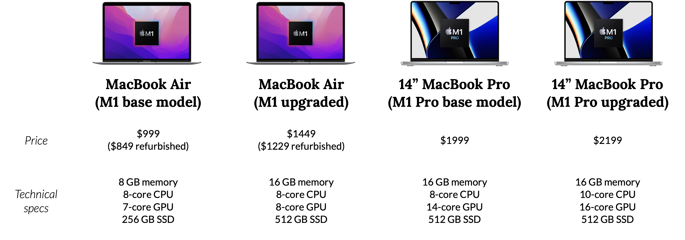
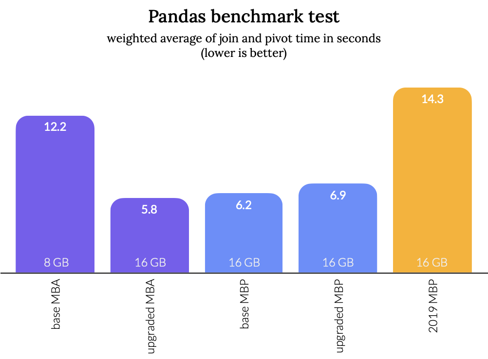
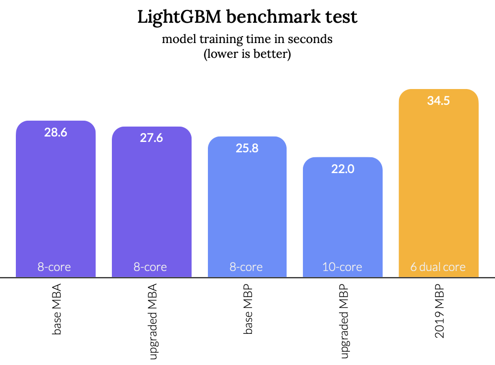
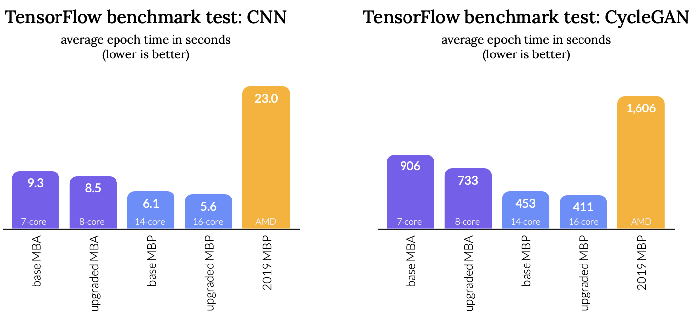
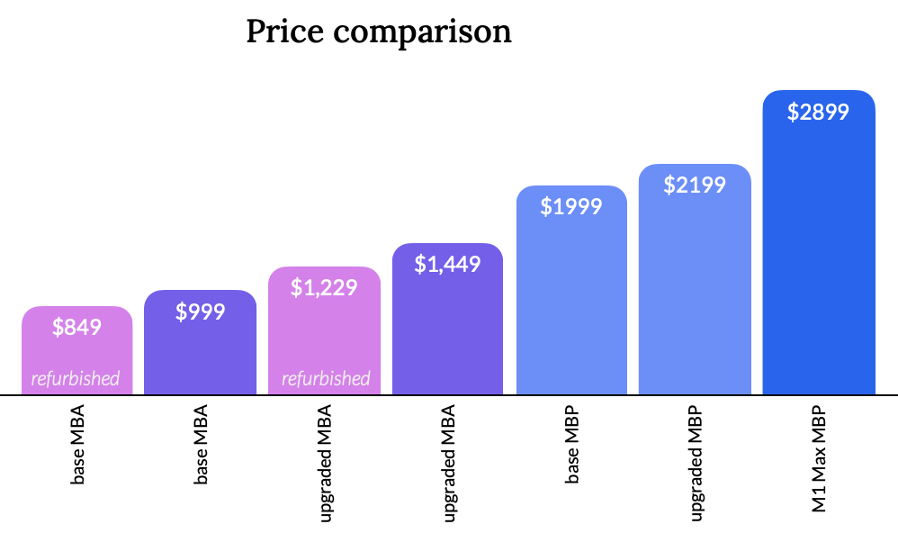
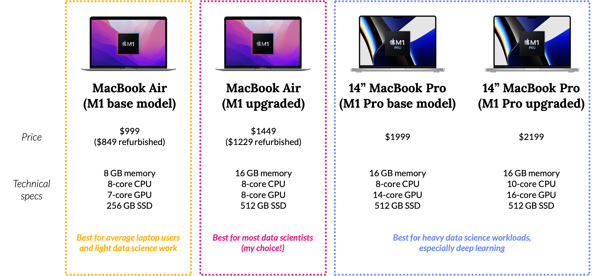

+++
title = "Why I Chose the MacBook Air over the MacBook Pro as a Data Scientist"
subtitle = "Benchmark tests and other considerations to help you decide between the latest and greatest Apple laptops"
date = 2021-11-28
tags = ["apple", "data science"]
draft = false
description = "I recently replaced my old laptop. Despite looking forward to the release of the new MacBook Pro for years, I opted for the MacBook Air instead. Why? It offers good performance and much better value. Most people (but not everyone) should probably make the same choice."
+++

<small>
<i>I originally wrote this post <a href="https://medium.com/@djcunningham0">on Towards Data Science</a> before moving it here.
It was shockingly popular (turns out people love reading about Apple products), so I figured I'd move it here when I deactivated my Medium account.
There have obviously been several new generations of MacBooks released since I wrote this post in 2021, so it's a bit out of date.
But my main recommendations remain unchanged—just replace "M1" with whatever generation Apple is on now.</i>
</small>

---

It's currently a great time to upgrade to a new Mac as Apple is rolling out their game-changing Apple Silicon (M1) chips.
I was recently in the market for a new laptop and my main contenders were the **2020 MacBook Air** and the **2021 MacBook Pro.**

In this article you'll find a detailed comparison of the MacBook Air and MacBook Pro from a data scientist's perspective, including benchmark tests for some common data-related tasks.
The title of this post spoils the ending (I chose the Air), but I'll provide recommendations for how to decide which option is right for you.

## My Background

To establish context, here's some information about me and what I'm looking for in a personal laptop.

* I like working on data-related projects in my free time (sometimes I write about them on this blog!).
  That usually means a lot of data processing, data analysis, and sometimes complex machine learning models.
* My projects usually involve datasets that are small enough to fit in memory.
  It's rare that I'll work with truly huge datasets in my personal projects.
* I don't work with deep learning models very often.
  Occasionally I'll train a deep neural network, but I usually work with more traditional modeling techniques.
  I'll explain why this might impact your decisions later.
* Outside of hobby data projects, I do a fair amount of photo editing and occasionally some minor video editing.
  I don't use my laptop for any serious gaming or anything else too taxing.
* I've been using the Apple ecosystem for years, so I didn't seriously consider any other options.
  Sorry to any Windows or Linux lovers out there.

*Note: I also work as a data scientist professionally, but in this case I was shopping for a personal laptop, not one for my job.
Whether you're shopping for a personal or professional machine may also impact your decision.*

## The Contenders

Apple has released two excellent laptops in the past year or so: the 2020 MacBook Air with the M1 chip and the 2021 MacBook Pro with the M1 Pro or M1 Max chip.
The Apple Silicon chips have already demonstrated huge performance and efficiency improvements over the Intel chips used in previous MacBook generations.

There are tons of possible configuration options for these machines and I won't go into all of them (head over to the Apple website to explore for yourself).
Instead I've narrowed it down four options that I think will meet the needs of most people, including most data scientists.
Here are those four options along with their relevant technical specs:

*Note: There are other differences between the Air and Pro that I didn't include in the table above.
Some of them might influence your decision.
I'll discuss those differences later in the post.*

**MacBook Air summary:** The cheapest laptop in Apple's lineup (although starting at $999, it's still pretty expensive).
It's also the smallest and lightest MacBook.
But don't write it off as weak—it outperforms high-end MacBooks from previous generations due to the M1 chip.
The "upgraded" option I've listed is the highest you can go for memory, CPU, and GPU.

**MacBook Pro summary:** Apple's most powerful laptop, but wow it's expensive… it *starts* at $1999.
You can push the specs (and price) a lot higher if you want to, especially if you go for the M1 Max chip.
It's available in 14" and 16" sizes, and the available specs and prices are pretty similar—it's up to you whether you prefer portability or a larger screen.

**What's missing?**
If you're familiar with Apple's lineup, you'll notice that I left out the M1 Max MacBook Pro.
If you're primarily using your laptop for data science/engineering tasks, you probably don't need all the power of the M1 Max chip.
Or if you do, the extra money you'd spend on the M1 Max is probably better spent elsewhere.
I also omitted the 2020 M1 MacBook Pro because I don't think it's a good choice for anyone—its specs are extremely similar to the MacBook Air for a couple hundred dollars more.

## Benchmark tests

Let's take each laptop for a spin and see how those specs translate to performance.
I bought all four configurations and ran them through a series of benchmark tests.
(And then I returned the ones I didn't want—thanks for your easy return process, Apple!)

Since I plan to use my laptop for data science projects, I designed my benchmark tests with data science tasks in mind.
Specifically, I tested three Python libraries commonly used for data science tasks:

* **Pandas:** Test some basic data operations using the `pandas` library.
  Specifically, join some large dataframes together, then pivot a large dataframe.
  Measure how long each operation takes.
  ***This is mainly a memory-intensive task.***
* **LightGBM:** Train a multiclass classification model on a large dataset using the `lightgbm` library.
  Measure the model training time.
  ***This is mainly a CPU-intensive task.***
* **TensorFlow:** Fit neural networks using the TensorFlow library, which allows for GPU acceleration on Macs.
  Specifically, train a convolutional neural network (CNN) on the well-known MNIST dataset, and train the [CycleGAN](https://junyanz.github.io/CycleGAN/) model on the horse2zebra dataset.
  Measure the average time per epoch.
  ***This is mainly a GPU-intensive task.***

You can find full details for the tests [on GitHub](https://github.com/djcunningham0/m1_benchmarks), including all source code and instructions for running the tests on your own.

### Results

The charts below show the performance of the five laptops I tested.
Here is the key for the axis labels:

* **base MBA:** the M1 base model MacBook Air (see previous graphic)
* **upgraded MBA:** the M1 upgraded MacBook Air (see graphic)
* **base MBP:** the M1 Pro base model MacBook Pro (see graphic)
* **upgraded MBP:** the M1 Pro upgraded MacBook Pro (see graphic)
* **2019 MBP:** a 16" MacBook Pro with 16 GB RAM and Intel i7 6-core CPU and AMD Radeon Pro 5300M GPU—a fairly high-powered MacBook from the last Intel generation (this was my work laptop at the time)

Let's go through the results from each test one by one.

#### Pandas benchmark test (memory-intensive)

<figcaption style="text-align: center">Annotation shows the amount of RAM.</figcaption>

The Pandas benchmark test requires large dataframes to be stored and manipulated in memory.
The three M1 machines with 16 GB memory (upgraded MBA, base MBP, and upgraded MBP) predictably outperformed the machine with 8 GB memory (base MBA) by about 50%.
Don't get too caught up in the exact numbers—there's going to be some variance due to RAM being used by other tasks on the machine.
You should consider the performance of the three middle models to be the same.

A very promising result is that the base M1 MacBook Air outperforms the 2019 16" MacBook Pro in this test, *even though the older machine has twice as much memory.*
It appears an M1 chip with 8 GB RAM will beat an Intel chip with 16 GB RAM.
That's amazing.

**Key takeaway:** Doubling your memory makes memory-intensive tasks (approximately) twice as fast, as expected.
The Air and Pro will perform the same if they have the same amount of memory.
And M1 kicks Intel's butt.

#### LightGBM benchmark test (CPU-intensive)

<figcaption style="text-align: center">Annotation shows the number of CPU cores.</figcaption>

The LightGBM benchmark test fits a gradient boosted trees classification model on a large dataset.
This is a CPU-intensive task—all CPU cores are maxed out while running the test.

Let's start with the M1 Pro MacBook Pro results.
The upgraded MBP has 25% more cores and achieves 15% better performance.
Some diminishing returns, but adding CPU cores has a pretty linear effect on performance.

Now let's put the MacBook Air results in context.
Although the Air and base Pro both have 8-core CPUs, they are not identical—the Air has 4 performance and 4 efficiency cores, while the Pro has 6 performance and 2 efficiency cores.
How much of a difference does it make?
Well, the benchmark test shows that the difference is measurable but not huge.
The base Pro outperforms the Air by about 8%.
In other words, the gap between the two Pro models is twice as large as the gap between the Air and the base Pro model.

**Key takeaway:** Increasing CPU cores improves performance in a predictable way.
The MacBook Air performance is within about 8% of the MacBook Pro despite the efficiency and performance core distribution.
And again, even the least powerful M1 chip outperforms the Intel chip.

#### TensorFlow benchmark test (GPU-intensive)

<figcaption style="text-align: center">Annotation shows the number of GPU cores.</figcaption>

I'm combining the two TensorFlow tests into the same summary because they tell the same story.
In both tests, a neural network model was trained on a dataset.
TensorFlow is able to use GPU acceleration on Macs (both M1 and Intel), so this was primarily a test of the GPU.

Again, these results came out pretty much exactly as we would expect from looking at the specs.
The upgraded MBP GPU has 14% more cores than the base MBP, and the base model is 10% slower.
The base MBP has double the cores of the base MBA, and the MBA is 75% slower (averaging the results of the two tests).
There are some diminishing returns, but increasing the number of GPU cores improves the performance in this benchmark test, as expected.

And this is the biggest difference we've seen between the M1 and Intel machines.
All of the M1 machines dominated the 2019 Intel MacBook Pro.
(And I'd expect this difference to become more dramatic over time—TensorFlow works on an M1 GPU, but it likely hasn't been fully optimized yet. I'd expect some improvements to the TensorFlow library that will result in gradual performance improvements on M1 machines over the next few years.)

I didn't test on any M1 Max machines, but they would obviously achieve even better performance.
You can spec the M1 Max up to 32 GB GPU cores (if you're willing to spend more than $3100).
You can extrapolate from the TensorFlow benchmark chart to get a pretty good estimate of that chip's performance.

Another thing worth noting here is that the MacBook Air does not have a fan.
That usually doesn't matter because the efficiency of the M1 chip keeps temperatures under control, but the computer is going to heat up under prolonged workloads (such as training a deep neural network).
There's a good chance you'd see some thermal throttling at some point, which would slow things down somewhat.
My benchmarks did not run long enough to notice any throttling so I can't comment on how significant the effect would be.
The MacBook Pro has a fan so it would be less affected by throttling.

**Key takeaway:** Increasing GPU cores improves TensorFlow performance in a predictable way, so this is a big win for the MacBook Pro and its larger GPU compared to the MacBook Air.
All of the chips perform very well compared to older Macs.

*Related note:* ~~Not all popular libraries are integrated with the M1 GPU.~~
PyTorch didn't have support for Apple Silicon GPUs when I wrote this post, but now it does.

## Other considerations beyond technical specs

Before making recommendations, I want to acknowledge some other factors that might influence your laptop decision because most of us don't use our laptops *only* for working with data.

It's clear that Apple designed the newest MacBook Pro for people doing intensive graphic design, 3D rendering, video work, and so on.
They will benefit most from the power of the M1 Pro and M1 Max chips.
Those users should pay for the upgraded models because there are no better alternatives on the market.
If you do (a lot of) this type of work in addition to data science, you'll want to go with a MacBook Pro.
Otherwise there's a good chance you don't really need all that power.

The Liquid Retina XDR screen on the MacBook Pro is an inch larger and far better than the LED screen on the MacBook Air.
That's a huge selling point for people doing photo and video work, but it's also nice for everyday tasks like watching movies.
The Pro's webcam is also higher resolution (1080p vs. 720p on the Air) which could be important for some users.

The MacBook Pro has an HDMI port, an SD card slot, and a MagSafe charging port so connectivity is never an issue—the MacBook Air is limited to two Thunderbolt/USB-C ports.
And the Pro can connect to multiple external displays while the Air is limited to one.
Probably not dealbreakers, but these features have some value.

Keep in mind that MacBook Air also has some advantages.
It gets better battery life and it's lighter than the Pro (2.8 lbs vs. 3.5 for the 14" Pro).
And this is personal preference, but I think the wedge design of the MacBook Air looks much better than the new MacBook Pro.

The lack of a fan in the MacBook Air can be both a pro and a con—on one hand you might occasionally experience some thermal throttling, but on the other hand you'll never be bothered by a noisy laptop fan.

And price, of course!
All of these laptops are expensive, but the MacBook Pro is *really* expensive.
You have to decide whether spending that much money on a laptop is worth it, or whether that money is better spent elsewhere.

<figcaption style="text-align: center">A very important data point.</figcaption>

The MacBook Air is a year older so you can currently find them [refurbished from Apple](https://www.apple.com/shop/refurbished), making it an even better deal.
I bought mine refurbished and I'm glad I did.
And sometimes you can also find deals if you don't buy directly from Apple (for example, from Amazon).

## Recommendations

It's finally time to recommend some laptops!
The recommendations below take into account the results from the benchmark tests and the other considerations I described.

### Choose the MacBook Air (M1 chip) if…

You have a light to medium-heavy data science workloads.
If most of your work is data manipulation and cleaning, basic data analysis, and/or fitting non-deep learning models, you are likely this type of user.
I fall into this category (reread the "My Background" section if you want more details).

The MacBook Air will give you plenty of power and will probably be much faster than whatever laptop you are upgrading from.
The 7- or 8-core GPU is powerful enough for some deep learning work—you only need to think about upgrading to the MacBook Pro if you're doing a lot of this type of work and decide you really need your models to train faster.

Light users will be fine with the base model and 8 GB of RAM, but it's probably worth it for most data scientists to upgrade to 16 GB RAM.
The tasks you do most frequently, like transforming large datasets, will be much faster and you will be more productive.

If you're OK with the 256 GB hard drive I would stay with the base 7-core GPU option.
If you want the 512 GB or larger hard drive, then I would recommend upgrading to the 8-core GPU option—it'll only cost $50 more.

### Choose the MacBook Pro (M1 Pro chip) if…

You have a very heavy data science workload and/or you have non-data science needs that would benefit from a more powerful GPU.
You're only going to get enough bang for your buck if you consistently take advantage of the powerful GPU in the M1 Pro chip.
In data science, that probably means you do a decent amount of deep learning.
Outside of data science, you could justify this purchase if you do a lot of design or video work that requires a powerful GPU.

It's up to you whether it's worth upgrading the 10-core CPU, 16-core GPU model.
It's a $200 increase over the base model and gives you a small but measurable improvement in performance (refer to the benchmark tests).
There are also far more upgrades you can make to this machine, but the price increases accordingly.

### Choose the MacBook Pro (M1 Max chip) if…

You have non-data science needs that require a *very* powerful GPU, such as design or video work.
I don't think the M1 Max is the right option for most data scientists.

You might think that the M1 Max would be a great choice if you do a lot of deep learning, and you'd be right... sort of.
Clearly the M1 Max is the MacBook best equipped for GPU-optimized model training.
But it's going to cost you a lot of money—a minimum of $2899 for the 24-core GPU option, and more if you make any other upgrades.

For heavy deep learning workloads, I would recommend that you buy a cheaper Mac (either the Air or the M1 Pro) and use the money saved to pay for cloud compute resources when you need them.
Your laptop will still be pretty capable for smaller scale work, and when you really need the extra power you can pay for the resources and still probably come out ahead on cost.
And keep in mind that some things like PyTorch won't work well on any Mac, even the M1 Max, so you'll have to offload that work somewhere else anyway.
Alternatively, consider buying a Linux box and Nvidia GPU to use for machine learning.

(If you want to learn more about deep learning hardware, check out [this awesome guide](https://towardsdatascience.com/another-deep-learning-hardware-guide-73a4c35d3e86) from Nir Ben-Zvi.
One thing he says is "the deep learning laptop doesn't exist anymore"—you're better off using cloud resources or building a desktop.)

### Choose an older MacBook Pro (Intel chip) if…

You really want to avoid disruptions to your existing environments, workflows, or data pipelines.
If you're migrating from an Intel Mac the transition won't be painless.
You're going to have to reinstall a lot of things because of differences between the ARM64 of the new Macs and the x86 architecture of the old Intel models.
For instance, you'll need to install new versions of Python, Conda, and other tools, and you'll need to reinstall packages into your environments.
Expect to do some troubleshooting.

That said, the change is worth it for most people.
After the transition phase you'll have a better, faster machine.
The compatibility issues are probably more of a concern for professional use cases where disruptions could interrupt production code.
And you can always use [Rosetta](https://support.apple.com/en-us/HT211861) in the short term to run apps and programs designed for Intel processors/x86 architecture.

### Choose something else (a non-Apple laptop) if…

You want a worse operating system and user experience.
(Just kidding!)

Without getting too much into personal preference for operating systems, there are some downsides to Macs in data science use cases.
For example, PyTorch does not have GPU support for Macs (*2025 update:* now it does, but it still might not be as good as CUDA on Windows/Linux).
If you do a lot of deep learning, especially if you use PyTorch, you may be better served with a Windows or Linux machine with an Nvidia GPU.
(Or get a Mac anyway and pay for cloud computing resources!)

## Conclusion

I hope this discussion helps you decide which laptop is right for you, or at least gives you a better idea of what you should be looking for.
To sum things up, here is the same graphic from earlier with some recommendations added:

I've been very happy with my choice of the MacBook Air so far.
Yes, the MacBook Pro is strictly better when it comes to performance, but I'd rather spend the extra $1000 (or more!) elsewhere.
To be honest, I had been looking forward to the release of this MacBook Pro for years but it ended up not being the right choice for me.
It's an awesome computer but the Air is a better value for my needs.
I expect many people will come to the same conclusion as me, but you'll be happy with any computer from this lineup.
