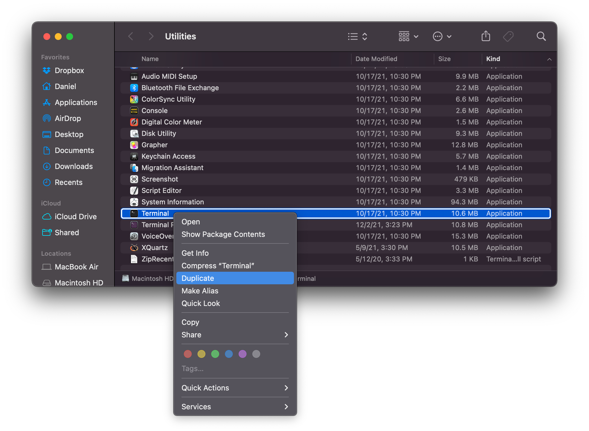
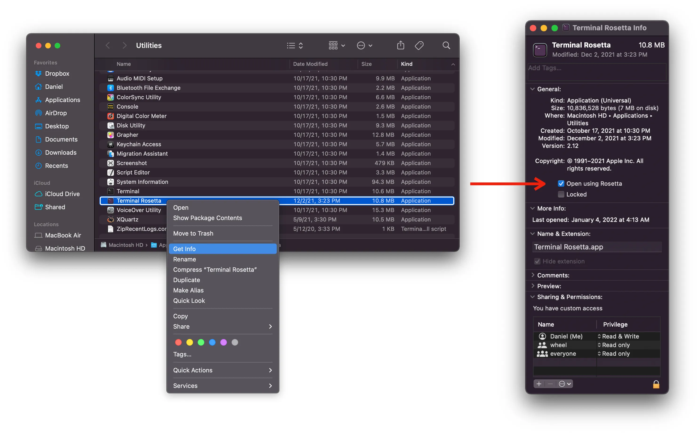

+++
title = "How to Manage Multiple Python Versions on an Apple Silicon M1 Mac"
subtitle = "Install both ARM64 and x86 Python versions and seamlessly switch between them using pyenv"
date = 2022-02-17
tags = ["environment management"]
draft = false
description = "A basic tutorial for managing Python environments using my preferred tool, pyenv."
+++

<small>
<i>I originally wrote this post <a href="https://medium.com/@djcunningham0">on Towards Data Science</a> before moving it here.</i>
</small>

This article describes how to manage ARM64 and x86 Python environments using pyenv.
Personally, I love the simplicity of pyenv.
There are other solutions (such as conda) but in my opinion pyenv is the easiest to use.
If you prefer (or require) conda for environment management, see my [other post]().

---

You probably won't use the same version of Python for all of your projects for the rest of eternity.
One one hand, Python is an active language and you'll want to take advantage of the newest features ([Python 3.10](https://docs.python.org/3/whatsnew/3.10.html) was recently released!).
On the other hand, you don't want to break all of your old code when you upgrade your installed Python version.
As a data scientist I encounter this all the time—I frequently need to rerun old analyses or projects, so I need a way to support multiple Python versions on my machine.

That's where version management comes in, and my preferred tool is [pyenv](https://github.com/pyenv/pyenv).
With pyenv you can install multiple Python versions on your machine **and easily switch between them.**

*Note: this article is geared towards Mac users, and especially Apple Silicon Mac users.
Linux users might benefit from the pyenv tutorial, but Windows users are out of luck—pyenv does not officially support Windows.*

## Installing Python versions using pyenv

It's really easy to install and manage multiple versions of Python using pyenv.
See [the documentation](https://github.com/pyenv/pyenv) for full details, but here are the simple instructions to install any version of Python:

### 1. Install Homebrew

Homebrew is a package manager for MacOS.
It allows you to install all sorts of useful tools.
To install it, follow the simple instructions [here](https://brew.sh/).

### 2. Install and configure pyenv

`pyenv` is a Python version management tool. It allows you to install multiple versions of Python and easily switch between them.

To install, follow these instructions (or see the full installation instructions on the [official GitHub repository](https://github.com/pyenv/pyenv)):

1. Install using brew: `brew install pyenv`
2. Add the following lines to `~/.zprofile` and `~/.zshrc` (or `~/.bash_profile` and `~/.bashrc` if you're still using bash):

```bash
##### ~/.zprofile #####
eval "$(pyenv init --path)"

##### ~/.zshrc #####
if command -v pyenv 1>/dev/null 2>&1; then
    eval "$(pyenv init -)"
fi
```

Then quit your shell session and start a new one for the changes to take effect.
You have successfully installed pyenv!

### 3. Install Python versions

Installing Python with pyenv is easy.
For example, to install the latest version of Python 3.9 you would run `pyenv install 3.9`.
To activate the environment, run `pyenv global 3.9` (to make it the default version everywhere) or `pyenv local 3.9` (to make only the current directory use this version).

(If you want a *specific* version rather than the latest of a given minor version, you can run, e.g., `pyenv install 3.9.7`.
Use `pyenv install -l` to display a list of versions available for install.)

## Additional challenges with Apple Silicon Macs

The steps above will almost always be sufficient.
However, with the newer Macs (personally, I use an M1 MacBook Air) you might run into issues when installing certain packages.
When Apple switched from Intel chips to their in-house Apple Silicon chips, they changed from x86 architecture to ARM64 architecture.
This is mostly a good thing—the only difference you'll notice in day-to-day usage is that the new chips are faster and more efficient than the old ones.

Unfortunately, you might occasionally encounter package compatibility issues.
Some Python packages are not yet supported on Apple's ARM64 architecture—for example, I ran into that problem with the `ortools` package.
You'll get errors during installation and you won't be able to use the package in your code.
Eventually the problem should go away when developers add ARM64 support for their packages, but you're going to have find another solution in the meantime.

---

*(If you're reading this post now, you're unlikely to encounter this sort of package compatibility issue on an Apple Silicon Mac.
When I first published this post, Apple Silicon was fairly new and many packages hadn't been updated to support it.
Now, years later, all major packages are likely to be compatible with Apple Silicon.
In that case, the rest of this post will be of little utility to you.
But you might enjoy reading about the hoops we occasionally had to jump through way back in the early 2020s!)*

---

Fortunately, there's a short term solution: **you can install Python with x86 architecture on an Apple Silicon Mac.**
And better yet, you can still use pyenv to manage your environments.

## x86 environments with Rosetta and pyenv

***Only follow these steps if you need to use packages that only work on x86 architecture.
Try the previous steps first and only come here if you encounter package installation issues.
Otherwise you are sacrificing performance for no benefit.***

### 1. Install Rosetta

Rosetta is software that allows Apple Silicon Macs to run apps designed for Intel-based Macs.
If you need to use a version of Python for x86 architecture, you will need Rosetta.

To install Rosetta, run this command in your terminal:

```bash
softwareupdate --install-rosetta
```

Then follow the prompts to agree to the license agreement and run the installation.

### 2. Create a Rosetta terminal

Now we need a way to run commands using Rosetta. First, duplicate the Terminal app. Navigate to /Applications/Utilities and duplicate Terminal:




Then rename the new copy to something like “Terminal Rosetta”.
Next, right click on the new Terminal, click “Get Info” and check the “Open using Rosetta” box:



You can now use this new terminal to execute commands using Rosetta and the x86 architecture.
**Use it for the remaining steps.**

### 3. Install Homebrew

Follow the simple instructions here. It's exactly the same as installing Homebrew on the ARM64 architecture, but it will automatically be installed to a different location.

### 4. Install pyenv

If you already installed it above, you're all set.
Otherwise, follow Step 2 in the “Installing Python versions using pyenv” instructions.

### 5. Modify .zshrc

We've installed everything we need.
Now we need a way to tell our machine to use the x86 version of brew and pyenv.
My preferred method is adding the following lines to your `.zshrc` (or `.bashrc`) file:

```bash
##### ~/.zshrc #####
# rosetta terminal setup
if [ $(arch) = "i386" ]; then
    alias brew86="/usr/local/bin/brew"
    alias pyenv86="arch -x86_64 pyenv"
fi
```

The `$(arch) = "i386"` command identifies whether we are running a Rosetta terminal.
The `brew86` alias calls the version of brew in the x86 location (the ARM64 location is `/opt/homebrew/bin`).
The `pyenv86` alias executes pyenv under the x86 architecture.

For example, you can now call `brew86 install ...` or `pyenv86 install ...` from your Rosetta terminal.

### 5. Install pyenv-alias plugin (optional)

By default, pyenv does not allow you to provide custom names for your Python versions.
That can be an issue if you want to install the same Python version under both ARM64 and x86 architecture.
The pyenv-alias plugin solves this issue.
Follow the installation instructions [here](https://github.com/s1341/pyenv-alias).

### 6. Create your x86 environments using pyenv

You're finally ready to install x86 Python versions!
In your Rosetta terminal, simply run `pyenv86 install x.x` (substituting a real Python version for `x.x`, e.g., `3.10`).
If you installed the pyenv-alias plugin in the previous step, I recommend adding an alias to your x86 environments.
For example, `VERSION_ALIAS="x.x.x_x86" pyenv86 install x.x.x`.

Now when you run `pyenv versions` you will see all of your ARM64 and x86 Python versions.
You can easily switch into an x86 environment when you encounter package compatibility issues in your projects.

---

If you have an Apple Silicon Mac you're likely to run into package installation issues some day, but the steps in this article provide a seamless workaround (well, as close to seamless as you're going to get).
Eventually these steps might be obsolete after developers have had enough time to add ARM64 support to their packages, but that could take a couple years for smaller or niche packages.
In the meantime I hope this post saves you some troubleshooting!
