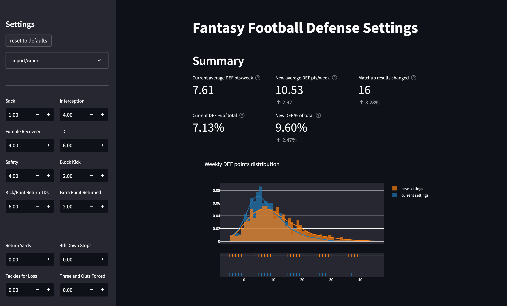

+++
title = "Should My Fantasy Football League Change Our Defense Scoring Settings?"
subtitle = "Analyzing the impact of possible changes"
date = 2022-09-06
tags = ["data analysis", "fantasy football", "Streamlit", "web apps"]
draft = false
description = "Some of my fantasy football league members want to make changes to defense scoring settings. I'm not sure it's a good idea, or if it even matters at all. Let's find out! Featuring a Streamlit web app and the (ugly) Yahoo Fantasy Sports API."
+++

I've been the commissioner of a fantasy football league for a few (maybe more than a few) years now.
In recent years a few people have suggested (sometimes enthusiastically) that we change our defense scoring settings[^1].
So this offseason I posed a question to the league: which defense scoring changes would you like to see?

Suggestions abounded, ranging from small to sweeping:
> * Give a few more points when a defense allows a low score
> * Interceptions and fumble recoveries should be worth more
> * 4th down stops are turnovers, too—points for those!
> * Points against shouldn't matter at all—score based on yards allowed instead
> * And neither should sacks—no points for sacks!
> * What about tackles for a loss?
> * Calculate a score based on \<this formula I made up\>
> * *Get rid of defense completely!!!*

As commissioner, I tried to take a neutral stance and suss out the majority opinion.
But my opinion on defense scoring was pretty firmly:
1. Simple is better than complex (i.e., let's not add to many scoring categories).
2. Defenses shouldn't dominate scoring in fantasy football.
3. *This probably doesn't matter anyway!* If we make a change, it will probably have very little impact.

That last one is testable, so like any ~~obsessive~~ good commissioner I set out to test it.
I'd backtest some changes on our previous fantasy football seasons.
In other words, I would replay every matchup from previous seasons to see how many outcomes (i.e., who won) would have changed with different defense scoring settings.
If most outcomes stayed the same, my hypothesis would be right—the exact defense scoring settings don't matter much and we can move on with our lives.
If lots of outcomes changed, then we should probably give our settings some serious thought.

## Pulling historical matchup data with the Yahoo Fantasy Sports API

That backtesting requires data from all our previous seasons, including which teams played each other each week, how many points they scored, which defense they had, and all of the stats the defense recorded.
It would be madness to click through the league history and collect all of that data manually.
I did not do that.

Fortunately, Yahoo provides a public Fantasy Sports API.
After authenticating with your Yahoo account, you can programmatically access all of the data from your current and historical fantasy sports leagues.
This would make my backtesting analysis possible.

Unfortunately, the API is not very convenient to use.
For starters, the [documentation](https://developer.yahoo.com/fantasysports/guide/) isn't great—it's one giant page with some inaccurate or out-of-date information, and it doesn't even include all of the available API endpoints.
Then there's the fact that the API natively returns XML (yuck), although there is an option to return JSON responses instead.
But those JSON responses have a deeply nested structure that you have to figure out for yourself with little to no help from the documentation.

After a few (or more) hours of API response wrangling, I finally figured out how to get all of the data I needed.
If you're curious, you can see how I pulled the data [here](https://github.com/djcunningham0/fantasy_football_defense_scoring/blob/main/pull_data.py) (viewer discretion is advised: there's some ugly stuff in there).

## Building a Streamlit web app to visualize the results

Now armed with data, I began analyzing some of the proposed rule changes.
For this task, I turned to one of my favorite new tools: [Streamlit](https://streamlit.io).
It's a Python library that makes it unbelievably easy to build interactive web apps—no web development skills required, only Python.
It's great for exploratory data analysis.
I find it kind of similar to working in a Jupyter notebook, but far more interactive.

I built an app that allowed the user to input their desired scoring settings and then applied those settings to all matchups from the previous five seasons, which I had already pulled from the Yahoo API[^2].
The app keeps track of how scores and outcomes would have changed and then displays all of the relevant information and some useful visualizations to the user.
I think it's pretty cool!

<figure>

<figcaption>
Screenshot from the Streamlit app.
With the settings in this example, you can see that average scores would increase a few points and about 3% of matchups would change outcome.
Lower down, the app also shows exactly which matchups would be affected and whether they would impact the league standings.
</figcaption>
</figure>

Another cool thing about Streamlit is that it's easy to deploy and share an app.
You can host an app for free at [streamlit.io/cloud](https://streamlit.io/cloud) and anyone with the link can access it.
Assuming your app is in a GitHub repo, it literally only takes a few clicks to deploy it.
Super easy!

That was really useful for me because I knew what the response from some league members would be if I just summarized my findings: "well, what if we tried *\<this other suggestion\>* instead?"
Now I could tell them to test it out for themselves!

**You can check out my deployed Streamlit app here:** https://djcunningham0-fantasy-football-defense-scoring-app.streamlit.app

Check it out, and let me know if there are any scoring changes we should really consider 😊

---

## So, did we change the scoring settings?

Nope!

After experimenting with a bunch of different settings, we arrived at two conclusions[^3]:
1. Most of the proposed changes would increase defense scoring too much.
2. Most changes would have very little impact on matchup outcomes.

Everyone arrived at those same conclusions, especially the second one, and the chatter around defense scoring died down.
So we'll make no changes for now.
Looking forward to the upcoming season!

[^1]: For context, we host our league on Yahoo and we use their default settings except with interceptions worth 2 points instead of 1 (which seems to be the default setting everywhere else).

[^2]: I didn't go to the trouble of connecting the Streamlit app to the Yahoo API.
Instead I did a one-time data pull from the API, saved the data in a static file, and read from that static file in the app.

[^3]: There was also a third type of conclusion: *"We should use \<these highly specific settings\> because then I would have won one more game last year and made the playoffs!"*
But no one was seriously convinced by that argument.