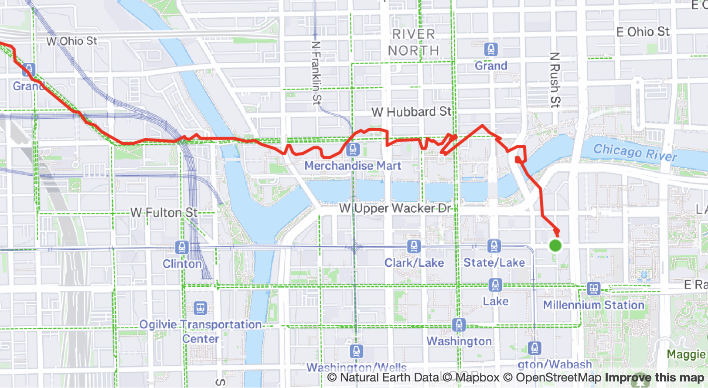
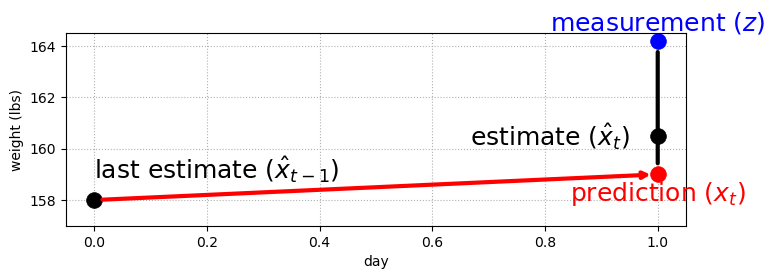
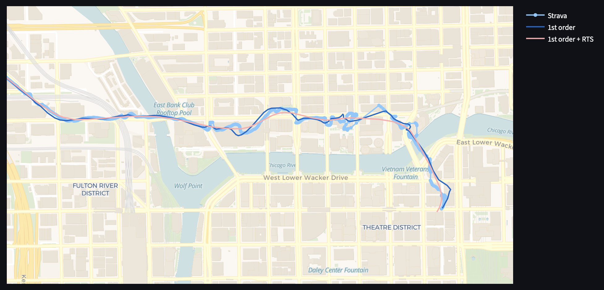
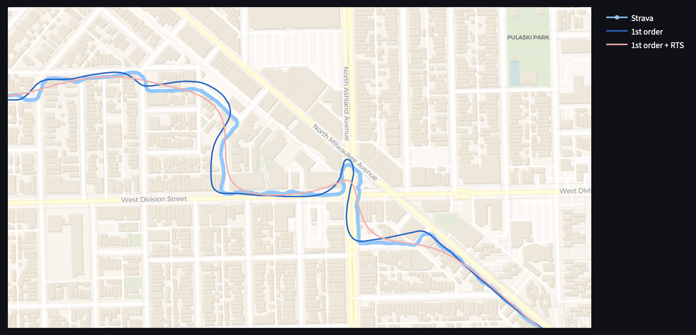
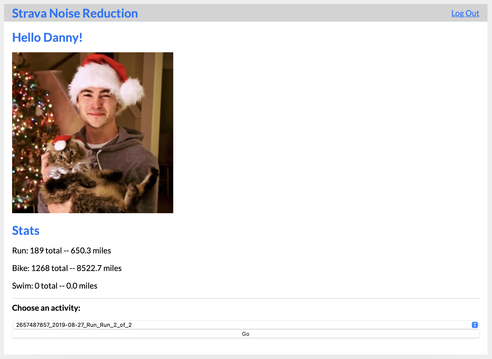
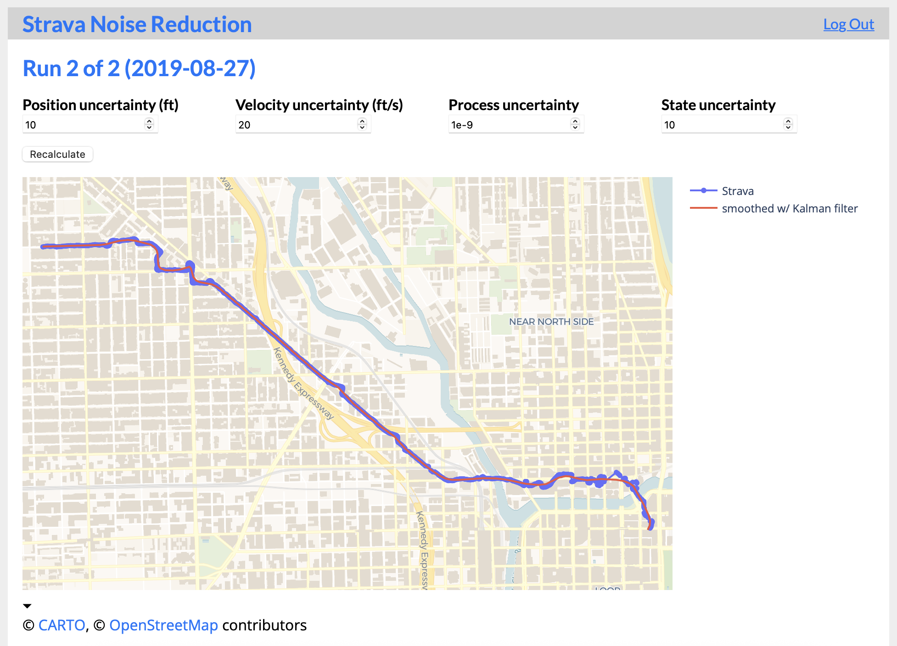

+++
title = "Strava Noise Reduction"
subtitle = "Messing around with Kalman filters to fix noisy Strava activities"
date = 2022-09-26
tags = ["data science", "strava", "kalman filtering", "flask", "web apps"]
draft = false
description = """
  I use Strava to track my runs, and sometimes I'm annoyed with how noisy the GPS tracks are.
  I recently learned about Kalman filtering, a methodology for smoothing noisy data.
  Let's see if it can solve my Strava problem.
  Plus, a small Flask app that integrates with the Strava API.
"""
+++

Strava is an exercise app popular with runners and cyclists.
I recently started using it to track my runs and I'm a big fan—it motivates me to run more frequently (plus it's fun to give and receive "kudos").

But I've noticed one annoying problem: noisy GPS tracks.
The problem is particularly bad near downtown Chicago (and probably any city with tall buildings).
When I upload a run in that area, the GPS track shows me bouncing all over the place, sometimes dramatically increasing the recorded distance.

Here's an example of a particularly noisy run:

<figure>

<figcaption>
    Strava would have you believe I ran through the Chicago River and several buildings.
    I assure you I did not.
    (<a href="https://www.strava.com/activities/2657487857">link to activity on Strava</a>)
</figcaption>
</figure>

To be clear, this isn't really a Strava issue.
Strava relies on the GPS tracker in your phone, and every GPS device struggles in downtown Chicago.
But it would be nice to remove some noise from these GPS tracks, and it feels like it should be possible.

## Kalman filtering background

Kalman filtering is a method for removing noise from time-dependent data.
GPS tracking is a classic example: each individual measurement from a GPS tracker will have some random noise, but a Kalman filter can combine the noisy individual measurements into a smoother, more accurate track.
That sounds like a perfect fit for the Strava use case!

The best resource I've found on Kalman filters is Roger Labbe's book [Kalman and Bayesian Filters in Python](https://github.com/rlabbe/Kalman-and-Bayesian-Filters-in-Python/)[^1].
It's a great mix of theory and practical examples.
A stats background is helpful, but it strikes me as fairly approachable even without it.

I won't go into the full details (read the book for that), but I'll give a quick overview of the core concept.
Kalman filters operate in two steps: a *prediction* step and an *update* step.
First we *predict* what the next state will be based on the current state.
Then we observe the next measurement and *update* our prediction accordingly.
Then we repeat that process for each data point.

Let's use the (simplified) Strava use case to illustrate.
Suppose a runner is running across an (x, y) grid:
1. Our latest measurement has the runner at (0, 0).
2. **Prediction step:** our model predicts that the runner will be at (5, 2) at the next time increment.
3. Measurement: our GPS records the runner at (4, 3) at the next time increment.
4. **Update step:** combining our prediction with the observed measurement, we estimate that the runner is now at (4.8, 2.2), somewhere between the prediction and measurement.
5. Repeat.

If that sounds a bit like Bayesian statistics, that's because it is!
Kalman filters are a type of Bayesian filter.
In Bayesian terms, the prediction step produces a *prior*, the measurement is a *likelihood*, and the update step produces a *posterior.*
I've obviously omitted a lot of details about *how* the Kalman filter performs the prediction and update, but the core concept should be pretty clear.

<figure>

<figcaption>
    This simple diagram (taken from <a href="https://github.com/rlabbe/Kalman-and-Bayesian-Filters-in-Python/blob/master/01-g-h-filter.ipynb">Chapter 1</a> of the book) illustrates the core concept behind Kalman filters.
    First we use the current state (<code>last_estimate</code>) to predict the next state (<code>prediction</code>).
    Then we observe <code>measurement</code> and combine it with <code>prediction</code> to produce our final estimate of the current state (<code>estimate</code>).
</figcaption>
</figure>

## Can Kalman filters de-noise my Strava tracks?

So Kalman filters can smooth noisy data.
Sounds like a perfect solution for my noisy GPS tracks in Strava, right?
Well, not so fast—there's one possible problem.

Since my phone's GPS presumably already has a Kalman filter (or something similar), it's theoretically impossible to improve accuracy by applying *a second* Kalman filter directly to the output.

> Can you apply a Kalman filter to the output of a commercial Kalman filter?
> ...
> Inputs to the Kalman filter must be Gaussian and time independent.
> ...
> The output of the GPS is time dependent because the filter bases its current estimate on the recursive estimates of all previous measurements.
> ...
> So, **the answer is no, you cannot get better estimates by running a KF on the output of a commercial GPS.**
>
> <cite>— <a href="https://github.com/rlabbe/Kalman-and-Bayesian-Filters-in-Python/blob/2258eacd9277684e9de86807280a6e604ae5bae7/08-Designing-Kalman-Filters.ipynb">Chapter 8</a> of Kalman and Bayesian Filters</cite>

Well, that sounds kind of like what we're trying to do.
Bummer.

But before giving up, let's consider whether that blurb is actually relevant to our problem.
The GPS in your phone is attempting to produce the best estimate of your current position *in real time.*
If we wanted to improve the real-time readings of our phone's GPS[^2], we'd be out of luck.

But in the Strava use case, we're *not* solving a real-time problem.
We have the full series of recorded GPS measurements from start to finish.
That's important because it changes which data is available to our filter; specifically, we know what future measurements look like.
Suppose we're attempting to remove noise from \(m_t\), the measurement at time \(t\):
* Real-time use case: we have \(m_t\) and all previous measurements (\(m_{t-1}\), \(m_{t-2}\), ...).
* Strava use case: we have \(m_t\), all previous measurements, *and all future measurements* (\(m_{t+1}\), \(m_{t+2}\), ...).

Can we make use of those future measurements in a Kalman filter?
Yes!
We can apply a concept called *smoothing*[^3].
Smoothing filters incorporate future measurements to further remove noise from a time-series.
Earlier we said it's impossible to improve upon one Kalman filter by applying a second one, but it *is* possible if the second filter has additional information that wasn't available to the first one.

So, this was a long-winded way of saying **yes, a Kalman filter can (potentially) de-noise a Strava track.**
Smoothing from future measurements will make it possible[^4].

## Implementing a Kalman filter on Strava data

Let's give it a shot!
I downloaded some GPX files from Strava and got to work designing some Kalman filters.
I'll spare most of the details and instead present one of the filters that worked reasonably well.
I do not claim that this filter is a perfect model for our use case—it's not even close, more of a proof of concept.
But I think it's decent, at least for illustrative purposes.

Here are the high-level components of my filter:
* **First-order[^5] Kalman filter:**
  The filter tracks position and velocity.
  It assumes velocity is roughly constant, and changes in velocity (acceleration) are treated as random noise.
  Most of my runs are at a steady pace, so the first-order filter should be appropriate.
* **RTS smoothing:**
  This smoothing approach takes the full series of measurements into account when making each estimate.
  In a sense, we’re running a Kalman filter both forward and backward on the data.
  Smoothing should help differentiate true changes in direction from random noise.

I used the [FilterPy library](https://github.com/rlabbe/filterpy) (developed by the author of the Kalman filtering book), which greatly simplified the implementation.
A Kalman filter is essentially a bunch of matrix math, and FilterPy implements that math for you.
You just need to define the vectors and matrices that specify the system you're modeling.
If you're curious you can see my code for defining the first-order filter [here](https://github.com/djcunningham0/strava-noise-reduction/blob/main/flask_app/kalman_filter.py) (and RTS smoothing is implemented in just two lines [here](https://github.com/djcunningham0/strava-noise-reduction/blob/1ac858bbf293fbdaf5ccd5cdaf709a78d63d21fb/flask_app/blueprints/activity.py#L47-L48)).

There are some parameters that have to be set in the filter, such as the position and velocity uncertainty and the amount of process noise.
Loosely speaking, these values tune how "smooth" or "reactive" the filter is (or how much it trusts its own estimates vs. the raw measurements).
I experimented with different parameter values until I found some that produced good (qualitative) results.

So how does it perform?
Reasonably well, I'd say.
Let's try it on that very noisy run I showed at the beginning:

<figure>

<figcaption>
    

      The beginning section of <a href="https://www.strava.com/activities/2657487857">my run</a>.
      I ran from <b>right to left.</b>
    

    
<b>Light blue dots:</b> Strava GPX track.

    
<b>Blue line:</b> processed with first-order Kalman filter.

    
<b>Pink line:</b> first-order Kalman filter + RTS smoothing.

</figcaption>
</figure>

There's pretty clearly some improvement there.
The raw Strava track is extremely noisy in this part—it goes through the river, does some loop-de-loops, then zigzags through buildings.
The first-order Kalman filter (blue line) smooths out some of the most severe noise but still leaves some artifacts of noise.
The RTS smoothing (pink line) removes most of the remaining noise.

But the filter certainly has some flaws.
Let's look at another section of the same run farther from downtown where there's less noise in the GPS signal:

<figure>

<figcaption>
    A different section of the same run in an area with less GPS noise.
    I ran from <b>lower right to upper left</b> in this section.
</figcaption>
</figure>

The raw track looks good here—the points follow the roads and alleys pretty closely, and no points stand out as obvious outliers.
Ideally, the filter should identify that there is little noise and only make small adjustments to the raw measurements.
It does a good job smoothing out the waviness on straight sections, but it applies way too much smoothing around corners, rounding them out quite a bit.

The big challenge was finding filter parameters that yielded good results on both sections of this run.
This was *impossible* with the relatively simple filter I designed.
There are only a few parameters to tune in my filter (uncertainty and process noise), and no combination yields good results in all scenarios.
You can tune it to perform well in high-noise sections or low-noise sections, but not both.

### Ideas for improving the filter

This project is certainly unfinished.
Here are some ideas for improving the filter that I might try someday:
* **Design a better filter.**
  For example, explore [adaptive filtering](https://github.com/rlabbe/Kalman-and-Bayesian-Filters-in-Python/blob/master/14-Adaptive-Filtering.ipynb) to better account for changes in speed and direction and allow for varying noise levels throughout an activity.
* **Quantitative evaluation.**
  I mainly just checked whether the curves "looked good" qualitatively.
  We should analyze the model diagnostics (e.g., residual plots) and other metrics (e.g., check if max speed and acceleration are within physical limits).
* **Address finer details.**
  For example, Strava data has latitude/longitude coordinates but I treated them as x/y coordinates to simplify the code.

## Building an interactive Flask app

Now that we've got a filter that (sort of) works, let's try to do something with it!
Sure, we can download GPX files from Strava and run them through the Kalman filter code, but that's a lot of manual effort.
If the goal is to build something useful, we should integrate with Strava and automate as much as possible.

I decided to build a [Flask](https://flask.palletsprojects.com/en/stable/) app that integrates with the [Strava API](https://developers.strava.com/docs/reference/) to pull the logged-in user's activities, then runs them through the Kalman filter.
You can find my code for the app [on GitHub](https://github.com/djcunningham0/strava-noise-reduction/tree/main) and ~~you can view the app [here](https://strava-noise-reduction.herokuapp.com)~~.
(Please forgive me for the ugly, unpolished UI.)

*UPDATE: sorry, the deployed app is no longer available because [Heroku discontinued their free tier](https://help.heroku.com/RSBRUH58/removal-of-heroku-free-product-plans-faq) in November 2022.*

### OAuth integration with Strava

I didn't want the app to work just with *my* Strava activities, but for anyone with a Strava account.
It's possible to do that using OAuth authentication.
The "log in" button in my app redirects you to Strava, where you log into your account there, and then my app is granted access to read your Strava data[^6].
It's pretty cool!

This was my first time working with OAuth.
It took me longer than I'd like to admit, but eventually I got it to work.
Here's the landing page of the app before you log in:

And here's the same page after you log in with Strava:

<figure>

<figcaption>
  Yikes—sorry for the ugly UI.
  It took me so long to figure out the OAuth flow that I didn't have time to make the app prettier.
</figcaption>
</figure>

The app uses the Strava API to pull some information from your profile (like your name, profile picture, and overall stats) and your recently uploaded activities.
If you select an activity and click "Go", it brings you to an activity page.

### Applying the Kalman filter to activities

On the activity page, the app uses the Strava API to pull information about the selected activity, including the GPS tracking data.
Then it runs the activity through the filter I designed earlier (first-order KF + RTS smoothing) and displays the raw and smoothed tracks on an interactive map.
I also exposed some of the input parameters for the filter.

The intended workflow is that you'd fine-tune the Kalman filter parameters until you were happy with the smoothed track.
Eventually I'd like to figure out a way to programmatically select the optimal parameters, or at least provide some preset options.
But this will do for now.

### (To Do) Exporting and uploading to Strava

There's one remaining step that would make this web app a lot more useful: a way to export the smoothed track and upload it to Strava.
Unfortunately there doesn't seem to be a convenient way to do it because of limitations in the Strava API.

Ideally, I was hoping to modify a Strava activity in place.
That is, read the GPS data from the activity, run it through the Kalman filter, and then overwrite the original GPS data with the smoothed output from the filter.
But unfortunately the API doesn't support updating the GPS track of an activity[^7].

My next thought was to delete the original activity and upload a new one with the smoothed GPS track.
The second part is possible: there's an endpoint for uploading an activity.
But there's no way to delete an activity via API, so this approach won't work either.

That leaves us without a clear path forward for an automated solution.
There's no avoiding the manual step of deleting the original activity with the noisy GPS track.
When I realized that I mostly lost interest in developing the web app further.

---

Despite the slightly sour ending note, this was a fun project!
Kalman filtering is an interesting topic, and it's not too intimidating if you're willing to dive in.
I only scratched the surface with the filter I implemented, so maybe I'll pick it back up someday.

[^1]: That link brings you to the GitHub repo, where each book chapter has a corresponding Jupyter notebook.
There's also a link to the PDF version in the repo's README.

[^2]: An example of a real-time use case would be improving the accuracy of your real-time position in the Google Maps app.

[^3]: For more details on smoothing, there's [a chapter](https://github.com/rlabbe/Kalman-and-Bayesian-Filters-in-Python/blob/master/13-Smoothing.ipynb) about it in the Kalman and Bayesian Filters book.

[^4]: Here's an example of how smoothing will help in the Strava use case.
Suppose I run straight, then make a sharp left turn.
When a real-time Kalman filter sees the first deviation from the straight line, it won't know whether it's a noisy measurement or a real direction change.
But a smoothed filter sees future measurements, so it knows it's a real direction change.

[^5]: The "order" of a Kalman filter refers to the number of derivatives of position in the model.
A first-order filter models position and velocity (the first derivative of position).
A second-order filter models position, velocity, and acceleration, and so on.

[^6]: This OAuth flow is what allows websites to have a "Log in with Google/Facebook/etc." option.

[^7]: There's an [Update Activity endpoint](https://developers.strava.com/docs/reference/#api-Activities-updateActivityById), but it only allows updating attributes like the name and description of an activity, not the GPS data.