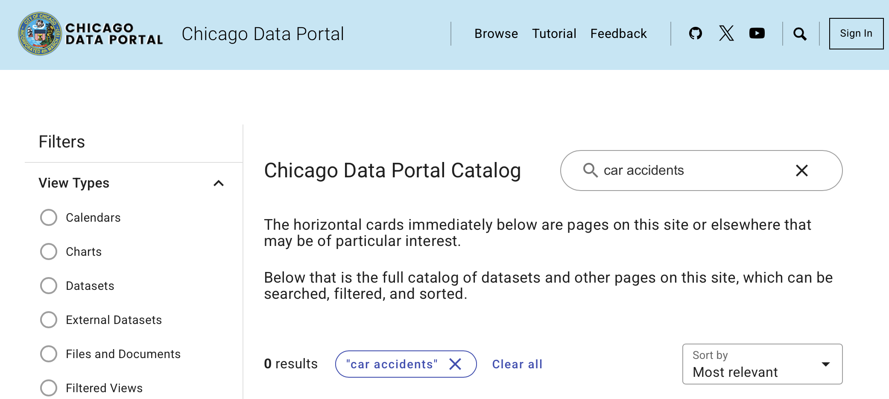
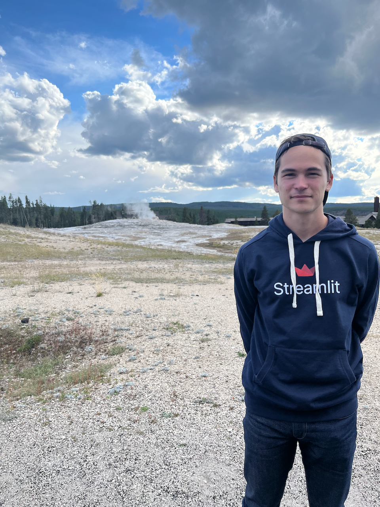

+++
title = "Streamlit Hackathon: Exploring Chicago Datasets"
subtitle = "I couldn't pass up an opportunity for some Streamlit swag!"
date = 2023-08-03
tags = ["streamlit", "hackathon", "information retrieval", "semantic search"]
draft = false
description = "Streamlit is hosting a hackathon to show off their new connections functionality. I built a simple app implementing semantic search to explore public datasets in the city of Chicago's Socrata open data platform."
+++

Streamlit is hosting the [Streamlit Connections hackathon](https://discuss.streamlit.io/t/connections-hackathon/47574).
As I've [previously mentioned](), I'm a big fan of Streamlit so I decided to enter.
The hackathon rules are:
* Use the new [`st.connection`](https://docs.streamlit.io/develop/api-reference/connections/st.connection) functionality to build a connection to any data source or API.
* Build a Streamlit app that showcases its functionality.

Pretty simple!
And everyone who enters gets a free Streamlit hoodie.
How could I pass that up!?

## Chicago Data Portal

I decided to connect to the [Chicago Data Portal](https://data.cityofchicago.org), which is accessible via the [Socrata API](https://dev.socrata.com).
I chose this connection for a few reasons:
1. I live in Chicago.
2. I already had some familiarity with the API (I previously used it to access [traffic crash data]()).
3. There are *a lot* of datasets available in the portal.
It feels like there's an opportunity to build something useful to improve data discoverability.

I decided to build an app that would help a user find relevant datasets in the Chicago Data Portal.

## Building the app

You can see the app I submitted here:
* [Live app](https://djcunningham0-connections-hackathon-socrata.streamlit.app) (this might break eventually)
* [Source code](https://github.com/djcunningham0/streamlit-connections-hackathon-socrata)

### Connecting to the Socrata API

The Streamlit connection functionality was pretty easy to use.
You create a class that inherits from a `BaseConnection` object, define simple methods for connecting to and querying an API or database, and you're good to go.
I got my Socrata connection working in a few minutes[^1].
You can see my implementation [here](https://github.com/djcunningham0/streamlit-connections-hackathon-socrata/blob/main/connections.py).

### Retrieving relevant datasets with semantic search

Like I mentioned earlier, there are a lot of datasets in the Chicago Data Portal—something like 800+.
I decided to implement **semantic search** to retrieve datasets that matched a user's query.

Semantic search is a modern information retrieval method that finds information based on semantic meaning rather than exact keywords.
It leverages language models that can embed text as numerical vectors.
When a user enters a query, you compare the embedded query to all embedded documents (in this case, "document" = description of a dataset) and return the documents with the highest similarity scores.
If the embeddings from the language model do a good job of capturing semantic meaning, you'll get relevant results.

Semantic search excels in some scenarios where traditional retrieval methods struggle, such as when there is no keyword match.
For example, a keyword search can't identify that a search for "car accidents" is related to "traffic crashes", but semantic search can.

<figure>

<figcaption>
    A keyword search for "car accidents" on the Chicago Data Portal returns no results...
</figcaption>
</figure>

<figure>

<figcaption>
    ... but a semantic search correctly finds "traffic crashes" datasets.
</figcaption>
</figure>

These days, implementing semantic search is easier than it might sound.
I chose to use the [SentenceTransformers Python library](https://sbert.net), which provides a convenient API for accessing a bunch of pretrained models suitable for creating embeddings[^2].
My semantic search implementation basically boils down to these few lines of code:

```python
from sentence_transformers import SentenceTransformer, util

### 1. Embed the corpus
datasets = ...  # retrieved with Socrata API
corpus = [
    f"title: {x['resource']['name']}; description: {x['resource']['description']}"
    for x in datasets
]

embedder = SentenceTransformer("all-MiniLM-L6-v2")
corpus_embeddings = embedder.encode(corpus, convert_to_tensor=True)

### 2. Embed the query
query = ...  # entered by user
query_embedding = embedder.encode(query, convert_to_tensor=True)

### 3. Retrieve the top ten results
cos_scores = util.cos_sim(query_embedding, corpus_embeddings)[0]
top_ten = cos_scores.argsort(descending=True)[:10]
```

It's pretty straightforward to implement that code in a Streamlit app where the user can enter a query.
The app returns the most relevant datasets to the query, shows the description of each dataset, and provides an option to see a preview of what the data looks like.
The Socrata connection is used to (1) retrieve the list of available datasets and (2) access a dataset when a user requests a preview.

---

That was my submission to the hackathon—go [check out my app](https://djcunningham0-connections-hackathon-socrata.streamlit.app)!
It has the semantic search functionality I described above, plus a few visualizations of some COVID-19 and speed camera datasets as examples of how you might use some of the data.
It was fun to build!

***UPDATE:*** I received my Streamlit swag!
They had some inventory issues that caused a delay, and to make up for it they sent me a hoodie *and* a tumbler.
Pretty cool!
Here's a bad photo of me wearing the hoodie:

<figure>

<figcaption>
    I look like a dork but I like the hoodie!
</figcaption>
</figure>


[^1]: I used the [sodapy](https://github.com/afeld/sodapy) package to interact with the Socrata API, which simplified my implementation.

[^2]: Specifically, these are pretrained *transformer* models, hence the name of the library.
Transformers are all the rage right now in the deep learning and AI community.
For an overview check out one of the many explainers online (like [this one](https://blogs.nvidia.com/blog/what-is-a-transformer-model/)), or if you're really motivated check out Google's landmark 2017 paper, [Attention Is All You Need](https://arxiv.org/pdf/1706.03762).
