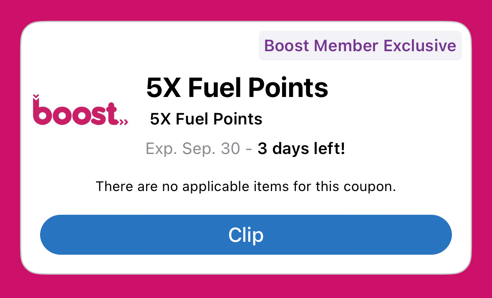

+++
title = "Should I Renew My Kroger Boost Membership?"
subtitle = "Running the numbers to see if it's worth it"
date = 2025-02-01
tags = ["data analysis", "money", "Kroger"]
draft = false
description = "My previous job gave me a free Kroger Boost membership. Now that membership is expiring. Is it worth renewing for $59?"
+++

I previously worked for Kroger[^1].
One of the benefits I received was a free year of Kroger Boost, which is Kroger's subscription plan that offers perks such as free grocery delivery, exclusive coupons, and extra fuel points.
But now my membership is about to expire and I'll have to pay full price if I want to renew.
It's $59 per year—is it worth it?

## Kroger Boost perks

First let's look at what you get with a Boost membership for $59/year:
* **Free grocery delivery.**
  I don't currently use grocery delivery and don't plan to start.
* **Exclusive coupons.**
  Usually in the form of digital coupons, which are easy to use in the Kroger app.
  Last year a decent number of the Boost-exclusive coupons were relevant to me, so I'll get some use out of this.
* **Discount on streaming services.**
  Free 6-month trial of Hulu, Disney+, or ESPN+.
  I don't use any of these services.
  Not interested.
* **2x fuel points.**
  Until recently fuel points were only redeemable for discounts on gas, but now you can use them for discounts on groceries.
  Boost effectively gives you 2% cash back, compared to 1% without the membership.

So two out of four perks are useful to me.

## My spending

The closest grocery store to me is Mariano's, the Kroger-owned Chicago chain, and I do most of my grocery shopping there.
Last year I spent about $5,500 on my Kroger card[^2].
Let's assume I will have similar spend this year.

## Is Boost worth it for me?

Let's run the numbers.
It'll require a few guesses and assumptions, but I'll try to be a little conservative.

#### Extra cash back

The easiest thing to estimate is how much extra cash back I'll get with a Boost membership; I'll get an extra 1% back on all purchases.
Let's assume that my spend this year is equal to last year.

> Spend $5,500 --> **$55 extra cash back**

Occasionally Kroger runs promotion where you get 2x (sometimes 3x or even 4x) points on certain products or your whole order.
With a Boost membership those promotions are typically doubled, so a 2x promotion would turn into 4x.
Let's assume these promotions run at a frequency such that 5% of my purchases get double points (the 5% is a guess, but I think it's on the conservative side).

> 5% of purchases get 2x points --> $5,500 x 5% x 1% --> **$3 extra cash back** (rounded to nearest $1)

<figure>

<figcaption>
    An example of a Boost-exclusive promo for extra fuel points.
</figcaption>
</figure>

An annoying feature of Kroger fuel points is that they're tied to the month of purchase and the minimum redeemable amount is 100 points (equivalent to $1).
If you have 1-99 points remaining at the end of the month, you forfeit those points.
However, while still a negative for the customer, this is actually a small hidden benefit of Boost.

Suppose you *don't* have Boost.
Each month there are two possible cases:
1. If you forfeit 0-49 points, you would instead forfeit 0-98 points with Boost.
   In this case Boost gives you exactly a 2x cash back benefit.
   E.g., if you get 540 points (redeemable for $5), you would get 1,080 ($10) with Boost.
2. If you forfeit 50-99 points, you would cross another 100-point threshold with Boost.
   In this case Boost gives you a *2x + $1* benefit.
   E.g., if you get 560 points (redeemable for $5), you would get 1,120 ($11) with Boost.

That means each month there's a 50% chance you'll get an extra $1 in addition to just doubling your non-Boost cash back.

> Extra $1 in 50% of months --> **$6 extra cash back**

That brings our total to $55 + $3 + $6 = **$64** extra cash back.
We're already coming out $5 ahead of the $59/year Boost membership.

#### Coupons

This one is harder to estimate accurately.
I didn't track how many Boost-exclusive coupons I used or how much money I saved with them last year.
But anecdotally, I think these coupons saved me a few dollars most months.
For example, I remember saving $3 on a bag of potatoes using a Boost-exclusive coupon.
Let's assume I'll save an extra $1-2 per month.

> $1-3 per month from Boost-exclusive coupons --> **$12-24**

Of course, the reason stores offer coupons is that they think you'll actually spend *more.*
If a coupon convinces you to buy something you wouldn't have otherwise bought, you're not actually saving money at all.
I try not to buy things *just* because I have a coupon, although I surely fall into that trap occasionally[^3].

#### Calculation summary

\[
\textbf{Estimated Annual Value of Kroger Boost (for me)}
\]

\[
\begin{aligned}
\text{Extra 1% cash back on \$5,500:} &\quad \$55 \\
\text{Bonus from doubled promos (5% of spend):} &\quad \$3 \\
\text{Monthly rounding benefit (50% chance of +\$1):} &\quad \$6 \\[3pt]
\textbf{Cash back subtotal:} &\quad \mathbf{\$64} \\[6pt]
\text{Boost-exclusive coupons:} &\quad \$12 \text{–} \$24 \\[3pt]
\textbf{Total estimated benefit:} &\quad \mathbf{\$76 \text{–} \$88} \\[6pt]
\text{Annual membership cost:} &\quad -\$59 \\[6pt]
\textbf{Net gain:} &\quad \mathbf{+\$17 \text{–} \$29}
\end{aligned}
\]

#### The verdict

**I decided to renew my Boost membership.**
According to my estimates, I'll net $17-29 with the membership.
For me that's enough to be worth it, although not overwhelmingly so.
If/when Kroger raises the cost of a Boost membership I'll have to reconsider[^4].

Your mileage may vary, of course.
By my calculations, the breakeven point for the extra cash back to pay for your membership is a little over $5,000 per year ($420/month)[^5].
If you spend at least that much at Kroger, Boost is worth it.
If you're slightly below that, the Boost-exclusive coupons *might* make it worth it.
I'd probably draw the line around $4,500 per year ($375/month).

The other main reason to sign up for Boost is if you already use Kroger delivery.
Boost is surely worth it if you regularly use delivery, as it removes the $7 delivery fee.
But beware: Kroger hopes Boost will encourage you to place more delivery orders because they think you'll spend more (trust me, I used to work there)[^6].
Just something to be mindful of!

---

## February 2026 update
My membership is up for renewal again.
It's now *$69 per year*, and Kroger recently removed the option to redeem fuel points for cash back on groceries (at least in my area).
I now get almost no value from Boost, so I am not renewing this year.

[^1]: Technically I worked for 84.51&deg;, a subsidiary of Kroger.

[^2]: My girlfriend also uses my Kroger card, so I'm including her (estimated) spending as well.

[^3]: Kroger's digital coupons (as opposed to paper coupons) help a bit.
I mindlessly clip a bunch of digital coupons, shop for the things I need, and if a coupon happens to match an item in my cart it's automatically applied.

[^4]: UPDATE: Sure enough, in April 2025 Kroger increased the price of a Boost membership from $59 to $69 per year.
Looks like I'll be running the numbers again next year.

[^5]: My calculations assume you'll redeem your points for cash back (1 cent per point) because that's how I use them.
But you can also redeem for gas discounts, which can make points more valuable.
You can redeem 1,000 points for $1/gallon up to 35 gallons, so the maximum possible value is 3.5 cents per point.
(Of course, if you have a 35-gallon tank you could save much more money by trading in that giant guzzler...)

[^6]: Kroger customers who use delivery (and pickup) tend to spend more.
They buy a larger percentage of their groceries at Kroger *and* they buy more products per order.
