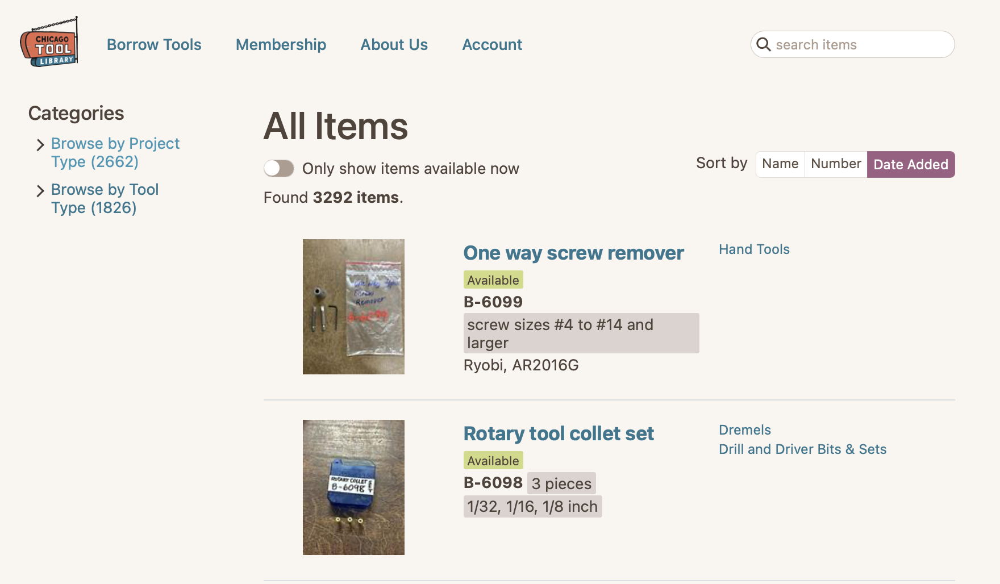
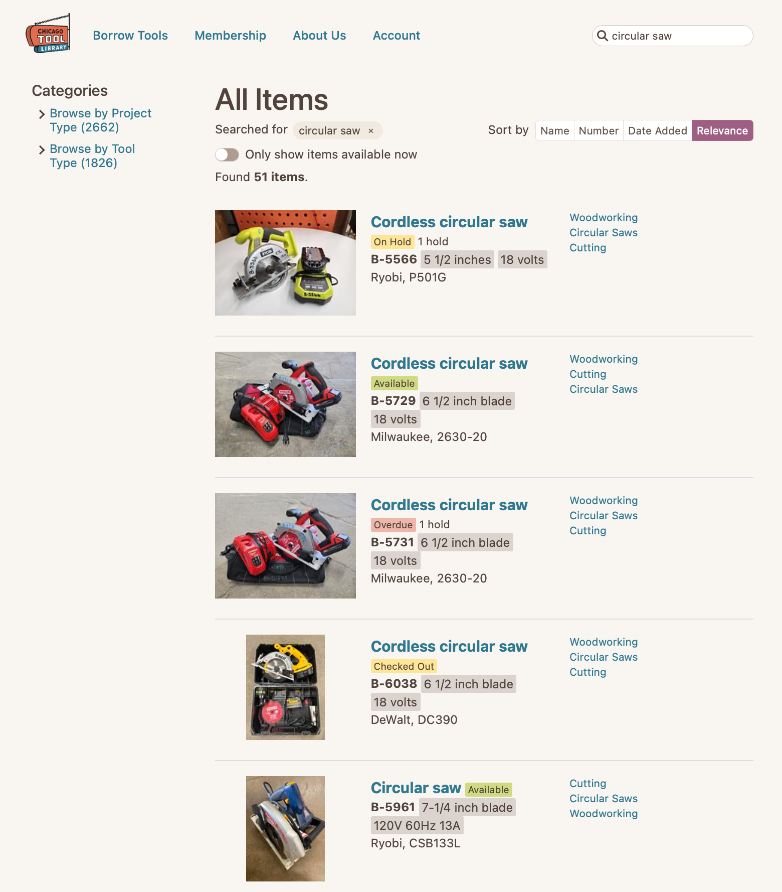
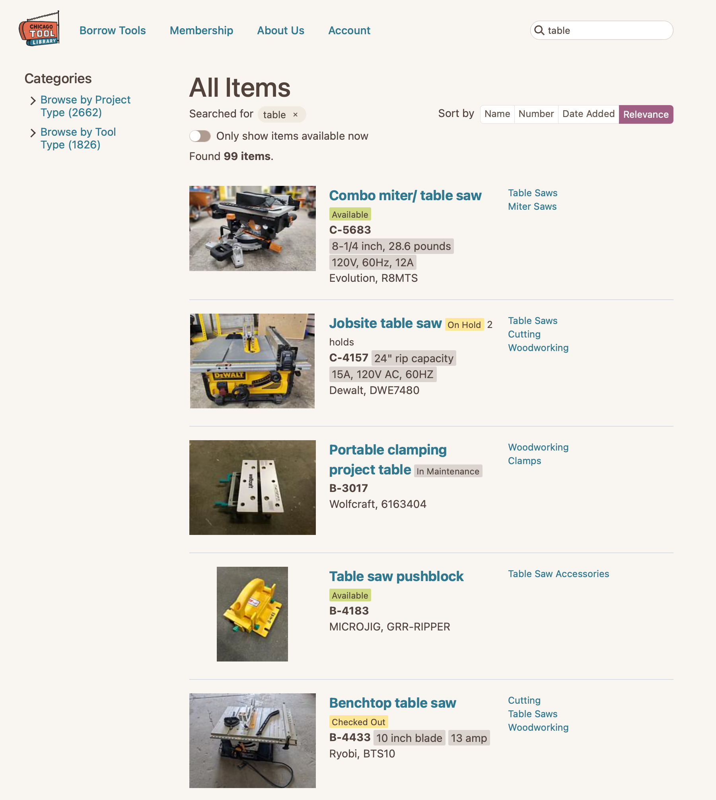
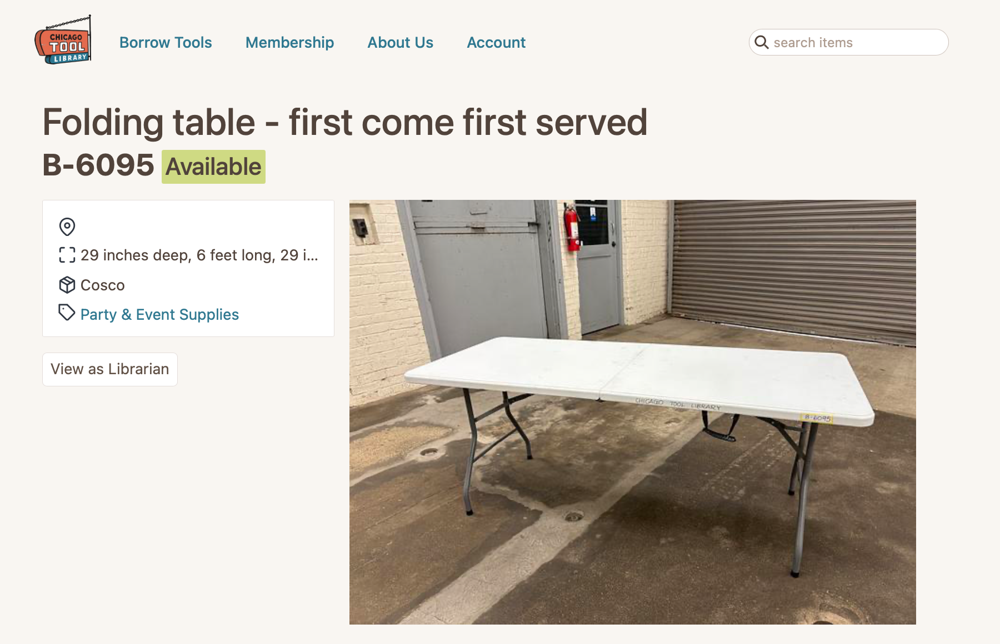
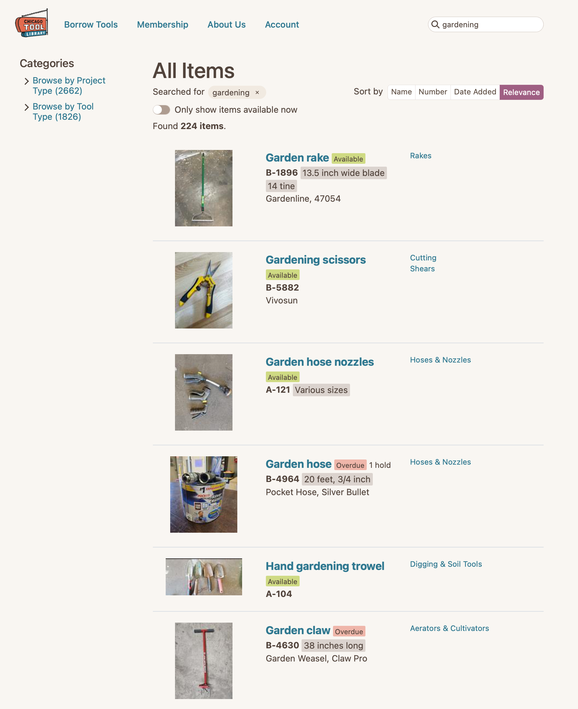
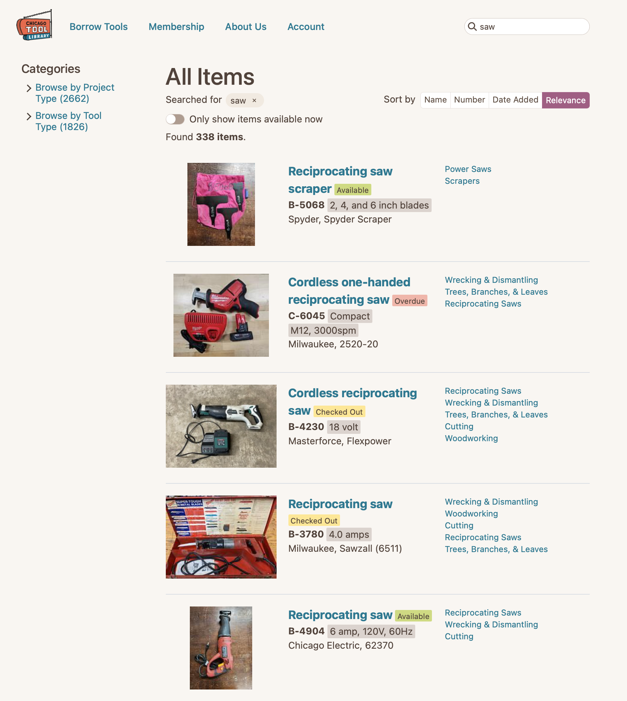
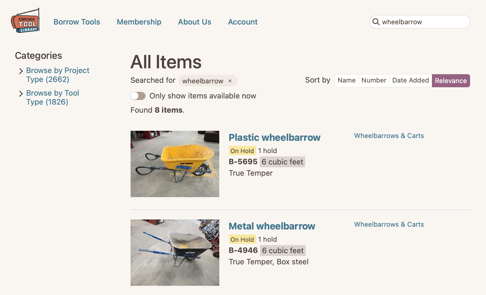
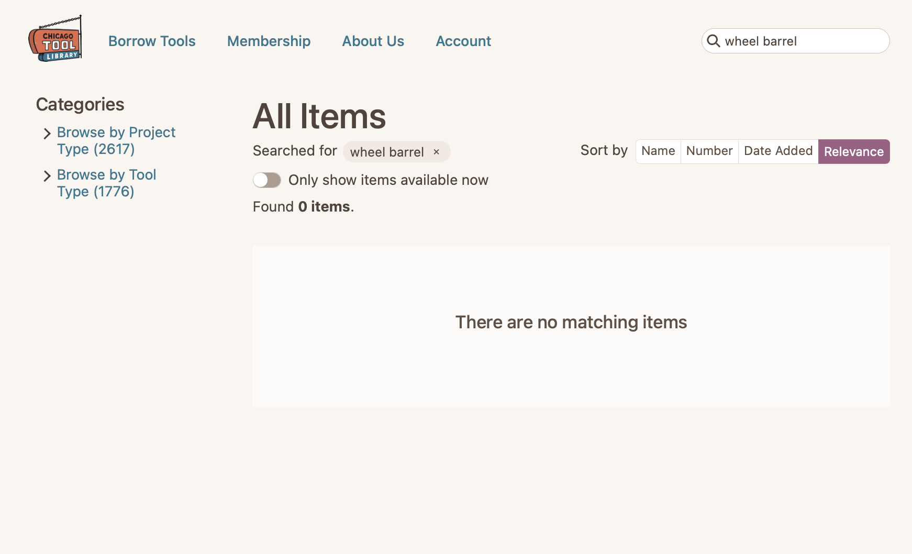

+++
title = "Tool Library Search Improvements: Part 1"
subtitle = "Identifying the problem(s)"
date = 2025-06-26
tags = ["data analysis", "information retrieval", "chicago tool library"]
draft = false
description = "An overview of the Chicago Tool Library's web app and common problems with its search functionality. Not talking solutions yet, just seeing what types of problems exist. Plus, some constraints and limitations of a volunteer project with a shoestring budget."
+++

For the past couple years I've volunteered with the [Chicago Tool Library](https://www.chicagotoollibrary.org), one of my favorite organizations in the city.
For the cost of a pay-what-you-want annual membership, you can freely borrow from the library's collection of thousands of tools.
Before I started volunteering I used the library as a member, borrowing a variety of tools for woodworking, bike maintenance, sewing, and more.
It's a great community resource.

I do most of my volunteering on the software side.
The tool library uses a homegrown software application called Circulate, originally developed by one of the library's founders and now maintained by a small but mighty team of volunteers.
Circulate lets members browse the library's inventory, reserve items, and schedule appointments, and it allows librarians to manage inventory and perform admin tasks.
You can check it out at [app.chicagotoollibrary.org](https://app.chicagotoollibrary.org/) (and if you live in Chicago, consider clicking the "Become a member" button 😊).


<figcaption>Inventory page from Circulate.</figcaption>

Circulate is written in Ruby on Rails, which is... not my forte.
Fortunately the software volunteer team has a few Ruby on Rails all-stars who have helped me learn (slowly).
I've made some small contributions to the codebase, but I've also looked for opportunities to apply my strengths.
One such opportunity was the search functionality in the app.

## Overview of Circulate search functionality

One of the main purposes of Circulate is to allow members to browse the library's inventory.
As such, the app includes a search box where users can search for tools by name.
For example, if I search for "circular saw" I get these results:


<figcaption>Search results for "circular saw". Looks pretty good!</figcaption>

Those results look pretty good!
The top five results are circular saws, so they're relevant to my search.
That's what we're hoping for.

We have a few goals for the tool library search functionality:
1. Retrieve all of the items that are relevant to the search term.
2. *Don't* retrieve any irrelevant items.
3. Rank the retrieved items in order of relevance, with the most relevant items listed first.

(To describe those goals in technical terms, we might say that goal 1 is high *recall*, goal 2 is high *precision*, and goal 3 is high quality *ranking*.)

## Challenges with search in Circulate

It's hard to achieve those goals, and Circulate often falls short of at least one of them.
We usually do pretty well with goal 1 (recall) but struggle with 2 and 3 (precision and ranking) in many cases.
These types of problems are, of course, not unique to the tool library.
Information retrieval is hard and it's nearly impossible to to get it perfectly right.

I've identified a few categories or themes of problems with the tool library's search functionality:

### Irrelevant results

This is the biggest, most important, and broadest category of search problems.
Sometimes a search returns results that aren't relevant.
Or, at least, the first few results are not relevant.

For example, these are the results when I search for "table":



Now, those results aren't *completely* terrible.
They all at least have "table" in the name.
But they're probably not what I'm looking for when I search for "table".
I'm much more likely looking for something like this:


<figcaption>Now that's what I call "table"!</figcaption>

The folding table should be the first result.
It's actually a table; the earlier results just include "table" as a descriptor in their names.
But this folding table appears *outside the top 10 results.*
That's not a great user experience—ideally I shouldn't need to scroll past irrelevant results to find what I'm looking for.

There are lots of similar examples.
For example, if I search "router" I get lots of results for router bits and router tables at the top of the results.
I don't see an actual router until the 22nd result!
*That's not even on the first page!*

Usually (but not always), this is more of a ranking problem than a retrieval problem in Circulate.
We *are* retrieving the most relevant items, but we're not correctly ranking them at the top of the results in some cases.

### Lack of diversity in results

In the context of a tool library, you might think about two different types of searches:[^1]
* **Specific searches:** searches for a specific tool, such as "circular saw"
* **General searches:** searches for a broader category of tool, such as "saw", which has several subcategories (circular saws, miter saws, hand saws, etc.)

In a specific search the objective is simple: return the specific tool the user searched for.
But in a general search, we probably want some *diversity* in the results.
We're not sure exactly what the user wants so we should return a variety of items near the top of the results.
(Of course, diversity isn't the only objective—the results still need to be relevant.)

Diversity is a bit of a mixed bag in Circulate.
For some searches, such as "gardening", the results are pretty diverse:


<figcaption>
    An example of good diversity.
    The first 6 results are all distinct items and they're all relevant to the query.
    (They're maybe not the *most* relevant items, but the diversity is good.)
</figcaption>

But the results for "saw" are a different story:


<figcaption>
    Not so good diversity.
    All of the top results are reciprocating saws.
    Where are the circular saws, miter saws, hand saws, and so on?
</figcaption>

Setting aside the fact that the first result is not very relevant (it's an accessory, not a saw), these results are just OK.
Reciprocating saws are relevant to the search, so it's good that we retrieved them.
However, lots of other types of saws are also relevant, and they're absent from the top of the results.
If a user happened be looking for a circular saw they'd have to scroll past a dozen or so reciprocating saws first.
Not a great user experience.
(In fact, circular saws are borrowed from the library more than twice as often as reciprocating saws, so this is both a diversity and relevance issue.)

### Typos and misspellings

Search in Circulate is not very robust to typos or misspellings.
For example, when you search for "wheelbarrow" you'll get several results:



But when you search for the common [eggcorn](https://www.merriam-webster.com/dictionary/eggcorn) "wheel barrel" you get no results:



Ideally, the search functionality figure out the intent of your search even if it was slighlty mispelled.

### Unavailable items

The previous problems are all very common problems in information retrieval.
This one is a bit more unique to the tool library use case.

As you've seen in the previous examples, many tools in the library have multiple copies.
The copies are not exactly identical (for example, they might be different brands), but they're the same type of tool.

When we have multiple copies of the same tool, it would make sense to show the "available" ones first.
That doesn't always happen.
For example:


Each of those carpet cleaners looks equally relevant, but only the 4th one is available to be borrowed right now.
That one should be ranked above the "checked out" and "in maintenance" ones.

This issue is less important than the previous ones mentioned.

## Search implementation in Circulate (pg_search)

Before we talk about fixing those problems, let's look at how the search functionality works.
Circulate uses a PostgreSQL database, and the search functionality uses PostgreSQL's built-in [full text search](https://www.postgresql.org/docs/current/textsearch.html) functionality.


Full text search is pretty cool!
The full details are way beyond the scope of this post, but basically full text search allows you to perform natural language queries on your database.
You give it a *query* (the thing you're searching for) and full text search will return the *documents* (the records in the database, which are tools in our use case) that best match that query.
To accomplish that, PostgreSQL applying some standard natural language processing techniques to both your query and documents.
For example, it uses [lemmatization](https://en.wikipedia.org/wiki/Lemmatization) (e.g., "walk", "walks", "walked", "walking" are all converted to "walk").


All of that is done using SQL queries with some built-in PostgreSQL functions, like `to_tsvector` and `to_tsquery`.
It's fairly difficult to write and understand those queries.
Fortunately, it's easy to implement PostgreSQL full text search in Ruby on Rails using the [`pg_search`](https://github.com/Casecommons/pg_search) gem.
We just add something like this to one of our models, and `pg_search` handles the rest:

```ruby
pg_search_scope :search_by_anything,
    against: {
        name: "A",
        number: "A",
        other_names: "B",
        brand: "C",
        plain_text_description: "C",
        size: "D",
        strength: "D"
    },
    using: {tsearch: {prefix: true, dictionary: "english"}}
```
<figcaption>Example search scope using the pg_search gem.</figcaption>

In that example, we're telling PostgreSQL to search across multiple columns (name, number, etc.) and that some columns are more important than others.
An "A" weight is more important than a "B" weight, and so on, so a match in the "name" column is more important than a match in the "brand" column.
That's some fairly straightforward configurability, it's somewhat limited (for example, you only have four discrete weights to choose from).

Here's how I'd sum up the pros and cons of PostgreSQL full text search:

Pros:
* Native to PostgreSQL
* Easy integration with Ruby on Rails via `pg_search` gem
* Performant
* Easy to get pretty good results out of the box

Cons:
* Not robust to typos (might be better if we enable [trigram search](https://github.com/Casecommons/pg_search?tab=readme-ov-file#trigram-trigram-search); more on that in a future post)
* Struggles with word order and semantic meaning (example: it fails to understand that "table" is semantically more similar to "folding table" than "table saw")

Somewhere in between:
* Configurability is decent but only gets you so far

In summary, **pg_search works pretty well for our needs but we're encountering some of its limitations.**
It's important for us to have something relatively simple and easy to maintain, but we'll need to do some tuning or find creative solutions to solve the problems we're encountering.

## Tool library limitations and constraints

Lastly, it's worth noting some of the real-world constraints at play.
In most of my professional experience, I've worked for large companies with huge budgets.
In that setting, any solution is potentially viable if you can prove it will drive value.

That is decidedly *not* the case with the tool library.
We're a nonprofit organization operating on a tight budget.
We currently pay less than $30 per month to deploy Circulate.
For context, it would cost $67 per month to add [Elasticsearch](https://elements.heroku.com/addons/foundelasticsearch) to our deployment[^2].
That might improve the quality of our search results, but we can't justify tripling our software budget when the current search implementation is already adequate.

---

Ok... this post has gotten pretty long, and we haven't even talked about what we're going to *do* about any of these issues.
Let's cover that in [Part 2]().


[^1]: "Specific" and "general" aren't meant to be rigorous definitions here.
It might be useful to create rigorous definitions so we can handle them differently in the software, but that would be a topic for another post.

[^2]: That's for the official Elasticsearch add-on in Heroku.
There are some cheaper alternatives that *might* be feasible for us, but I'm not sure.
