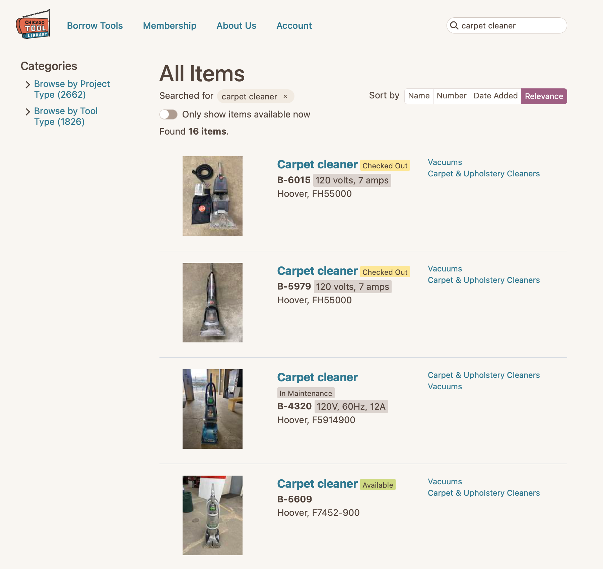
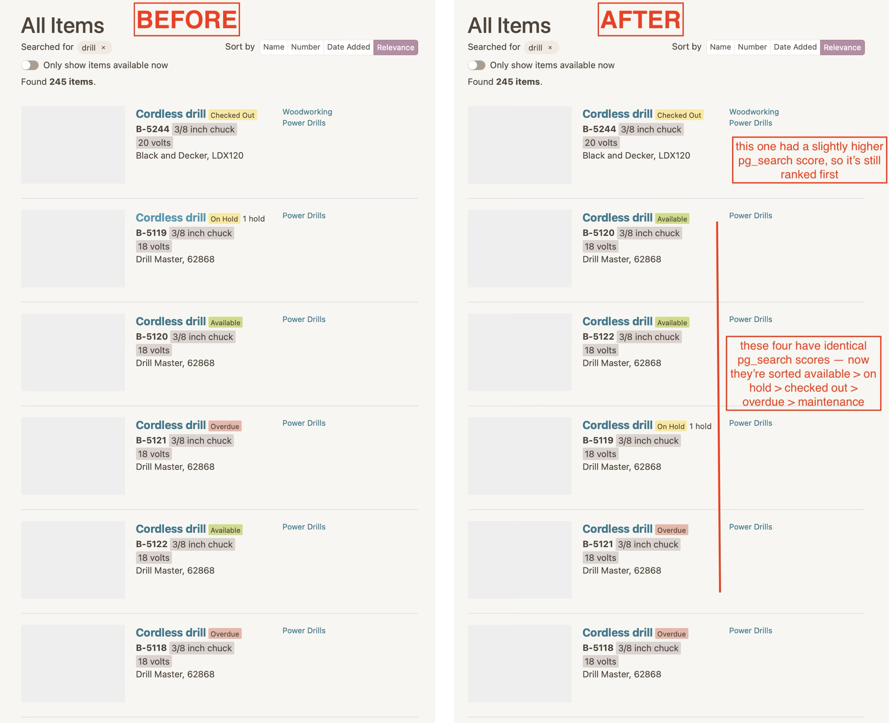

+++
title = "Tool Library Search Improvements: Part 2"
subtitle = "Quick wins"
date = 2025-09-02
tags = ["data analysis", "information retrieval", "chicago tool library"]
draft = false
description = """
  Now that we've identified some common problems, let's make the first steps toward solving them.
  First we'll focus on small, simple changes that will have an immediate impact.
"""
+++

In [Part 1]() we discussed the Chicago Tool Library's Circulate app and some of the common problems with its search functionality.
Now let's start discussing solutions.
The best way to start is by picking off some of the low hanging fruit.
These solutions won't be super quantitative, but the point is that they're easy to implement and clearly improve the user experience.

## Step 0: Collect data

I'm labeling this as Step 0 because it doesn't solve any problems on its own, but it will be foundational for other solutions later on.

Circulate originally didn't have any logging when users interacted with the website, which made it hard to analyze search performance.
If you want to improve search results, *you need to know what users are actually searching for.*

When we decided to attempt to improve search, one of the first things we did was add logging to the app.
We used a gem called [`ahoy`](https://github.com/ankane/ahoy) (what a fun name!) to add logging for two types of interactions:
* **Searches:** log the query, any filters applied, and number of results returned
* **Item views:** log the item ID, the referring URL (which includes the search term if it came from the search page), and the search result index

Logging searches will allow us to see what users search for most frequently, and the logging views will help us piece together which queries are returning relevant results and which ones are not.
Now that we're armed with data, we'll be able to focus and evaluate our efforts to make sure we're solving problems that users are actually facing.

## Quick Win 1: Queries with zero results

This one immediately follows from Step 0.
Now that we're logging search events, we can create a report to identify which search queries are returning zero results.
Most of those search queries fall into one of two cases:

**Case 1:** There really are no tools in the library that are relevant to the query.
One of the most common examples is "drum sander".
The tool library doesn't have one.
In this case, returning zero results is the correct behavior.
There's nothing super actionable for us here, but it can still be useful data to provide to the organization—it might help identify gaps in the inventory that we weren't aware of.

**Case 2:** There is a relevant tool but it wasn't retrieved.
This case is much more actionable.
Our current search actually has pretty good recall, so it's uncommon that we fail to retrieve a relevant tool.
However, **our current search implementation (pg_search) struggles with typos.**
It's common for a misspelled query to return zero results—see the "wheel barrel" example from Part 1.

The good news is the typo issue is easy to (partially) address.
In our database, we have a field where we store "other names" for items, which we frequently use to store synonyms or common typos.
To handle an individual typo, we just need to add, for example, "wheel barrel" in the list of other names for all of the wheelbarrows in the inventory.
That's not a very robust solution—it doesn't scale well to other search terms and it doesn't defend against other variations of the same term (e.g., "wheeel barrell")—but it's easy to implement for the most common typos[^1].

It's worth noting that there's a long list of low-volume zero-result queries, but we're not too worried about that long tail, at least not when looking for quick wins.

## Quick Win 2: Search by number

This could be grouped with the "zero search results" category, but it required some backend code changes to fix so I'm splitting it out separately.

Each tool in the library is assigned an identifier like `B-1234`.
Users can type that number into the search box in the Circulate app to pull up that tool (there are even physical signs in the library telling users about that functionality).
But at the time, that only worked if you searched for *only* the number—that is, you'd have to search for `1234`.
If you included the letter and searched for `B-1234` you would get zero results (and you'd probably be frustrated).

We saw occasional searches in the logs for tool numbers including the letter, so this seemed like a small problem worth fixing.
We made a small backend change and now you can get the same result by searching for any of `B-1234`, `B1234`, or `1234`.
(The change was small enough that I was able to write all of the Ruby code myself for this one 😅.)

## Quick Win 3: Ranking by availability

Another problem we identified was that unavailable (Checked Out, On Hold, In Maintenance) items were often ranked above available copies of identical items.
Recall this carpet cleaner example:


<figcaption>The "Available" one should be ranked first.</figcaption>

That's not a relevance issue, but it is a suboptimal user experience.
We should make it easy for the user to find tools that are relevant *and* available to be checked out.
This carpet cleaner example isn't too bad—the first available item is near the top of the list.
But for tools with many more copies or higher demand, such as cordless drills or sewing machines, the problem can be much worse.
You might see an entire page of unavailable items before you reach the first available one.

Here we can make another easy change to slightly improve the user experience.
When we perform a search in Circulate, `pg_search` calculates a relevance score for each retrieved item.
What happens when we have two identical[^2] items?
They'll have the same relevance score, so which one will be ranked first?
By default, `pg_search` breaks ties using the primary key.
In our case, that means if two items have the same relevance score, the one with the lower ID (a non-user facing number) will be ranked first.

That sounds like a quick win: **let's break ties using item status instead.**
We'll simply use item status as a second sorting criterion, so "Available" items will always be ranked above identical "On Hold" items, and so on.

This is, of course, just a partial fix.
We're only breaking ties for items with identical `pg_search` relevance scores.
An unavailable item will still be ranked above an available one if its score is a *tiny bit* higher, but it's a good start.


<figcaption>
  Search results for "drill" before and after using item status as a tiebreaker.
  The problem isn't fully solved, but now there are more available items near the top of the list.
  (Sorry about the missing thumbnails—this is from the dev environment.)
</figcaption>

## Quick Win 4: Boosting known relevant results

*Note: we haven't actually implemented this one yet.*

One more thing we've thought about doing is manually boosting the relevance scores of specific items for specific queries.
For example, in [Part 1]() I called out two examples of frequently searched terms with suboptimal results:
* "table" -> "folding table" should be the first result, but it's outside the top 10 (behind things like table saws)
* "router" -> "router" should be the first result, but it's outside the top 20 (behind things like router bits)

In each of those examples, we have a specific item (or a specific item description) that we want to boost to the top of the results, or at least boost higher than it naturally appears.
We've tried to solve these cases by tweaking some item descriptions and other metadata, but it hasn't worked.
So we've considered taking a more manual approach.

It would be straightforward to create and consume a configuration table like this:


```
| search term | item to boost | boost amount |
|-------------|---------------|--------------|
| table       | folding table |          1.5 |
| router      | router        |         1.75 |
| ...         | ...           |          ... |
```

<figcaption>
    Example of how we might configure targeted search result boosting.
    With this configuration, we could move specific results higher (or lower) for specific queries.
</figcaption>

With that configuration, we could easily target specific search terms that are known to have poor results.
It would be effective for simple examples like the ones I described, but there are pros and cons to this solution.

**Pros:**
* It would work for simple examples
* Easy to implement
* Can boost relevant results or suppress irrelevant results

**Cons:**
* Only works for known examples
* Relies on subjective judgement (who gets to decide whether a result is relevant?)
* Configuration must be manually maintained
* Not obvious *how* boosting should be applied

That last one—the boosting implementation—requires some discussion that we haven't had time for yet.
Do we multiply the `pg_search` relevance scores by some value?
Or should it be additive?
Or maybe hard code an exact relevance score?
Should we boost individual item IDs, or all items with the same name?
We haven't fully explored those options.

And also, **this solution might become irrelevant if we make more substantial changes.**
For example, we might be able to improve our `pg_search` functionality in a way that naturally resolves these individual issues.
Or if we move away from `pg_search` altogether, this type of boosting might not even be applicable.
So this one is on the back burner for now.

---

In summary, we:
* Started logging search data so we can identify issues and measure the effectiveness of solutions
* Implemented a few quick wins targeting some small and specific scenarios

In [Part 3]() we'll zoom back out and discuss how to quantify our search performance, which will set us up to make broader improvements.


[^1]: "Wheel barrel" was the 10th most common query to return zero results, so it was affecting a decent number of users.

[^2]: "Identical" in this case means they have the same, or very nearly the same, values for name, brand, description, and all other fields in the `pg_search` scope.