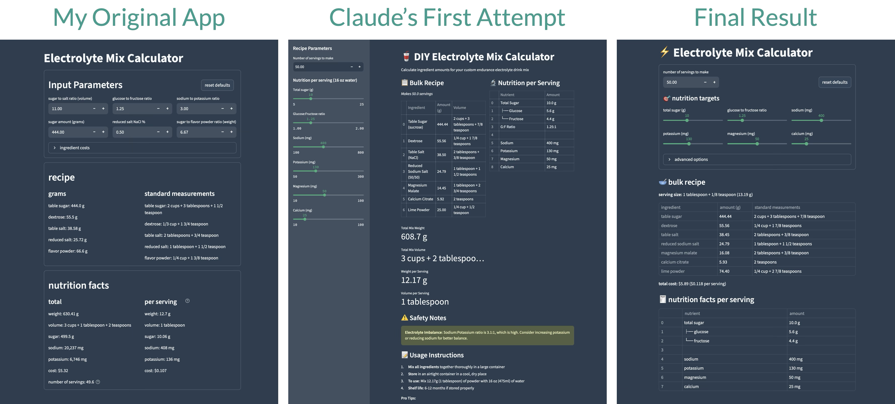

+++
title = "Vibe coding a web app"
subtitle = "How good are the latest and greatest LLM agents?"
date = 2025-09-20
tags = ["streamlit", "web apps", "ai", "llms"]
draft = false
description = "I built a simple Streamlit web app for a DIY electrolyte mix recipe. Embracing the \"vibe coding\" lifestyle, I decided to let a Claude agent do most of the work for me. Here's how it went. (Spoiler: pretty good but far from perfect)"
+++

Last year I made a recipe for a homemade electrolyte mix which I use for endurance exercise like runs, hikes, and bike rides.
It's a simple recipe I made to save money compared to commercial products.
You can read more about it on [my other blog](https://nicelittleadventures.com/diy-electrolyte-mix/).

I occasionally like to make small tweaks to the recipe or scale it up or down, so I also developed a simple [Streamlit](https://streamlit.io) app to help with that.
The app allows me to adjust some basic parameters—like the sodium content and how many servings to make—and it calculates how much of each ingredient I should use.

Recently I made a more substantial change to the recipe: I added sources of magnesium and calcium[^1].
My Streamlit app couldn't accommodate these new ingredients so it needed some updates.
But why do the work myself when LLM agents and "vibe coding" are all the rage right now?
Let's give that a shot!

## The task

I asked the LLM agent to build a Streamlit app from scratch.
It likely would have been faster to start with my existing app and ask it to modify it, but I wanted to see how well it would do writing all of the code itself (although later on I did show it a few bits of my original code to add some specific functionality).
I decided to use Anthropic's **Claude Sonnet**[^2] in agent mode.

Here's the prompt I gave it[^3]:

<div class="wrap-code scroll-code">

```
I'm making a DIY electrolyte mix for endurance exercise (running, cycling, hiking). I'm planning to make a mix with approximately the following nutrition information per serving (will be mixed with 16 oz of water):
10 g sugar
400 mg sodium
130 mg potassium
50 mg magnesium
25 mg calcium

I plan to use the following ingredients:
* Table sugar
* Dextrose (to tune the glucose-to-fructose ratio; I plan to target a 1.25:1 ratio)
* Table salt
* Reduced sodium salt (50/50 NaCl and KCl)
* Magnesium malate powder
* Calcium citrate powder
* Lime powder for flavor

First, does that list of ingredients and target nutrition seem reasonable?

Second, can you help me figure out the recipe, i.e., how much of each ingredient to mix? I would like to mix it in bulk and portion it out at time of use.

I also want to be able to adjust the following parameters:
* Glucose-to-fructose ratio: default to 1.25, but allow anything from 1 to 2
* Amount of each element per serving, either through raw amounts or ratios (e.g., sugar to salt ratio, sodium to potassium ratio, etc.)

I think it would be useful to have a simple app that calculates the recipe based on the input parameters. Please develop a Streamlit app using Python that allows the user to enter the relevant parameters (using sensible defaults) and outputs a recipe for a bulk mix (e.g.,. 200 g sugar, 25 g dextrose, 17 g salt, ...)
```

</div>

## My workflow

Try as I might, I couldn't fully embrace full-on vibe coding, where you let the LLM agent make all of the changes and you never write a line of code yourself.
Instead, I settled into this loose workflow which seemed to work pretty well:
1. **Ask the LLM agent to do one thing.**
For example, "build an app that does *X*" or "add a feature that does *Y*".
I tried to avoid asking for multiple "things" at once.
2. **Verify that the new functionality works.**
If it doesn't, explain what isn't working and ask the agent to try again.
(It usually worked on the first try.)
3. **Make some minor tweaks myself.**
For example, I might rearrange some UI elements.
4. **Repeat.**

## The results

Overall the LLM agent was **very impressive.**
I was able to build the app faster, and the final product is at least as good as what I would have produced on my own.
That said, it was far from perfect and there are some pitfalls to watch out for.

Before I give my more detailed thoughts, here's where you can check out the app:
* Hosted on Streamlit cloud: https://nicelittleelectrolytemix.streamlit.app/
* Source code on GitHub: https://github.com/djcunningham0/diy-electrolyte-mix

### The good

**It's fun!**
This might be the best reason to check out LLM agents for yourself.
It's cool new tech and it's fun to build things!

**It built a good prototype in one shot.**
Claude produced an app that did everything I asked for.
All UI elements were functional and the app worked as expected (at least on a surface level).
Pretty awesome for just a few minutes of work!

**Adding new features is a breeze.**
I'd give Claude a 2-3 sentence summary of something I wanted to add or change, and it usually got the core functionality right on the first shot.
That allowed me to add new features much faster than I could have on my own.
For example, adding new ingredients for magnesium and calcium took just a few minutes, including all code and UI changes.

**It helps with design choices.**
An LLM is far more than a code autocomplete tool—it can give you ideas you might not have thought of on your own.
For example, in my original app I parametrized the inputs in a way that probably only felt intuitive to me (one such parameter was a "sugar-to-salt ratio").
Claude parametrized the inputs much more intuitively: you enter your target nutritional values per serving (10g sugar, 400mg sodium, and so on).
That parametrization made the app easier to use *and* it made the code easier to understand.
There were other cases where I preferred my own design decisions to Claude's, but that's fine—it was useful to see multiple possible implementations so I could choose the best one.

<figure>

<figcaption>
    Evolution of the Streamlit app.
    The design of the final app clearly combines elements from both earlier versions.
    It felt like a collaboration with Claude.
</figcaption>
</figure>


### The bad

*Note: I don't think any of these shortcomings are unique to Claude.
I've seen the same behaviors from every LLM I've used.*

**‼️ It made some critical mistakes.**
Not in terms of errors in the code—the code ran fine.
But it used some incorrect information and implemented some of the logic incorrectly.
My use case isn't exactly rocket science, but you must do quite a few things[^4] correctly to arrive at the correct recipe.
If there's a mistake anywhere along the way, the final recipe will be incorrect.
That's potentially dangerous!

And Claude *did* make mistakes.
Several times!
*Confidently!*

After Claude created the app from my initial prompt, I asked it to double check that the nutrition facts looked correct.
And it immediately found mistakes in several calculations!
Claude easily fixed those, then assured me everything was good when I asked it to "please double and triple check".
But after I prodded it a few more times, it found one more mistake in the molecular weights!
You can see my conversation [here](https://claude.ai/share/36085f80-0396-47cd-a361-500eb049f981).

It's worth noting that I had previously calculated the recipe manually so I always knew whether the result Claude gave me was right or wrong.
But otherwise it would have been very easy to miss those mistakes!

**It's reluctant to refactor existing code.**
Instead, it strongly prefers adding to what's already there.
After a few iterations your codebase starts to become pretty large.
If you let it run wild you'll definitely have maintenance headaches in your future.
This is why I settled into the "ask, verify, tweak, repeat" workflow—a lot of the tweaks I made were refactors to simplify or consolidate the code.

**It's too verbose.**
LLMs use too many code comments, and they love `try-except` blocks[^5].
Sometimes they add useless comments like "this calculation has been corrected".
And they tend to comment every few lines explaining each tiny code block.
These behaviors are *somewhat* useful in normal LLM mode where the goal is to answer the user's question, but they're annoying in agent mode where you're building a real codebase.


# Conclusion

LLM agents are cool!
They're nowhere near the level of working independently or replacing humans, but they're definitely useful.
The best description I've seen is [tools in a loop to achieve a goal](https://simonwillison.net/2025/Sep/18/agents/).

My experience does highlight the dangers of relying too much on LLMs.
They're prone to mistakes in logic and assumptions (as are humans), so it's risky to trust the output from an LLM agent without validating it yourself.
For that reason, I can't recommend a pure "vibe coding" workflow.
It's still important to know how to read and write code, and I'd recommend a "trust but verify" approach.

In my opinion, their utility far outweighs their limitations, so I'll surely use LLM agents again in the future!


[^1]: My original recipe only had sodium and potassium for electrolytes (and sugar for energy).
Sodium is the most important to include in an electrolyte mix, followed by potassium.
Magnesium and calcium also matter for muscle function, but you don't lose as much of them in sweat so they're much less important to include in an electrolyte mix.

[^2]: I don't think the exact choice of model mattered very much.
I was curious to try Claude because I hadn't used it much and one of my coworkers had recently said that he liked it.
I expect any of the other popular models that offer "agent mode" would produce very similar results.

[^3]: You might notice that I didn't include the new ingredients (magnesium and calcium) in my prompt.
I decided to have Claude recreate my original recipe first, then I'd ask it to make changes later.

[^4]: Including but not limited to: use correct molecular weights; use correct molecular formulas; calculate correct ingredient amounts (nontrivial since some ingredients contribute multiple minerals); use correct densities of each ingredient; calculate correct volumes; and validate that nutrition facts match targets.

[^5]: There is of course nothing wrong with `try-except` blocks, but they cause code bloat when overused for things like input validation.
For simple, non-production-grade apps they're usually not necessary.