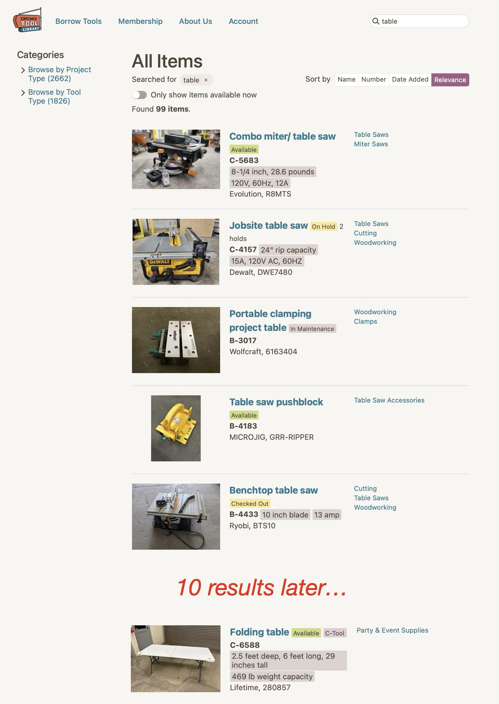
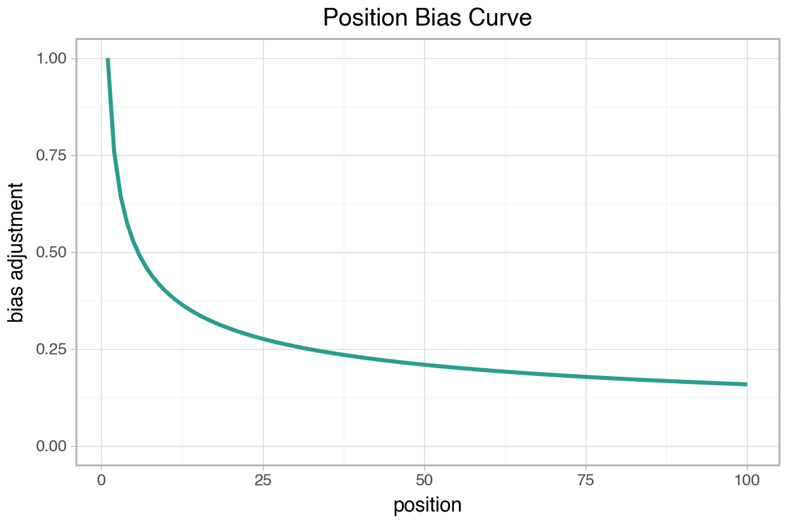
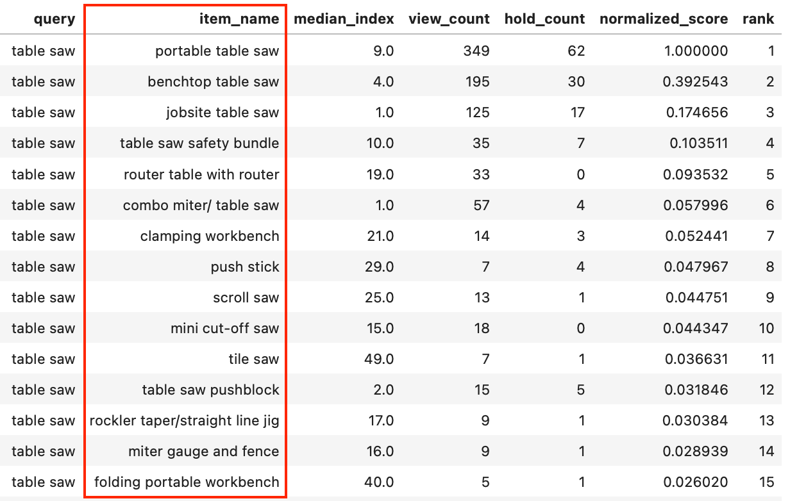

+++
title = "Tool Library Search Improvements: Part 3"
subtitle = "Quantifying the problem"
date = 2025-11-16
tags = ["data analysis", "information retrieval", "chicago tool library"]
draft = false
description = """
  Subjective analysis can only take us so far.
  Let's attempt to quantify search performance so we can measure whether our solutions are working.
  In this post, I describe methodology to infer the relevant items for each query and the quality of search results.
"""
+++

In [Part 2]() we made some small improvements to the Chicago Tool Library's search functionality.
For example, we fixed a few cases where the search previously returned no results.
Small, targeted changes like those are a useful first step, but it's not viable to make large-scale improvements that way.
We'll need a more robust approach.

So far we've relied on subjective evaluation of search results—i.e., using our judgement to decide whether the results of a query are good or bad.
Subjective evaluation is useful but not scalable.
We'll never be able to look through the results for *all* queries, especially when we start exploring different search implementations.
In order to make broader improvements, we'll need a way to evaluate search results objectively and quantitatively.

In this post, I'll propose some methodology for performing that quantitative evaluation.
You can also view [this Jupyter notebook](https://github.com/djcunningham0/ctl_search/blob/main/relevant_items.ipynb) where I demonstrate the methodology.

## Evaluating search results with NDCG

Fortunately, search result relevance is a well-studied information retrieval topic, and there are a handful of common metrics for evaluating search results.
Generally, relevance evaluation works like this: compare the ***retrieved items*** (the results from your search) to the set of ***relevant items*** (all items that are relevant to the query, whether they were returned by the search or not), and compute a value indicating whether the search returned the correct results and/or ordered them correctly.

My preferred relevance metric is normalized discounted cumulative gain (NDCG).
I won't go through the calculation details (the [Wikipedia page](https://en.wikipedia.org/wiki/Discounted_cumulative_gain) gives a decent overview), but NDCG has the following attributes:
* **Relevance *and* order:** NDCG evaluates whether the most relevant items were returned *and* whether they were ranked in order of relevance.
* **Emphasis on top results:** NDCG applies a harsher penalty to errors near the top of the list.
* **Graded relevance:** NDCG naturally handles multiple levels of relevance (e.g., highly relevant, somewhat relevant, not relevant).
  Some other metrics only allow for binary labels (relevant/not relevant).
* **Comparable across queries:** NDCG produces a score between 0 and 1 for each query, where 1 means all relevant items were retrieved and ranked in the correct order.
  We can average a set of query-level values to get an overall NDCG score.

In practice, it usually makes sense to measure ***NDCG@k*** rather than full NDCG.
NDCG@k only considers the first *k* retrieved items, which reflects how people actually interact with search results: if the top results aren't relevant, the user will likely try a different query rather than scrolling all the way through the list.

This seems like a perfect fit for our tool library use case.
Our goal is to return the most important results at the top of the list, and we definitely have different levels of relevance[^1].

Great!
We know how to evaluate and quantify our search quality.
There's just one huge piece missing... *how do we know which items are relevant for each query?*

## Inferring the relevant items for each query

One of the inputs to NDCG is the set of relevant items and their relevance scores for each query.
We don't know the list of relevant items for every query—if we did, we'd already have perfect search functionality!

So we'll need to infer relevance somehow.
One signal for relevance is user behavior: which results do people click on after performing a search?
Recall, in [Part 2 (Step 0)]() we started logging some search data.
Specifically, for each search we collect the following information:
* The query (or search term) that the user entered
* Which item(s) the user viewed (clicked) in the results
* If an item was viewed, the item's position in the search results
* If an item was viewed, did the user place a hold on it?

Now it's time to make use of that data!
For each query, we'll assume that the items users interact with the most (through views and holds, with holds treated as a stronger signal) are the most relevant results for that query.
We can write a simple SQL query to create those relevance rankings for each search term.

We *could* stop here and use those simple relevance rankings to calculate NDCG, but we should probably make some further refinements.

### Adjusting for position bias

A common challenge in evaluating search results is *position bias:* users are much more likely to click on results at the top of the list, even if there are more relevant results farther down.
Users might not even scroll far enough to see the results beyond the first few items.
For example: when's the last time you looked beyond the first page of Google search results?

The upshot is that highly relevant items might not get many clicks if they are buried in the results.
Therefore, raw click count does not necessarily produce an accurate relevance ranking.

This problem is definitely relevant for the tool library.
We know a lot of search results are poorly ranked, with highly relevant items appearing too far down in the results.
For example, recall the ["table" example from Part 1]():

<figcaption>
  "Folding table" is the most relevant item, but it's less likely to be clicked (or even seen) because it's so far down in the results.
</figcaption>

How should we address position bias when inferring which items are relevant?
One option is, when counting views and holds to calculate relevance scores, to apply extra weight if the item was far down in the list.
A click on a result far down in the list is an *extra strong signal* that it's relevant to the query.

There are many ways we could make that adjustment.
I made the position bias adjustment using the following curve:

**Interpreting the curve:** The y-value estimates (roughly) how likely the result at a given position is to be seen by the user.
We'll scale relevance scores by the reciprocal of the y-value.
For example, the curve estimates that an item at position 25 has a ~25% chance of being seen.
If the user clicks it, we'll scale the relevance score for that click by 4.

This curve is not particularly scientific and is not derived from empirical data.
I just parametrized it in a way that gave good subjective results for some high-volume queries.
We could argue about the exact shape of the position bias curve, but I'd say this curve is good enough—it's more important that we do *something* to address position bias than to do it perfectly.

### One big flaw

There's one big flaw in the methodology for identifying relevant items: it can only find items *if they are included in the search results.*
If there's a relevant item that isn't currently returned by the search, then users will never be able to click on it and we'll calculate a relevance score of zero.

I don't think this is a huge problem in our use case.
The tool library's searches tend to struggle more with precision and ranking than recall—in other words, we usually return all relevant items, but sometimes they're buried below irrelevant results.

## Tying it together: using relevance scores to calculate NDCG

Now we have a pretty straightforward way to infer the most relevant items for a given query:
1. Look at all historical searches for the query
2. Count the views and holds placed for each item from the search results
3. Adjust for position bias
4. Order by relevance score

And it seems to work pretty well.
I reviewed the output for some high-volume queries and the results are sensible.
For example, here's the inferred list of relevant items for "table saw":

<figcaption>
  Relevance scores the "table saw" query.
  The top three items are clearly the most relevant.
  Some of the top search results for this query (e.g., "table saw pushblock" with median position 2) are not very relevant according to this methodology.
</figcaption>

Now it's straightforward to use those relevance scores (the `normalized_score` column from the table above) to calculate NDCG.
For each search result from a query, we pass in its relevance score (or 0 if it has no score) and perform the NDCG calculation[^2].

The next step is to use this evaluation methodology to optimize our search performance.
We'll pick that up in Part 4 by tuning our search settings and measuring the impact across a set of high-volume queries.

[^1]: An example of relevance levels: if I search for "drill", the results should include both "cordless drill" and "drill bits".
Both are relevant, but clearly "cordless drill" is *more* relevant.

[^2]: For what it's worth, with our current search implementation "table saw" has an NDCG@1 of 0.06 (very bad) and an NDCG@5 of 0.54 (decent).
That's an indication that the first search result is not very relevant, but some of the other top results are more relevant.