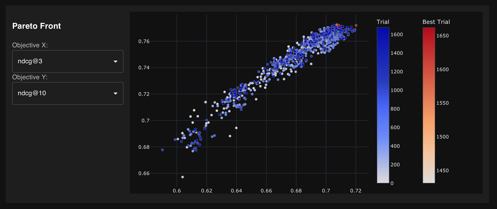
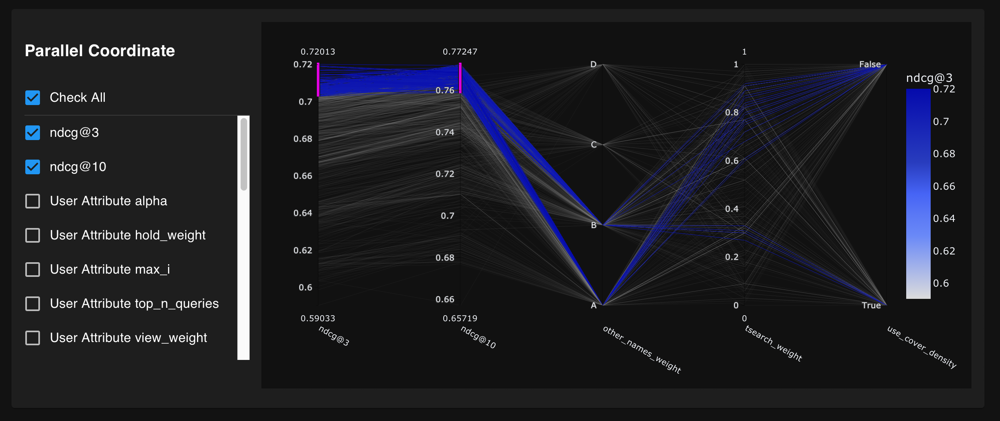
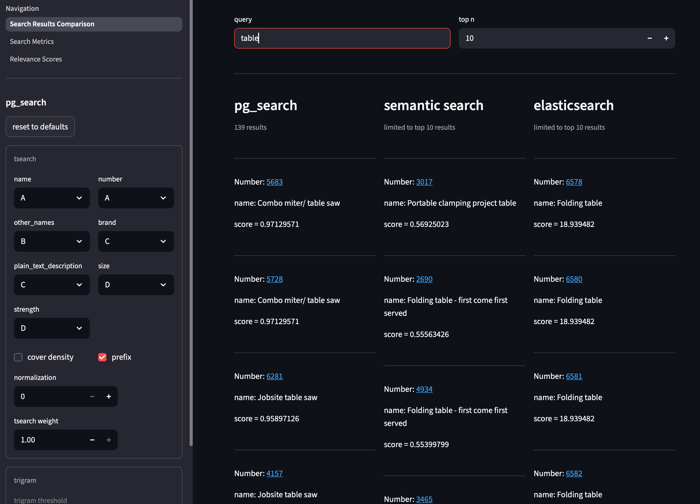
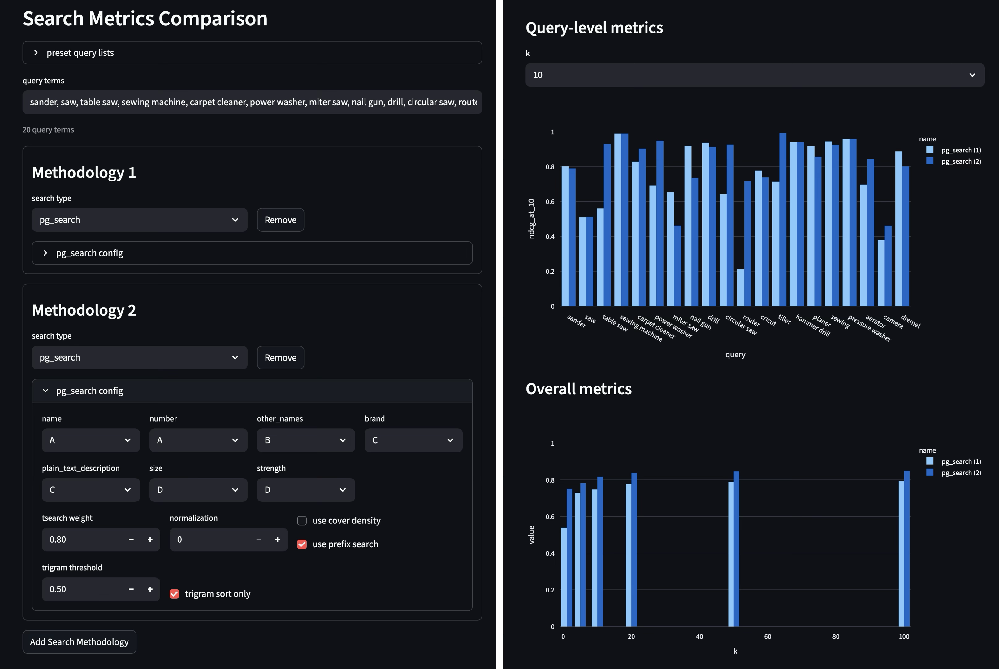

+++
title = "Tool Library Search Improvements: Part 4"
subtitle = "Tuning the search implementation for optimal performance"
date = 2025-12-01
tags = ["data analysis", "information retrieval", "chicago tool library"]
draft = false
description = """
  Let's (finally) make some broad changes to the tool library's search configuration.
  We'll add some components and tune some parameters, then choose the combination that yields the best results.
"""
+++

We're finally ready to make substantial improvements!
Until now, we've been limited to making small, targeted improvements to the tool library's search behavior.
It's been too risky to make sweeping changes because we've had no way of evaluating the impact of those changes across a large number of queries.

But in [Part 3](), we developed methodology for quantitatively evaluating search performance.
Now we'll leverage that methodology to find the search configuration that achieves the best results.

## Overview of available options

In order to keep things tractable, we'll focus on optimizing the performance of our current PostgreSQL full text search implementation--we won't explore brand new methodologies (yet).
Specifically, we're using the `pg_search` Ruby gem (see [Part 1]() for more details), which is implemented like this:

```ruby
pg_search_scope :search_by_anything,
  against: {
    name: "A",
    number: "A",
    other_names: "B",
    brand: "C",
    plain_text_description: "C",
    size: "D",
    strength: "D"
  },
  using: {tsearch: {prefix: true, dictionary: "english"}}
```
<figcaption>Our current `pg_search` configuration.</figcaption>

The `pg_search` [documentation](https://github.com/Casecommons/pg_search?tab=readme-ov-file) shows quite a few configuration options we're not currently using.
Most importantly, we can add additional techniques.
**Trigram search** (or trigram matching) is the most promising for our use case[^1].
It calculates similarity between two words by counting the number of three-letter sequences (called trigrams) that they share.

```
sander -> [s, sa, san, and, nde, der, er, r]
sandpaper -> [s, sa, san, and, ndp, dpa, pap, ape, per, er, r]
--> 13 distinct trigrams, 6 shared
--> similarity = 6 / 13 = 0.46
```
<figcaption>
    An example of trigram similarity with medium similarity.
</figcaption>

One advantage of trigram search is that it naturally handles some typos and misspellings.
If I make a typo and search for "hamer", a trigram search will return results for "hammer" because it has high trigram similarity with my query.

On its own, trigram search isn't sufficient—full text search usually does a better job retrieving and ranking results.
But **`pg_search` allows us to combine multiple search techniques** for retrieval and/or ranking.
Perhaps a combination of full text search and trigram search will outperform either of them on their own?

### The set of parameters we'll tune

After a bit of research and exploration, I decided to tune the following parameters.

**Full text search (tsearch):**
* **Weights** (A, B, C, or D) for each of the 7 columns included in the search
* **`prefix` parameter:** if true, return results for partial words (e.g., "tabl" would return results for "table")
* **Ranking function:** full text search has "standard" and "cover density" options for calculating relevance.
Cover density considers the proximity of matching lexemes[^2] (see [docs](https://www.postgresql.org/docs/current/textsearch-controls.html#TEXTSEARCH-RANKING) for details).

**Trigram:**
* **`threshold` parameter:** retrieve items with a trigram similarity greater than this value
* **`sort_only` parameter:** if false, use trigram search to retrieve additional items not returned by tsearch; otherwise, only use trigram scores for ranking

**Shared:**
* **tsearch weight:** use a weighted average of the tsearch score and the trigram score to rank results by relevance; this parameter will define what percentage of the weighted average comes from tsearch

(*Note:* I also restricted trigram search to only look at the "name" field.
It did not perform well when allowed to look at all of the same columns as tsearch.)

## Implementing the parameter space

Now the plan is to iterate through a bunch of combinations of those parameters and evaluate our evaluation metric (NDCG) for each combination.

The `pg_search` Ruby code is just executing a PostgreSQL query under the hood.
Instead of modifying the Ruby code in the tool library app, we can execute a SQL query on the database:

```sql
SELECT *,
  ts_rank(
    setweight(to_tsvector('english', coalesce(name, '')), 'A') ||
    -- ... other columns
    setweight(to_tsvector('english', coalesce(strength, '')), 'D'),
    to_tsquery('english', '<QUERY>:*')
  ) AS rank
FROM items
WHERE
  (setweight(to_tsvector('english', coalesce(name, '')), 'A') ||
   -- ... other columns
   setweight(to_tsvector('english', coalesce(strength, '')), 'D')
  ) @@ to_tsquery('english', '<QUERY>:*')  -- :* enables prefix search
ORDER BY rank DESC
```
<figcaption>
    This PostgreSQL query is equivalent to our Ruby `pg_search_scope` definition above.
    It looks uglier, but it'll be easier to work with.
</figcaption>

Each additional parameter, including adding trigram search, involves adding to or modifying parts of that query.
I wrote a Python function to construct and execute the query for any possible combination of parameters ([here](https://github.com/djcunningham0/ctl_search/blob/9f839e56452a6bd7d2e52b21d3fde637fe8bad0f/app/sql.py#L44-L128)).

Another benefit to using Python is that we can integrate with some helpful tools for the next step.

## Executing the parameter search

Next we need to evaluate a bunch of parameter combinations to see which gives the best results.
This is conceptually very similar to hyperparameter tuning in machine learning, so we'll treat it as such.

Our parameter space is too large for an exhaustive search over all possible combinations, so we'll need a more efficient option.
One approach is a random search, but I often prefer to use an optimization approach.

My preferred hyperparameter optimization tool is [Optuna](https://github.com/optuna/optuna), an automatic hyperparameter optimization framework.
Optuna balances *exploration* and *exploitation*: it explores the full parameter space, but learns from previous trials and spends more time exploring promising regions.
I like Optuna compared to similar libraries for its friendly syntax, multi-objective support, and built-in visualizations[^3].

You can see the script I used to optimize the tool library `pg_search` parameters [on GitHub](https://github.com/djcunningham0/ctl_search/blob/main/tune_pg_search.py), and I'll discuss some of the details below.

### Defining the objective function

An important part of any parameter optimization is defining the *objective function* that you want to maximize (or minimize).
Since Optuna can perform multi-objective optimization, I chose to define an objective function that maximizes two metrics:
* **NDCG@3:** measure whether the most relevant items appear at the very top of the list
* **NDCG@10:** measure whether the first page of results contains relevant items

These two *k* values each capture an important aspect of good search results for the tool library use case.

### Choosing a subset of queries

We also need to decide which subset of queries to evaluate in our NDCG calculation.
It's not feasible to include *every* query we've ever seen.
Even if we could, we should focus our efforts on high-volume queries anyway—those queries have the biggest impact on user experience.

With that in mind, I chose to evaluate on two subsets: the top 100 and top 50 most frequent queries in the historical search logs.

## Evaluating the results

I let my hyperparameter script run for a couple hours, then came back to evaluate and understand the results.
The bottom line is we **achieved our goal and improved NDCG** for our search results.

**Current configuration:**
* NDCG@3 = 0.63
* NDCG@10 = 0.71

**Best solutions:**
* NDCG@3 = 0.72 **(+0.09)**
* NDCG@10 = 0.77 **(+0.06)**

Let's dive a little deeper to make sure the results stand up to some scrutiny.

### Optuna dashboard

As I mentioned, one of the benefits of Optuna is the built-in visualizations.
I didn't do any extra work to generate the following charts; I simply ran the Optuna dashboard.

Since we performed a multi-objective optimization (maximizing more than one metric), Optuna finds the Pareto frontier.
Any solution on the Pareto frontier could be chosen as optimal, depending on which objective you want to prioritize.

<figure>

<figcaption>
    A scatter chart showing each trial's performance on both objectives.
    The red points fall on the Pareto frontier.
</figcaption>
</figure>

Another useful visual is the parallel coordinate chart.
This one can help uncover insights about which combinations of parameters tend to produce good results.
In our case (see the chart below), we can see the following relationships:
* The weight for the `other_names` column needs to be high (either A or B) to achieve good results
* Either value of `cover_density` (true or false) can produce good results, but it must be paired with a compatible value of `tsearch_weight`

<figure>

<figcaption>
    Parallel coordinate chart from the Optuna dashboard.
</figcaption>
</figure>

### Spot checking the results

We could simply choose a solution from the Pareto frontier, but it would be wise to do a sanity check.
I wanted to check two things for any given set of parameters:
1. Does it produce good subjective results on some common queries? (E.g., "drill", "table saw", etc.)
2. Does it perform well on different query subsets and values of *k*?

As I've written [multiple]() [times]() [before](), I'm a sucker for a Streamlit web app, so I built one to subjectively evaluate the top-performing parameter sets.
First, I added a page where you can execute a query using any set of parameters and see the results:

<figure>

<figcaption>
    The "pg_search" column emulates the behavior of the real tool library app, showing the search results that would be returned with the specified settings.
    (The other columns are a sneak peek of a possible future blog post.)
</figcaption>
</figure>

Then a page that calculates NDCG@*k* for any set of queries, any number of search configurations, and various *k* values:



For a handful of high-scoring solutions from the optimization set, I spent some time investigating them in the Streamlit app to see if they consistently performed well or had any drawbacks.

## Final decision

I found a few interesting insights while reviewing the top-performing solutions:
* Our current tsearch weights are pretty darn close to optimal.
A few combinations performed slightly better, but not by much, and not consistently across different query subsets and *k* values.
* We should keep `prefix=True` for tsearch.
The overall metrics were similar with `prefix=False`, but it performed poorly for some very important queries such as "drill" and "saw".
* Similarly, "cover density" ranking performed poorly on high-volume queries, so we should stick with standard `ts_rank`.
* The optimal weighting for ranking is ~80% tsearch, ~20% trigram.
* The trigram `sort_only` setting had minimal impact on NDCG.
When `sort_only=False`, `threshold=0.3` strikes a good balance (too high doesn't retrieve any additional items; too low retrieves too many irrelevant items).

After considering all of those points... drumroll, please... I decided this is our **optimal `pg_search` configuration:**

```ruby
pg_search_scope :search_by_anything,
  against: {
    name: "A",
    number: "A",
    other_names: "B",
    brand: "C",
    plain_text_description: "C",
    size: "D",
    strength: "D"
  },
  using: {
    tsearch: {
      prefix: true,
      dictionary: "english"
    },
    trigram: {
      only: [:name],
      threshold: 0.3,
      sort_only: false
    }
  },
  ranked_by: "(:tsearch * 0.8) + (:trigram * 0.2)"
```

If you look closely, you'll see that we didn't actually change much.
The tsearch configuration is exactly the same as the current configuration—we just added trigram search and a weighted score for ranking.

But hey, it's not the number of lines in the PR that matter, but rather the impact those lines will have.
In this case, the changes should make a real improvement to the tool library's user experience!

---

If somehow you've made it this far, thanks for reading!
I may or may not write a future post in this series.
If I do, it'll explore alternative search methodologies, such as semantic search.
Those methodologies may or may not be feasible to implement in the Chicago Tool Library project, but they'll be fun!


[^1]: The other technique implemented in `pg_search` is Double Metaphone, which is an algorithm for finding words that sound similar.
It performed poorly on our dataset in my initial exploration, so I didn't pursue it further.

[^2]: A lexeme is a unit of lexical meaning, sort of like a root word that has different forms.
For example, "run" is the lexeme for "run", "runs", "ran", and "running".

[^3]: In my experience, Optuna is also better at finding optimal parameters than similar libraries (e.g., hyperopt).
