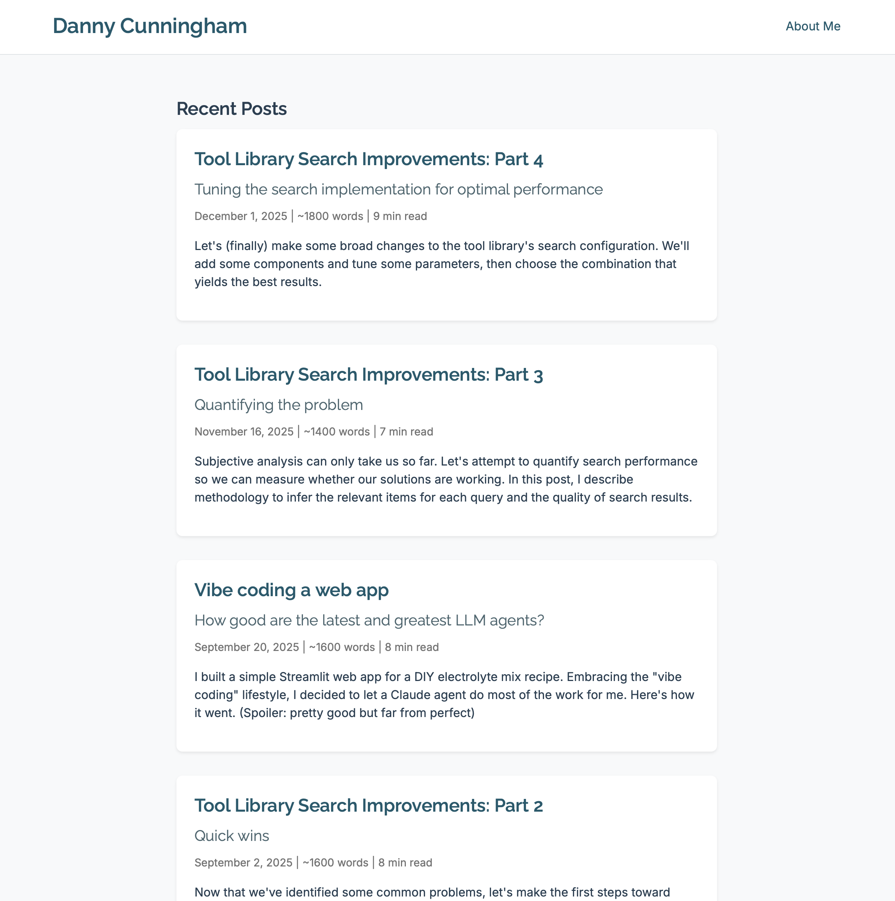
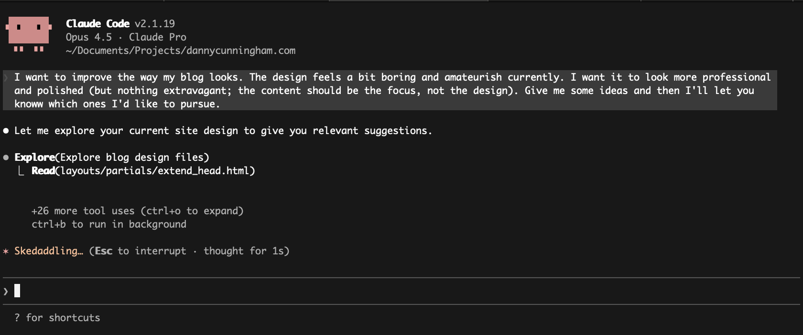
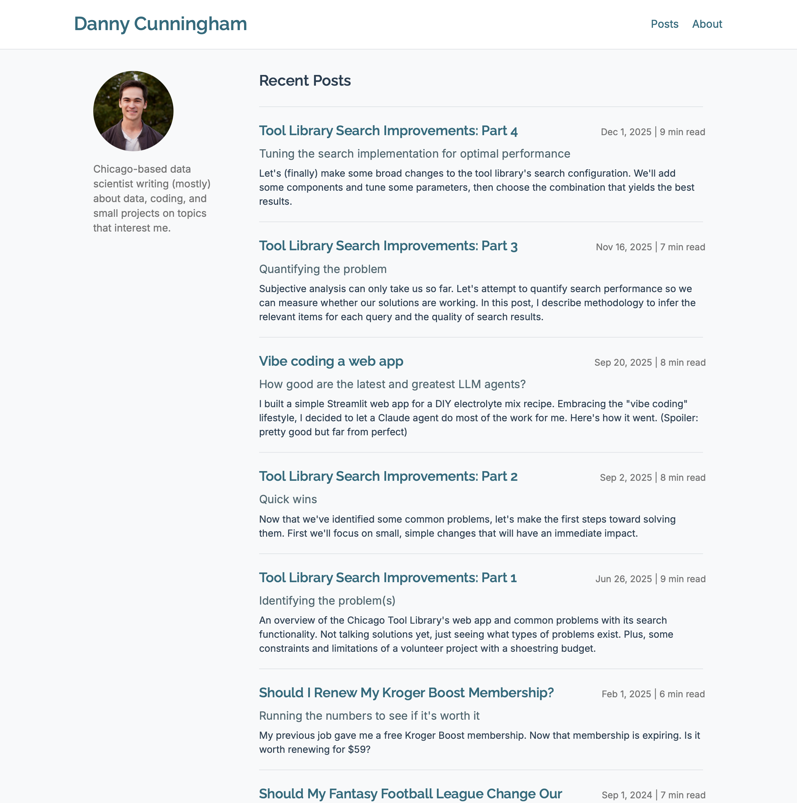
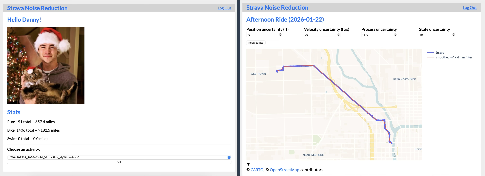
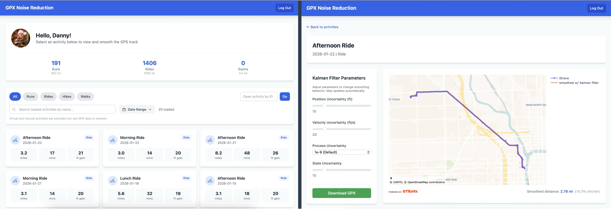

+++
title = "Almost Magic: AI coding is amazing"
subtitle = "I finally tried Claude Code, and I'm impressed"
date = 2026-01-26
tags = ["vibe coding", "AI", "LLMs"]
draft = false
description = "\"Any sufficiently advanced technology is indistinguishable from magic.\" Ok, AI coding tools aren't *quite* that advanced... but they're closer than I thought. My first impressions after using Claude Code on a few projects."
+++

> Any sufficiently advanced technology is indistinguishable from magic.

That famous quote belongs to science fiction writer [Arthur C. Clarke](https://en.wikipedia.org/wiki/Clarke%27s_three_laws).
It came to mind recently when I tried some of the latest AI coding tools.
They're *just barely* distinguishable from magic.

A few months ago I wrote [a post]() about vibe coding a web app.
For that project, I used the GitHub Copilot extension in VS Code to use an LLM[^1] in "agent" mode, meaning the agent would write and modify code in my project.
The results were pretty good!
But it made some mistakes, and the agent required a lot of prompting and some manual intervention.
At the time, agent mode didn't feel like a big improvement over copy/pasting code to and from ChatGPT (which, to be fair, was already very useful).

But it seems there's been a *huge* improvement with the latest tools and models.
Specifically, I recently tried Claude Code with the Claude Opus 4.5 model and I'm seriously impressed[^2].

## An example: this blog!

The first thing I pointed Claude Code at was a facelift for this blog.

I'm terrible at frontend development.
I can hack together some basic HTML/CSS/Javascript, but it'll take me a while and it won't be pretty (and I probably won't enjoy doing it, either).
And thus, my boring blog was born.
This is what the homepage originally looked like:

<figure>
    
    <figcaption>
        My original homepage design.
        Not very inspiring.
    </figcaption>
</figure>

I wanted to see if Claude Code could breathe a bit more life into it.
I gave a short prompt saying I wanted something a bit more "professional and polished" and asked for some ideas:

After "skedaddling" for a bit, Claude gave a few suggestions that all sounded pretty good.
I picked one and told it to go for it.
Here's the result:

<figure>
    
    <figcaption>
        The revamped homepage.
    </figcaption>
</figure>

Claude did that in basically *one shot,* and I didn't have to write a single line of code.
There was a bit of back and forth after the original prompt, but hardly any.
I'm pretty pleased with the result.
It's certainly not a work of art, but it's more polished and uses the space better than before.
And it would have taken me hours to do it on my own—it took less than 10 minutes with Claude Code.

But this was an easy task, relatively speaking.
LLMs have been pretty good at writing HTML and CSS ever since the first version of ChatGPT.
Let's try something slightly more involved.

## Another example: an old Flask web app

A few years ago I wrote a post about [removing noise from GPX tracks]() from runs and bike rides recorded with Strava.
As part of that project I built a Flask app that connected to Strava API via OAuth.

At the time I didn't have a lot of experience with Flask.
In fact, that was one of the reasons I worked on that project: to learn Flask.
As you can imagine, my code was kind of a mess and I probably violated lots of best practices.
And the UI... yikes.
It's so ugly I hesitate to even show it, but here it is:

<figure>
    
    <figcaption>
        The homepage (left) and activity page (right) of my original Flask app, featuring UI atrocities.
        An assault on the eyes.
    </figcaption>
</figure>

I ran Claude Code in my repository and gave it a single high-level prompt along the lines of:
"I have a Flask app.
The code is messy and probably violates some best practices.
The UI looks terrible.
Please make it better."
After a bit of discussion, Claude Code took the reins and produced this:

<figure>
    
    <figcaption>
        The revamped Flask app, courtesy of Claude Code.
        An enormous improvement.
    </figcaption>
</figure>

Wow, that looks a lot better.
Once again, Claude Code implemented the new design in one shot.
It's so easy to revamp a UI with these tools.

It's not apparent from a screenshot, but it also made some backend improvements.
Nothing drastic—AI coding tools are reluctant to massively refactor your code, for better or worse—but some common-sense changes in line with Flask and web development best practices.
Things like better request handling, better caching, better separation of concerns, and so on.

And then I asked Claude to add a few new features.
Add the "Powered by Strava" branding[^3].
Add a button to load more activities.
Add a date filter.
Calculate the distance of the smoothed GPX track.
It wasn't perfect—I had to ask Claude to fix a few bugs along the way—but it knocked out each one quickly and effectively.

All of those design changes and new features were done in *one evening.*
Amazing.

---

## My impressions

In short, I'm very impressed.
Claude Code crushed the first two projects I threw at it.
It's clear that AI tools are *extremely* good at certain tasks, and that list of tasks is quickly growing.
These days, you can rely on AI to understand, refactor, and improve an entire codebase, with high confidence that it will succeed.
We're pretty darn close to fully automating lots of traditional software engineering work.

I'm still a bit skeptical that AI coding tools are ready for other types of technical work, like data science and analysis.
In most of my projects in those fields, I've found AI tools are helpful but insufficient.
But I'm starting a few data projects (maybe future blog posts!) where I'll put Claude Code to the test, and who knows—I very well could be proven wrong.

To be fair, the two projects I gave to Claude Code—a simple static website and a small Flask app—are right in its wheelhouse.
LLMs are very good at writing frontend code and adding small, well-defined features.
So it's not terribly surprising that Claude Code succeeded.

Even on those simple projects, the results weren't perfect.
Left to its own devices, Claude Code did a few silly things.
My favorite example: it added activity icons in the Flask app to represent runs or bike rides, *except they weren't really icons.*
Instead, they were inline SVG images that *vaguely* looked like the right shape:

<figure>
    

        <svg fill="none" stroke="var(--primary-color)" viewBox="0 7 24 16" width="200" height="133">
            <circle cx="5" cy="18" r="3" stroke-width="2"/>
            <circle cx="19" cy="18" r="3" stroke-width="2"/>
            <path stroke-linecap="round" stroke-linejoin="round" stroke-width="2" d="M12 18V9l-3 3M12 9l7 9"/>
        </svg>
    

    <figcaption>
        This is a bicycle, according to Claude Code.
    </figcaption>
</figure>

On one hand, it's cool that an LLM can generate a reasonably good SVG sketch of something on the fly.
On the other hand... *why would you want to do that?*
It's obviously better to go find a real bicycle icon, which is what any human developer would have done (and it's what I did when I noticed what Claude had done).

That's all to say, AI agents aren't perfect and you'd better review their output periodically.

Lastly, it's *fun* to work with these tools.
Getting so much done so fast makes you feel superhuman.
But I wonder, will the fun wear off eventually?
It's worth remembering that coding and building things *without* AI tools is also fun, and arguably more rewarding.
Everything involves tradeoffs, I suppose.

## Is it magic?

Back to the quote at the top: are AI coding tools "indistinguishable from magic"?
I'm almost tempted to say yes.
You can ask for something in plain English and an AI agent will build if for you in a matter of minutes.
That sure feels like magic!

I still find it somewhat miraculous that LLMs work at all.
Take every piece of written information you can find, use it to train a cleverly designed neural network, and apparently the result is a model that can write like a human?
Amazing!

I find it even more miraculous that LLMs can understand and write *code.*
Human language is full of ambiguity; computer code must be precise and specific.
Before LLMs existed, I wouldn't have assumed a model that understands human language would also understand code.

And now the level of automation that exists in the current tools feels miraculous.
It feels like there's a hint of magic in there somewhere.
I know it's actually a lot of very clever engineering, but at some point, what's the difference?

[^1]: I think I used Claude Sonnet 3.5 at the time, which is a few versions out of date.
For reference, at the time of writing Claude is now on version 4.5 for its Sonnet, Opus, and Haiku models.

[^2]: This isn't meant to be an endorsement of Claude Code, per se.
I've heard similarly great things about other tools, especially Cursor, and I expect the latest versions of all the major LLMs perform similarly well.

[^3]: Technically required for any apps integrating with the Strava API.