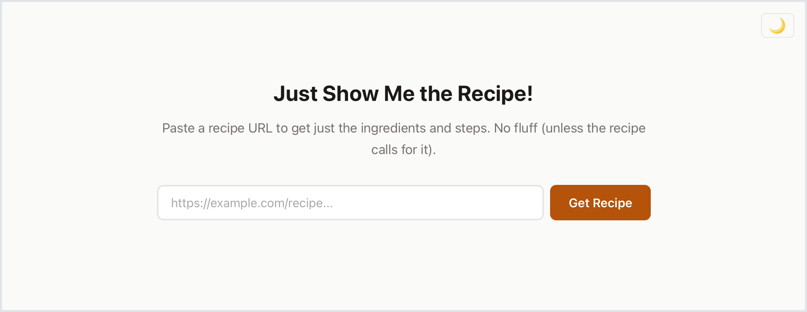
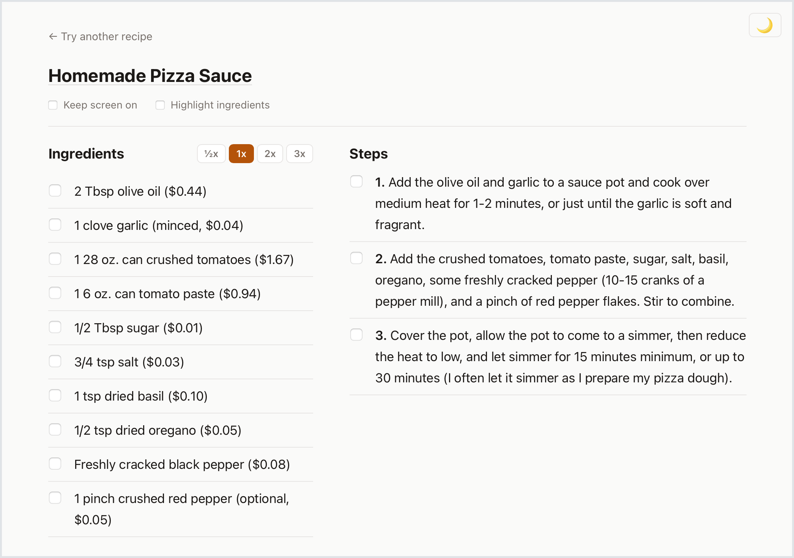
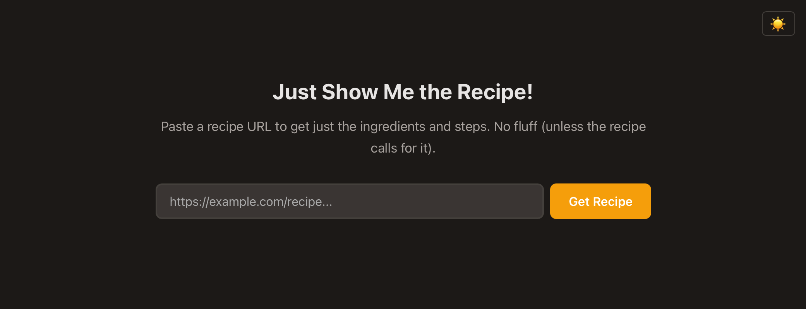
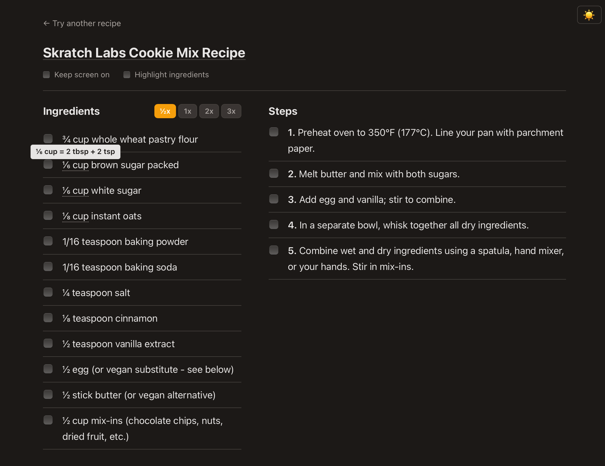
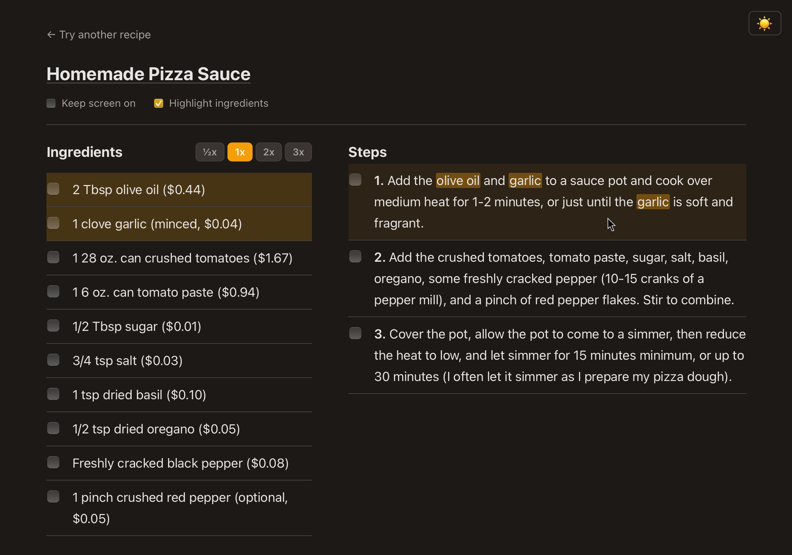

+++
title = "Just Show Me the Recipe!"
subtitle = "No fluff (unless the recipe calls for it)"
date = 2026-02-12
tags = ["web apps", "fastapi", "NLP"]
draft = false
description = """
  I'm tired of online recipes with the author's life story and tons of popup ads.
  So I built a minimal web app to extract just the ingredients and instructions.
"""
+++

Popular opinion: I hate when recipe websites have a long story, a dozen pictures, and a popup ad before you get to the recipe.
Just show me the recipe already!
I'm sure you can relate.

So I built a web app to take any[^1] online recipe and strip it down to just the ingredients and steps.
It's intentionally minimal: a simple landing page and a two-column recipe page.

Behold!
The app is live at [https://justshowmetherecipe.onrender.com](https://justshowmetherecipe.onrender.com).

<figure>

</figure>

<figure>

</figure>

## Tech stack

- Backend: FastAPI with Jinja2 templates
- Frontend: vanilla HTML/CSS/JavaScript
- Deployment: Dockerized, hosted on Render (free tier)

The code is available on GitHub [here](https://github.com/djcunningham0/just-show-me-the-recipe).

## Core functionality

When the user enters a URL, the app scrapes the HTML and parses the recipe ingredients and steps from it.
There are three parsers built into the app, and we use the results from the first one that is successful:

1. **Structured data parser:** Many recipe sites use the [schema.org Recipe schema](https://schema.org/Recipe).
   This parser searches for the metadata associated with the Recipe schema and extracts it[^2].
   This is the most reliable parser, but it only works on sites that implement the schema.
2. **Scraping parser:** Use the community-maintained `recipe-scrapers` Python library.
   This library includes configuration for scraping recipe information from lots of sites, plus some generic logic for sites that aren't officially supported.
   It's very easy to use.
   The results are very reliable for officially supported sites, and somewhat reliable for unsupported sites.
3. **Heuristic parser:** As a last resort, look for basic patterns in the HTML that might indicate recipe ingredients and steps.
   For example, a bulleted or numbered list after a heading of "Ingredients".
   It's _definitely_ not perfect, but it's the only viable method for some smaller or less popular recipe pages[^3].

If no parser finds a recipe, the app assumes there is no recipe on the page and displays an informative error message.

## Bells and whistles

### Dark mode

Ok, this barely qualifies for "bells and whistles", but I like it.
There's a simple toggle in the top right corner to switch to dark mode.

<figure>

</figure>

### Checkboxes

Another simple one.
A lot of recipe websites have this feature and I quite like it, so I added it to my app.
Clicking the checkbox next to an ingredient or step crosses it out.
It helps me keep track of where I am in the instructions.

### Recipe scaling

Another feature that lots of recipe websites have.
I added buttons on the recipe page to scale the recipe up or down (preset values of 1/2x, 1x, 2x, and 3x).
When you choose a different scale, all of the ingredient amounts are updated.

Implementation required some additional natural language processing to identify numeric quantities, and then some JavaScript to make the buttons work.
Most of the NLP is done by the [ingredient-parser-nlp](https://github.com/strangetom/ingredient-parser/) Python library.

Lots of credit to Claude Code on this one.
It would have taken me a week or more to get the JavaScript working on my own.
Claude Code did it in two minutes, then we spent half an hour finding and fixing edge cases.

### Measurement conversion tooltips

Sometimes when scaling a recipe you get unusual measurements.
For example, if you halve a recipe you might need 1/6 cup of something.
Nobody has a 1/6 measuring cup, so that isn't a very useful measurement.
It would be better to show the equivalent amount: "2 tbsp + 2 tsp".

It's also helpful to know conversions in the other direction.
When you double a recipe, sometimes it's useful to know that you can use 1 tablespoon instead of 3 teaspoons, or 1/4 cup instead of 4 tablespoons.

I added tooltips when there's a more convenient measurement available.
You can hover[^4] over the quantity to see the conversion.

<figure>

<figcaption>
    Halving this recipe resulted in a measurment of "1/6 cup brown sugar".
    The tooltip shows the more useful measurement of "2 tbsp + 2 tsp".
</figure>

I really like this feature.
I haven't seen it on any recipe websites, and it's annoying to have to remember or look up conversions.

### Ingredient-to-step highlighting

I saved the coolest feature for last.

I get frustrated when recipes have long steps with many ingredients each, and you have to scroll back and forth between steps and ingredients repeatedly to look up quantities.
I wish recipes would more clearly connect steps with the relevant ingredients.
So I added a feature that (partially) solves that problem.

When you hover over an ingredient, it highlights the relevant step(s), and vice versa.
I find this makes it much quicker to find the information you need.
The visual cue makes it easy to find the ingredient you need and look up its quantity.

<figure>

</figure>

But to be clear, this feature isn't perfect.
It's prone to false positives.
For example, if one ingredient is "pepper" and a step calls for "red pepper flakes", it will probably highlight that as a match.
I chased down and fixed some edge cases, but it's impossible[^5] to get it to work for every possible case.

---

## Closing thoughts

I think this is a pretty useful app!
I expect to use it, anyway.
Maybe you will too.
[Check it out](https://justshowmetherecipe.onrender.com) next time you cook something!

[^1]: It won't work for literally _any_ online recipe, but it should work with most.

[^2]: This is, for example, the same metadata that Google uses to show recipe cards in search results.

[^3]:
    Some examples of a recipes that fall to the heuristic parser are this [Skratch cookie recipe](https://www.skratchlabs.com/blogs/blog/skratch-labs-cookie-mix-recipe) and my very own [electrolyte powder recipe](https://nicelittleadventures.com/diy-electrolyte-mix/).
    Both are parsed correctly.

[^4]: The tooltips appear inline on mobile.

[^5]:
    At least, it's impossible using the simple NLP and pattern matching methods I implemented.
    An LLM could do a much better job at this task and might perform close to perfectly.
    But that's out of scope for this app right now.

<!-- Wake up the Render free-tier app so it's ready when the reader clicks the link -->

