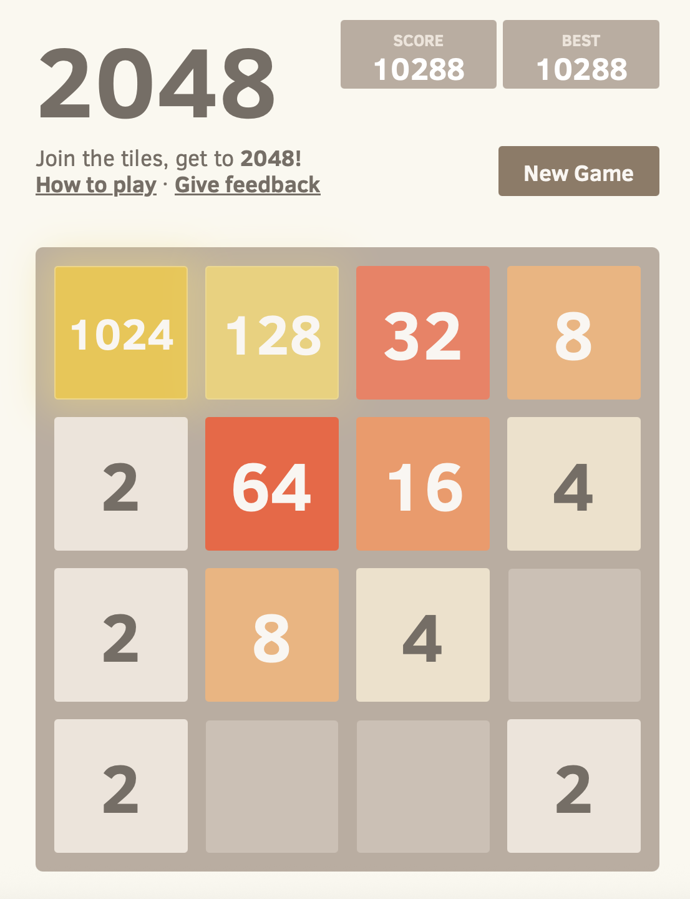
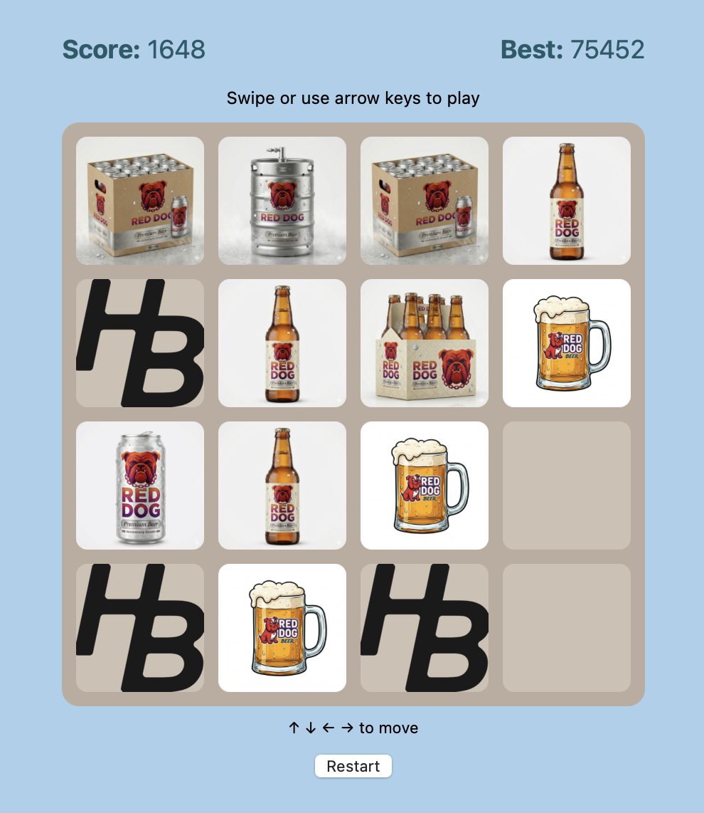
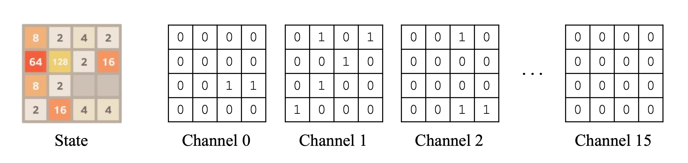
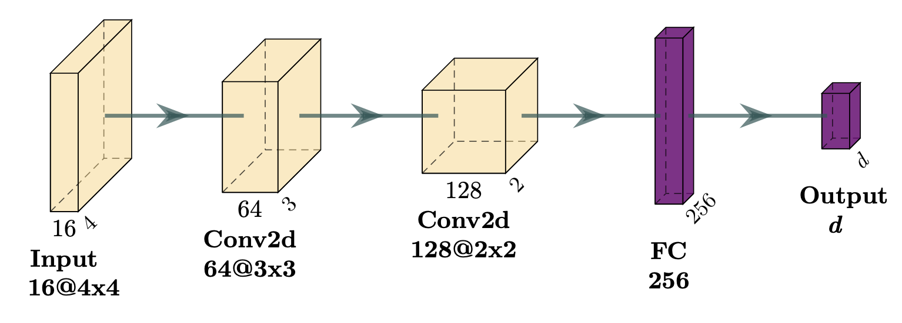
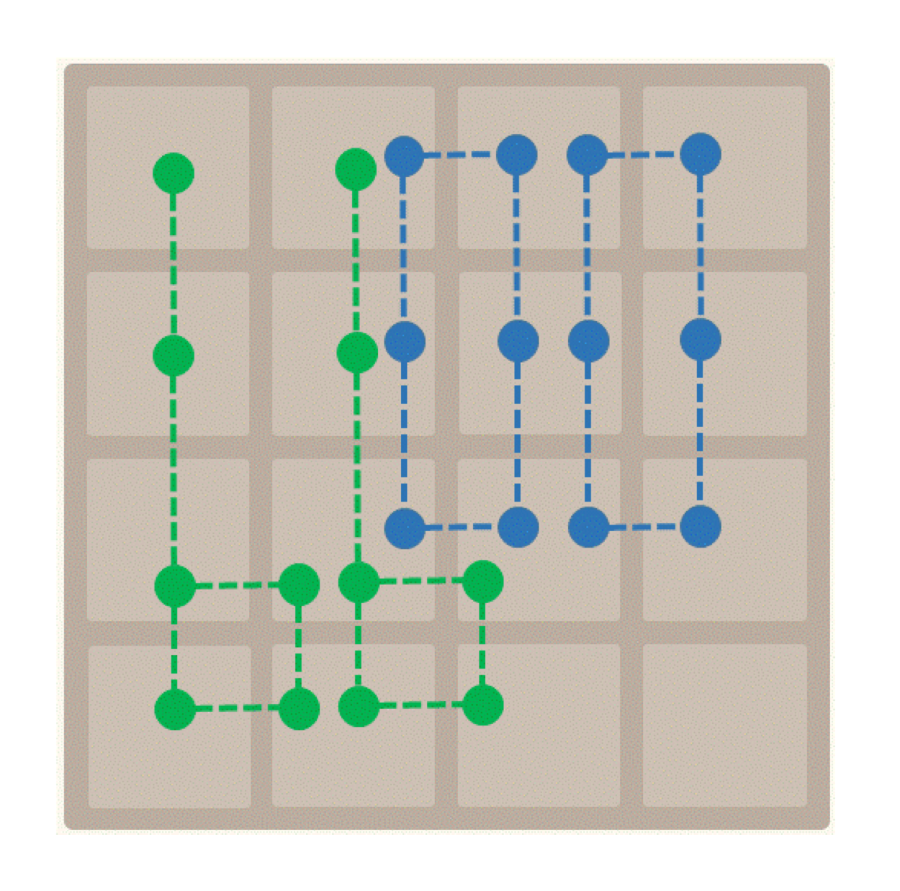
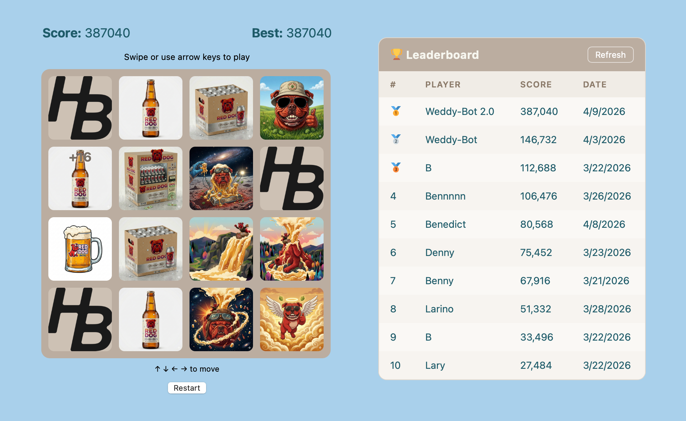

+++
title = "Using Reinforcement Learning to Play 2048"
subtitle = "And dominating my friend's \"Weddy-48\" leaderboard"
date = 2026-04-09
tags = ["reinforcement learning", "machine learning"]
draft = false
description = """
  I explored some reinforcement learning methodologies for 2048—yes, the 12-year-old tile sliding game.
  Mostly as a learning exercise, but also to crush the top scores on my friend's custom, "uncommonly smooth" beer-themed 2048 implementation.
"""
+++

Reinforcement learning feels intuitive to me: an algorithm takes some action, receives a reward or penalty, and learns to improve through ongoing trial and error.
In fact, before I got into data science that's how I thought all "machine learning" algorithms worked.
But, while conceptually simple, reinforcement learning is difficult and doesn't have widespread applications (or at least not as widespread as other types of ML[^1]).

I've always thought it would be fun to learn how reinforcement learning works beyond a surface level, so let's give it a shot!
RL is particularly well suited to games with discrete turns and scores, so I decided to apply it to 2048, the tile-sliding game.

## 2048 gameplay

The game is played on a 4x4 grid, and it starts with two numbered tiles (with values 2 or 4) in random positions.
On each turn, you slide all tiles up, down, left, or right.
Tiles can slide into an empty space, or two adjacent tiles of the same value can slide into each other and merge into a tile with twice the value (e.g., two 4s become one 8).
After sliding, a new tile (a 2 or 4) appears in a random empty space.
You score points for merges (score = merged tile value), and the game ends when the grid is full with no valid moves.

The mechanics are straightforward once you get the hang of it.
You can try out the official game [here](https://classic.play2048.co).

The game gets harder as the grid fills with larger tile values.
The nominal objective is to achieve the 2048 tile, which requires a bit of skill, but the game continues beyond that.
Good players can achieve 4096, or even 8192 tiles and beyond.

<figure>

<figcaption>
Screenshot of the <a href="https://classic.play2048.co">official 2048 game</a>.
</figcaption>
</figure>

## Why 2048?

A few reasons:

1. I played this game a lot when it came out 10+ years ago. Good nostalgia factor.
2. It's a good fit for reinforcement learning, with well-defined actions and rewards.
3. My friend built a custom implementation called "Weddy-48" on his wedding website, and I want to crush the high scores.

About that custom implementation: it's an homage to an obscure, out-of-production, "uncommonly smooth" beer called Red Dog.
Instead of numbered tiles, each tile is a Red Dog-themed image.
Cans merge into bottles, bottles into 6-packs, into 12-packs, into kegs, and so on.
There are Red Dog waterfalls and volcanoes and planets.
It's beautiful.

<figure>

<figcaption>
Screenshot of the custom "Weddy-48" game.
Same mechanics, better images.
</figcaption>
</figure>

## Reinforcement learning concepts

I'll give a quick overview of some key RL concepts.
If you're not interested, skip ahead to the Methodology or Results section.

Reinforcement learning (RL) is a machine learning paradigm where an _agent_ interacts with an _environment_ in a trial-and-error fashion.
The agent attempts to maximize _rewards,_ leading it to learn an optimal _policy._
In other words, **the agent learns to play the game by itself** with no explicit instructions from the user.

- **Agent:** the decision maker/action taker (in our case, the player of the game)
- **Environment:** the context in which the agent operates (in our case, the 2048 game board and rules)
- **Reward:** feedback given to the agent after each action (in our case, points scored on a turn)
- **Policy:** the agent's strategy for choosing actions (in our case, some way to map a board state to an up/down/left/right action)

Defining the reward function is one of the tricky parts of RL.
For 2048, we want the agent to choose the action (up, down, left, right) that will maximize the _final_ score.
That's not trivial!
It's easy to see how many points your next move will score, but greedily maximizing points on each move is not a successful long-term strategy.
RL largely involves finding a clever way to get the agent to maximize towards a final outcome (or some approximation of it) rather than some intermediate outcome.

For this project I tried a handful of RL methodologies, which I'll describe below.
I lifted the core concepts and some of the implementation details from several research papers on reinforcement learning for 2048, especially [this one](https://arxiv.org/pdf/2212.11087) by Hung Guei, which is pretty comprehensive.

### Temporal difference (TD) learning

[Temporal difference learning](https://en.wikipedia.org/wiki/Temporal_difference_learning) is a general class of reinforcement learning.
Every methodology I used falls under the umbrella of TD learning.

TD learning is essentially a bootstrapping technique: the agent updates its value estimates _using other value estimates._
The agent learns incrementally from each step rather than waiting until the end of the game to see the final outcome.

It's called "temporal difference" because the learning signal comes from the _difference_ between value predictions at successive time _(temporal)_ steps.
We're comparing what we thought a state was worth _then_ vs. what we think the next state is worth _now._

The trick is that in each update, we're comparing our value estimate for the current state to our estimate for some future state, **which has more information about later stages of the game baked into it.**
Gradually, the value estimate for each state converges towards "how many more points will we score through the end of the game if we play optimally from this position".

The algorithm, or training loop, works roughly like this:

- Start by assigning some "value score" to each possible state or action (e.g., initialize everything as zero).
- Play a game.
  On each turn:
    - Calculate our current estimate of the value of the current state \( V(s) \).
    - Choose the action that leads to the next state \( s' \) with the highest estimated value \( V(s') \).
    - Update the estimated value of the current state \( V(s) \) to nudge it closer to the reward \( r \) earned on this turn plus the (discounted) value of the next state: \( r + \gamma \times V(s') \), where \( \gamma \) is some discount factor (often something like 0.99).
      The difference between this term and \( V(s) \) is called the _TD error._
- Repeat for many games.

### Q-learning and afterstate learning

Let's discuss one nuance of the TD learning algorithm: _what_ exactly are we estimating the value of?

We'll consider two different options:

- **Q-learning:** Learn the quality of a given action in a given state, \( Q(s, a) \).
- **Afterstate learning:** Learn the value of a given "afterstate", \( V(s) \). An afterstate is the state of the board after a move, but _before_ the random tile spawn.

[Q-learning](https://en.wikipedia.org/wiki/Q-learning) is a more widely known methodology, but **afterstate learning has proven more effective in literature on 2048.**
Factoring out the random tile spawn gives the value function a clearer signal to learn.
Thus, I mainly used the afterstate learning objective (but explored both).

_How_ we estimate the value of a given state is not defined by the TD learning algorithm or the learning objective.
The estimator can be any kind of predictive model, heuristic, etc.
I used neural networks and N-tuple networks, as described in the next section.

## Methodologies

I'll describe the methodologies I implemented to train my 2048 bot.
If you're not interested or the explanations go too deep, skip to the Results section.

All of my code can be found [on GitHub](https://github.com/djcunningham0/2048_reinforcement_learning).

### Deep reinforcement learning

Deep reinforcement learning (DRL) uses a neural network to learn/predict value estimates.
DRL felt like the most natural place to start for me (even though it's _not_ the most successful approach in the 2048 literature).
It's fairly similar to supervised learning, which I'm very familiar with.
The key difference is that the labels the model is learning to predict are _created during the training process_ rather than known beforehand.

**State representation:** We represent the board as a 16x4x4 tensor, where each of the 16 channels is a one-hot encoding of a tile value.
That is, all of the empty tiles have a 1 in their grid position on the first channel, the 2-tiles have a 1 in their position on the second channel, and so on.

<figure>

<figcaption>
State encoding used for my deep reinforcement learning models.
The idea and image are taken from <a href="https://arxiv.org/pdf/2212.11087">Guei's paper</a>.
</figcaption>
</figure>

**Network architecture:** I used a **convolutional neural network** (CNN), which, again, I borrowed from the [Guei paper](https://arxiv.org/pdf/2212.11087).
CNNs are commonly used for image-processing tasks, so they're a natural fit for 2048—the game board is essentially a 4x4 image.
Specifically, I used a relatively small[^2] neural network with two convolutional layers and one fully connected layer.
The PyTorch implementation is [here](https://github.com/djcunningham0/2048_reinforcement_learning/blob/main/rl_2048/network.py).

<figure>

<figcaption>
Visual representation of the neural network.
The 16x4x4 tensor is passed through two convolutional layers (kernel size 2) and one fully connected layer.
The output dimension <em>d</em> is either 4 or 1, depending on the prediction target.
</figcaption>
</figure>

**Prediction target:** We can use DRL for either Q-learning or afterstate learning[^3].
That choice determines our output dimension (\( d \) from neural network visual).
For Q-learning, we use \( d = 4 \), one output node for each possible action.
For afterstate learning, we use \( d = 1 \) since we're predicting the value of the (after)state, not each action.

**Implementation details:** There are a few tricks to implementing TD learning with a neural network.
Here's a non-exhaustive list:

- **Replay buffer:** Instead of training on the agent's most recent actions and rewards, we fill a "replay buffer" (a simple FIFO queue) and sample random mini-batches from it for training.
  This breaks correlations between consecutive steps and helps the value estimates converge.
- **Target network:** We maintain two copies of the neural network.
  The online network is updated at each training step.
  The target network lags behind and is synced with the online network periodically.
  We use the target network to compute the next-state value in the TD error calculation.
  This provides a more stable target for the online network to train on.
- **Exploration:** DQN often uses an \( \epsilon \)-greedy algorithm during the training loop to encourage exploration of unexplored states, with \( \epsilon \) decreasing over time.
  (Note: in practice, \( \epsilon \)-greedy is not necessary for afterstate learning because the random tile spawn injects enough randomness to encourage exploration.)

### N-tuple network

N-tuple networks are simpler and faster than neural networks.
They're also the gold standard for 2048.

Recall that for TD learning we need to evaluate how "good" a state, or board configuration, is.
An N-tuple network takes the full input and breaks it up into smaller chunks, called tuples.

**Tuple structure:** In 2048, each tuple is a subset of squares on the 4x4 grid.
Choosing the tuples is very important—the network will only be effective if the tuples capture meaningful patterns in the input.
Rather than reinvent the wheel, I used the same 4x6-tuple network shown to work well in [this paper by Yeh et al.](https://arxiv.org/pdf/1606.07374)

<figure>

<figcaption>
The 4x6-tuple network I used for my analysis.
</figcaption>
</figure>

**Memory-efficient lookup tables:** A huge advantage of N-tuples is that all of their operations can be performed as in-memory lookups.
While the whole 2048 board has a vast[^4] number of possible states, a 6-tuple only has about 17 million (16^6) possible states, easily small enough to fit in memory.
For each tuple, we maintain a lookup table (LUT) that stores the value for each possible state.
To evaluate the state of a full board, we simply look up the current value for the state of each tuple, and sum them up.

**Symmetry:** The 2048 board has 8-fold symmetry—4 rotations and 2 flips.
N-tuple networks can easily take advantage of this symmetry.
When evaluating a board with our N-tuple network, we also evaluate all symmetrically equivalent boards[^5].
Taking advantage of symmetry dramatically improves the performance and training time of the network without adding any additional parameters.

**Training:** Training the network via TD updates is straightforward.
After each move we calculate the TD error of the full board (see TD learning section) using the LUTs for each tuple, then we update the LUT entries in the direction of the error (`weight += learning_rate * td_error`).

### Expectimax search

Expectimax search isn't a learning methodology, but rather a search algorithm.
I'll go a little bit into the details, but **TLDR: expectimax allows our agent to plan multiple moves ahead.**
It can be layered on top of any TD learning agent.

By default, a TD learning agent acts in a "greedy" manner: it picks the action that will move to the most valuable next state.
Expectimax allows the agent to probabilistically trace out the possible futures beyond that action in order to make a better long-term choice than the greedy option.

Expectimax is a tree search algorithm that accommodates randomness in the game engine.
The search builds two types of alternating nodes:

- **Max node:** Pick the (valid) action that brings us to the afterstate with the maximum value
- **Chance node:** Evaluate all possible board states after the random tile spawn

Up to a specified depth, we build another max node after each chance node, and so on.
Once we've built the tree, we use the agent's value function to evaluate the leaf nodes, then backpropagate the values through the tree.
We calculate the probability-weighted average value at each chance node and select the optimal action at each max node.
When we reach the root of the tree, we choose the branch that leads to the highest expected value.

In general, a deeper search yields better results, but takes exponentially longer to perform.

## Results

Finally... how did the agents do?
Pretty well!
For context, the best score I got in the past couple weeks was 75,000 (up to 4,096 tile).

Without Expectimax

| Model                 | Average Score | Max Score | Max Tile | 2048% | 4096% | 8192% | 16384% |
| --------------------- | ------------- | --------- | -------- | ----- | ----- | ----- | ------ |
| Deep Q-learning (DQN) | 12,000        | 31,000    | 2048     | 8%    | 0%    | 0%    | 0%     |
| Afterstate CNN        | 19,000        | 65,000    | 4096     | 42%   | 6%    | 0%    | 0%     |
| N-tuple network       | 194,000       | 361,000   | 16384    | 100%  | 100%  | 88%   | 38%    |

Expectimax depth = 1

| Model           | Average Score | Max Score | Max Tile | 2048% | 4096% | 8192% | 16384% |
| --------------- | ------------- | --------- | -------- | ----- | ----- | ----- | ------ |
| DQN             | 18,000        | 34,000    | 2048     | 36%   | 0%    | 0%    | 0%     |
| Afterstate CNN  | 53,000        | 147,000   | 8192     | 92%   | 58%   | 2%    | 0%     |
| N-tuple network | 273,000       | 372,000   | 16384    | 100%  | 100%  | 100%  | 70%    |

Expectimax depth = 2

| Model           | Average Score | Max Score | Max Tile | 2048% | 4096% | 8192% | 16384% |
| --------------- | ------------- | --------- | -------- | ----- | ----- | ----- | ------ |
| N-tuple network | 327,000       | 385,000   | 16384    | 100%  | 100%  | 100%  | 92%    |

Expectimax depth = 3

| Model           | Average Score | Max Score | Max Tile | 2048% | 4096% | 8192% | 16384% |
| --------------- | ------------- | --------- | -------- | ----- | ----- | ----- | ------ |
| N-tuple network | 325,000       | 387,000   | 16384    | 100%  | 100%  | 100%  | 100%   |

<figcaption>
Results for all models at various depths of expectimax search.
Data points represent the results of 50 games played with each model.
Each model was trained for ~24 hours (100K games for the DRL methods, 10 million games for the N-tuple network).
I stopped at 1-ply expectimax for the DRL models because the runtime is extremely slow at greater depths.
</figcaption>

I'd say the key findings are:

1. **The N-tuple network dominated.**
   This was expected and consistent with the literature.
   But the afterstate CNN model performed pretty well, even achieving the 8192 tile and a higher max score than most human players.
2. **Expectimax is very effective.**
   All of the models saw a big improvement from a 1-ply expectimax search.
   They continue improving with deeper searches, but with diminishing returns.

Some other tidbits:

- The N-tuple network couldn't _quite_ get to the 32,768 tile.
  With more training episodes I think it would get there eventually.
  A larger network (say, an 8x6-tuple network) would surely get there (as demonstrated in the [Guei paper](https://arxiv.org/pdf/2212.11087)), but would also take much longer to train.
- The N-tuple network is _a lot_ faster than the DRL methods—like 100x faster.
  That's partially due to a rewrite I—well, Claude Code—did in Rust after first implementing in Python.
- The N-tuple network discovered the optimal "corner" strategy (it's best to keep your highest tile in one of the corners), but the DRL methods did not.
  They seemed to prefer to keeping the largest tile on an edge but not in a corner.

Here are some games played by the trained agents for your viewing pleasure:

<figure>
<video controls muted playsinline>
    <source src="terminal_gameplay.mp4" type="video/mp4">
</video>
</figure>

## Getting on the leaderboard

Once the agents were trained, I rigged up a script to open a web browser, navigate to the Weddy-48 page, and enter the moves chosen by the agent.
As expected, Weddy-Bot crushed everyone.

<figure>

<figcaption>
Weddy-Bot is the afterstate CNN agent with 1-ply expectimax search.
Weddy-Bot 2.0 is the N-tuple network agent with 2-ply expectimax search.
</figcaption>
</figure>

---

## Closing thoughts

This was a fun intro to reinforcement learning!
I'm not sure if or when I'll—ahem—_reinforce what I learned_ (sorry) by applying RL to another project, but it's nice to learn a new skill regardless.

I suspect I've claimed the permanent top spot on the Weddy-48 leaderboard, but if not, I've got a few more tricks up my sleeve that would surely push Weddy-Bot's score even higher.
A larger N-tuple network would surely do it, and... better not give away any other ideas[^6].

[^1]:
    I was a bit disappointed to learn supervised learning, where an algorithm learns to predict labeled outcomes, is far more common in industry.
    Not as cool as reinforcement learning, in my opinion!

[^2]: About 170K total parameters, which was small enough to train on my laptop (2020 MacBook Air) in a reasonable amount of time.

[^3]:
    If we choose Q-learning it's known as a deep Q-network (DQN).
    Deep afterstate learning has no established name or acronym, as far as I can tell.

[^4]: \( 16^{16} \approx 10^{19} \), assuming each square could have one of 16 possible values, from empty to 32,768. (Not technically correct because it's not possible to reach every such state, but a reasonable approximation.)

[^5]: Isomorphisms, if I'm remembering my linear algebra classes correctly.

[^6]: Although they can almost all be found in, you guessed it, [Guei's paper](https://arxiv.org/pdf/2212.11087).
