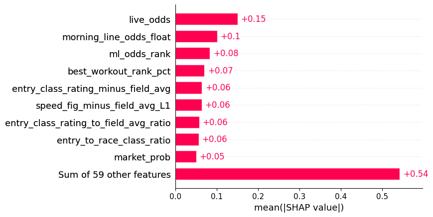
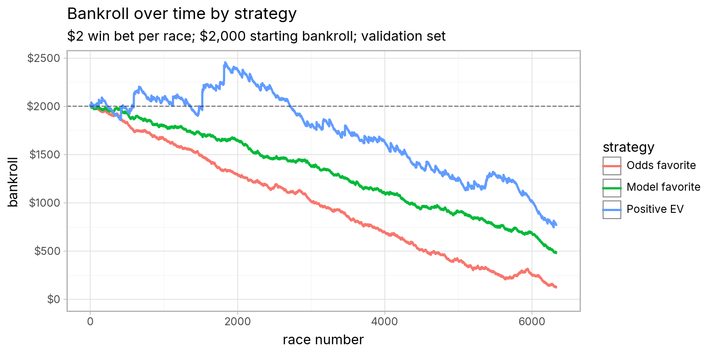
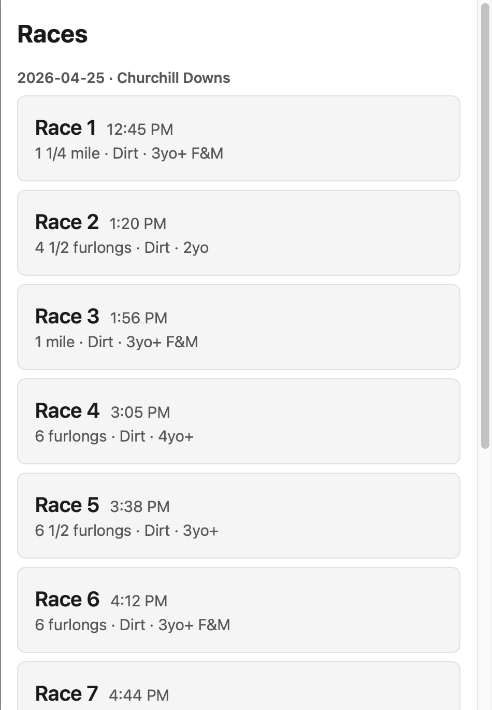
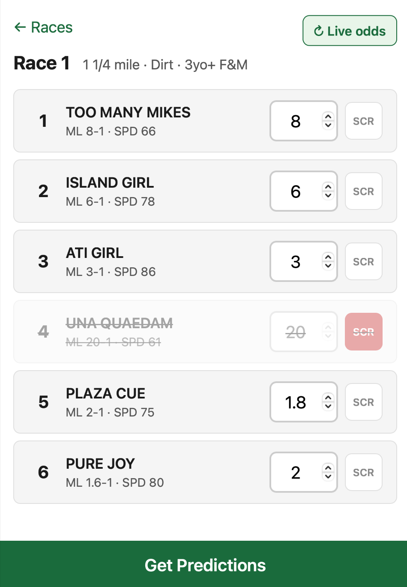
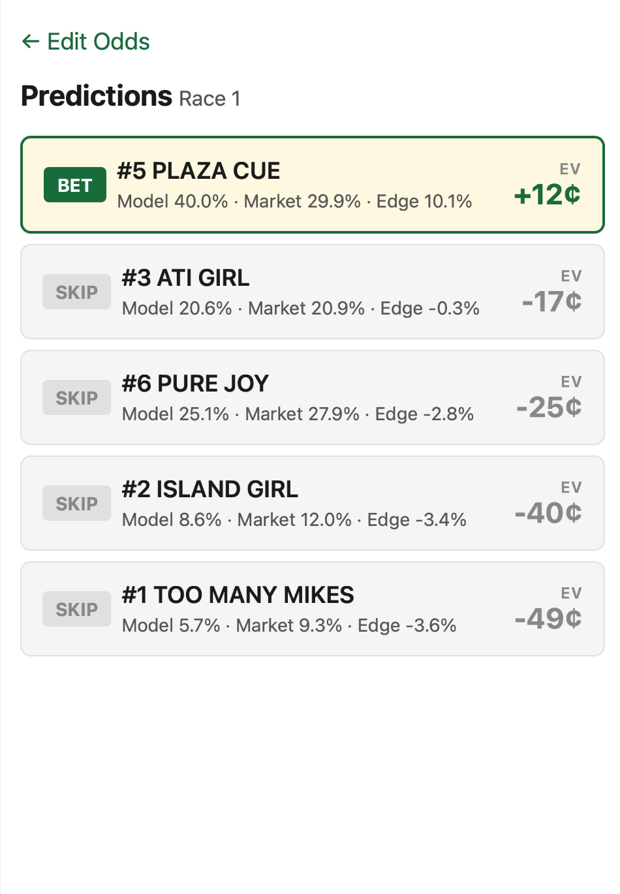

+++
title = "Building and Deploying a Horse Racing Machine Learning Model"
subtitle = "And using it to lose (less) money at the racetrack"
date = 2026-05-08
tags = ["machine learning", "horse racing", "FastAPI", "web apps", "projects"]
draft = false
description = """
  Over the span of a few weeks, I built and deployed a model to predict the winners of horse races.
  Then I used it live at the track on a trip to Churchill Downs.
  Turns out it's very difficult to turn a profit betting on horses.
"""
+++

A few weeks ago I went to opening day at Churchill Downs for a bachelor party.
I bet on the horse races while we were there, as one does.

Like most people, I know nothing about betting on horses.
My typical strategy for choosing a horse is to weigh the odds, the questionably important stats in the race program, and, perhaps most importantly, how much I like each horse's name[^1].

But I thought maybe I could improve upon that strategy.
A few weeks before opening day, I decided to see if I could build a predictive model that would give me an edge at the track.
The main goal was to build a functional proof-of-concept, not necessarily a profitable system.
(Spoiler: it was indeed _not_ profitable.)

---

## Architectural Overview

Here's an overview of the final product.
The system is organized into four layers: raw data is ingested into parquet, used to train an XGBoost model, served via FastAPI, and consumed by a mobile web frontend at the track.
The web app is hosted on Render.

- **Data layer (Python):**
    - Training: ingest the raw Equibase XML files and save as parquet files
    - Inference: ingest the raw Brisnet CSV and manually entered Equibase data
- **Modeling layer (Python/XGBoost):**
    - Feature engineering
    - Train and evaluate an XGBoost model (classification or ranking)
    - Track experiments with MLflow
    - Save the model as a `joblib` artifact
- **Serving layer (FastAPI):**
    - Serve the trained model
    - Return win probabilities and EV via REST endpoint
    - Load race data via REST endpoint and persist as JSON file
    - Retrieve live odds from TwinSpires
- **Frontend layer (Vanilla JavaScript + Alpine.js):**
    - Lightweight and mobile friendly web UI
    - View predictions for pre-loaded races
    - Basic interactivity (fetch live odds, update scratched horses)

All code is available [on GitHub](https://github.com/djcunningham0/horse_racing) (but the datasets are not).

---

Below I'll discuss some of the design details and decisions I made along the way.
You can skip ahead to the end if you just want to see how well (or poorly) I did at the track.

## Step 1: Acquiring Data

Before building a predictive model, we need data, ideally a lot of it.
I was surprised to learn that there are _over 30,000_ thoroughbred horse races in the US every year, so there's a huge amount of rich data available.

There's just one big problem: the data is heavily monetized.
The main player in the space is [Equibase](https://www.equibase.com/about/overview.cfm), the official data authority for thoroughbred horse racing in the US.
They're in the business of _selling_ that data, not giving it away for free—with one exception.

### Training data

Out of the goodness of their heart[^2], Equibase offers a [free dataset](https://www.equibase.com/handicappersdata.cfm) that includes all races from 2023.
This free dataset will be perfect for our training set.
It includes:

- Results files: each horse's finishing position, plus basic information like odds and track surface
- Past performance (PP) files: detailed data about a horse's (and jockey's) recent races, including some proprietary Equibase metrics like "speed" and "class" ratings
- Machine-readable formats (specifically, XML files)

The main downside is that the data is a few years old, but that's perfectly acceptable for a proof-of-concept hobby project.
Especially when you consider that Equibase quoted me _$1,500/year_ if I wanted additional years of the same dataset.
(I declined.)

### Inference data

In order to actually use the trained model at the track, we'll need data for that day's races.
Specifically, we'll need exactly the same data points that were used to train the model.

I couldn't find a single source with every data point I needed (at least, not in a convenient file format).
Instead, I bought two files and combined them:

1. Single-day PP CSV file from Brisnet.
   This contains all of the basic inputs, like horse post positions, morning line odds, and track details.
   Price: $1.50.
2. Single-day PP file from Equibase.
   This contains the Equibase-specific values, like "speed" and "class" ratings.
   It's only available in PDF format so it requires a bit of data entry, but it's easily doable for a single day of races.
   Price: $2.75.

## Step 2: Modeling

### Prediction target

First things first: we need to decide what the model should predict.
There are lots of different bets you can place on a horse race, from the simple "win" bet to the more exotic bets like exactas and trifectas.

For simplicity, I decided to focus on win bets only.
That gives us the simplest possible prediction target: **our model will predict each horse's probability of winning the race[^3].**

### Model selection and training objective

For model selection, all signs point to XGBoost.
We have a tabular dataset with large enough volume (~40K distinct races, ~300K entries), and surely some nonlinear relationships.

Then there's the choice of training objective.
There are two natural choices:

- Learning-to-rank (`XGBRanker`)
- Binary classification (`XGBClassifier`)

My first intuition was learning-to-rank with NDCG as the objective.
It fits the problem nicely: we're trying to rank the horses in each race in order of their likelihood of winning, and NDCG puts extra emphasis on getting the top of the list right.

But I also tried binary classification, and it performed better than learning-to-rank on the validation set.
**So I selected `XGBClassifier` as the final model** (using the default log loss objective).

### Training setup

I followed a pretty standard training workflow: split the dataset into training, validation, and test sets; optimize performance (through feature engineering, hyperparameter tuning, etc.) on the validation set; then verify that performance holds on the test set.

I used a chronological train/validation/test split: races before a certain date go into the training set; races after that date go into validation and then test.
Then I trained the final model on the full dataset before deploying.

### Feature engineering

The final model includes about 70 features.
Some come straight from the raw data, and others are derived from the raw data (e.g., comparing a horse's speed rating to the rest of the field).
The features fall roughly into the following buckets:

- **Odds:** Morning line and live odds (see note below), plus simple derivations (e.g., ordinal rank within field)
- **Race characteristics:** Surface type, distance, age and sex restrictions, etc.
- **Entry/horse characteristics:** Post position, age, career starts and wins, Equibase class rating, etc.
- **Past performances:** Finishes, odds, Equibase speed ratings, race characteristics, etc. from the horse's prior three races
- **Workout results:** Days since last workout, percentile rank in latest workout, etc.

#### "Live" odds feature

There are two types of odds in our training data: morning line and final.
Morning line odds are posted the morning of the race (or 1-2 days earlier), so they're valid to use in a predictive model.
But final odds are not—once betting opens, the odds constantly change right up until the race starts.
If we include final odds as a feature in our training set, we'll leak information that wouldn't be available at inference time.

At inference time we'll have live odds (AKA tote odds).
This would be a very important feature for our model—in fact it's the _only_ feature that changes while we're at the racetrack.
But our training dataset doesn't include any snapshots of live odds leading up to the race.

I decided to create a synthetic approximation of live odds in the training data using the following algorithm.
For each race:

1. Convert morning line and final odds to implied win probabilities. (Note: probabilities sum to greater than 1 due to track takeout.)
2. Choose some point between morning line and final probability[^4].
   Interpolate each horse's odds to that point.
3. Add random noise to each horse's probability[^5].
4. Re-embed the track takeout.
5. Convert probabilities back to odds.

**I'm not sure if this is a good idea[^6]!**
I'm assuming that my noisy live odds will resemble the live odds we'll see at the racetrack.
However, it definitely leaks some information because the final odds are part of the calculation.

#### Feature importance

Here's the SHAP feature importance plot for the model:

<figure>

<figcaption>
Top features by mean absolute SHAP value.
</figcaption>
</figure>

As expected, the odds features have the highest importance in the model.
Horse betting markets tend to be very efficient, so the final odds (and even morning line odds) tend to be pretty close to a horse's true odds of winning.

Besides odds, workout performance and Equibase's speed and class ratings are fairly predictive, especially when compared with the other horses in the race.

#### Considered but infeasible features

I was limited by the data points that were available in both the training and inference data, and by the fact that there was a three-year gap between the training set and inference data.
But if that constraint didn't exist[^7], there are a handful of feature categories that might substantially improve the model:

- **Jockey/trainer features:** Win rates, over/underperformance on different surfaces and tracks, etc.
  Probably the most impactful category I'm missing.
- **Pace features:** Pace describes a horse's speed at different points in a race (e.g., early vs. late).
  Some tracks and distances favor particular pace profiles.
- **Odds movement data:** This would give us valid live odds to use for training, or we could train a separate model to predict final odds from morning line and live odds.

### Betting logic (EV calculation)

Now that we have a model that predicts win probabilities, it's straightforward to calculate the expected value (EV) of a win bet on each horse.
If our model is accurate, we'll make money over the long run if we bet on horses with positive EV[^8].

<!-- prettier-ignore -->
\[ \text{EV} = \text{model probability} \times \text{decimal odds} - 1 \]

For example, if a horse has 4-to-1 odds (equivalent to decimal odds of 5.0), we'd calculate positive EV if the model predicted a probability greater than 20% (the win probability implied by 4-to-1 odds).

It's worth noting we're unlikely to find positive-EV bets in every race because the final odds aren't meant to be fair—the racetrack typically takes a ~15% takeout (or "vig").

### Model evaluation

I evaluated the model in two ways:

- **Model diagnostics:** Traditional accuracy metrics to evaluate how well the model predicts the target variable.
- **ROI metrics:** Simulate the real-world use case to see if the model is profitable.

The model diagnostics were useful for making sure the model was improving as I added features and tuned hyperparameters.
They also helped me make sure the model was not overfitting on the training set.

The ROI metrics are more tangible.
I calculated the hypothetical profit (or lack thereof) you'd achieve with three different strategies:

- **Odds favorite:** bet on the horse with the best final odds in each race
- **Model favorite:** bet on the horse with the highest win probability according to the model in each race
- **Positive EV:** bet on the horse(s), if any, with positive EV according to the model

If you placed $2 win bets[^9] on all races in the validation set using those strategies... you'd lose money with all of them.
But you'd lose _less_ if you followed the model's recommendations!

Here's how it would play out if you started with a bankroll of $2,000:

<figure>

<figcaption>
  Bankroll over time for three different strategies.
  ROI (profit / total staked) for each strategy: odds favorite = -15%, model favorite = -10%, positive EV = -6%.
</figcaption>
</figure>

Those results should temper any delusional expectations of making a profit at the racetrack, but otherwise I'd call it a moderate success.
It's notoriously hard to beat the strategy of always betting the favorite—the -15% ROI roughly matches the typical track takeout—but the model manages to do so.

Qualitatively, the model nearly always recommends betting on the horse with the highest predicted win probability, which is usually (but not always) the horse with the best odds.
According to the model, longshot bets are a sucker play.

## Step 3: Serving the Model

Training the model is only half the fun.
Now we have to figure out how to use it at the racetrack!

I built a simple web app so I could retrieve the model's predictions and recommended bets in real time at the racetrack.

### FastAPI backend

The backend is a simple REST API built with FastAPI.
On startup, the model (serialized to a `joblib` file) is loaded into memory.
The primary endpoint is `/predict`, which processes a request through the model and returns a response with the predicted win probability and EV for each horse:

```
POST /predict
─────────────

Request
───────
{
  race_id,
  distance_yards,
  ...,  # additional race characteristics

  runners: [
    {
      horse_name,
      post_position,
      morning_line_odds,
      live_odds,
      ...  # additional horse characteristics
    },
    ...  # (one entry per runner)
  ]
}

Response
────────
{
  race_id,
  predictions: [
    {
      horse_name,
      post_position,
      model_prob,    <-- P(win)
      market_prob,   <-- from live odds
      edge,          <-- model − market
      ev_per_dollar  <-- betting value
    },
    ...  # (one entry per runner)
  ]
}
```

For practical usability, I added two other important features:

- **Pre-loading race data.**
  The only model input that changes in real time is the live odds.
  All other features can be entered beforehand.
  The `/races` endpoint allows us to load and persist the static features for a list of races, and then the `/{raceId}/predict` endpoint will combine the pre-loaded features and the live odds before returning predictions.
- **Fetching live odds.**
  Rather than relying on the user to enter the live odds manually, I added functionality to fetch live odds from TwinSpires (the official online wagering platform of Churchill Downs) via the `/races/{raceId}/fetch-twinspires-odds` endpoint.

### Frontend

The frontend is intentionally simple, with an emphasis on being mobile friendly since it's intended to be used at the racetrack.
It's built with vanilla JavaScript with Alpine.js for interactivity.

#### Home page

The home page shows all of the pre-loaded races along with some metadata.
Clicking a race brings you into the race detail screen.

<figure>

</figure>

#### Race screen

The race screen shows all of the horses in the race and their odds.
This is the most interactive screen in the app.
You can update the live odds of the horses manually or by clicking the "Live odds" button, and you can scratch any horses that drop out before the race starts.
At any point, you can click "Get Predictions" to view the predicted win probabilities and EVs using the current odds.

<figure>

</figure>

#### Predictions screen

The predictions screen shows you which horse(s) the model recommends betting on.
It sends the current odds to the prediction endpoint, which returns win probabilities and EVs.

<figure>

<figcaption>
  The dollar amounts show the expected profit per dollar bet.
  E.g., "+12¢" means a $1 bet is expected to return 12 cents of profit.
  (Note: the predictions here are using dummy odds that I entered, not the actual odds from the race.)
</figcaption>
</figure>

### Deployment

I Dockerized the app and deployed it on [Render](https://render.com).
I used the cheapest Render tier and only left it deployed for a few days.
In total, it cost $1.78.
Not bad!

---

## Results at Churchill Downs

Alright, enough technical mumbo jumbo.
How did the day at the racetrack go?

In terms of execution, the app worked flawlessly.
I was able to access the app and refresh odds and predictions throughout the day.
The TwinSpires live odds fetching was very reliable—good thing, because manually entering the live odds for every horse would have been nearly infeasible.

But did the model earn a profit?
Not quite, as you can see from the results of the day's races:

<figure>
<p class="table-title">Model predictions vs. actual results ($2 win bet in each race)</p>

| race # | model top pick | predicted EV | actual winner        | profit       | profit (+EV only) |
| ------ | -------------- | ------------ | -------------------- | ------------ | ----------------- |
| 1      | Ati Girl       | -$0.08       | _Pure Joy_           | -$2.00       | $0                |
| 2      | Sargent Bilko  | +$0.11       | **Sargent Bilko**    | **+$2.02**   | **+$2.02**        |
| 3      | Lady Orient    | +$0.03       | **Lady Orient**      | **+$2.12**   | **+$2.12**        |
| 4      | Lord Majesty   | +$0.13       | **Lord Majesty**     | **+$2.40**   | **+$2.40**        |
| 5      | Wistucky       | -$0.07       | _Exploration_        | -$2.00       | $0                |
| 6      | Cocoa Nimbus   | +$0.17       | _Dancewhenyoucan_    | -$2.00       | -$2.00            |
| 7      | Goodbetterbest | -$0.03       | _Classy'n Connected_ | -$2.00       | $0                |
| 8      | Guardian       | +$0.04       | _Shadow Coast_       | -$2.00       | -$2.00            |
| 9      | Zeitlos        | +$0.07       | _One Magic Philly_   | -$2.00       | -$2.00            |
| 10     | Without        | +$0.13       | _Treaty of Rome_     | -$2.00       | -$2.00            |
|        |                |              |                      | ————         | ————              |
|        |                |              |                      | **_-$7.46_** | **_-$1.46_**      |

<figcaption>
  "Model top pick" is the horse with the highest EV according to the model.
  "Actual winner" shows the horse that won the race (<b>bold</b> if it matches the top pick).
  The "profit" column assumes you place a $2 bet on the model's top pick.
  "Profit (+EV only)" assumes you only place a bet if EV is positive.
</figcaption>
</figure>

The model got off to a hot start, with the top-EV pick winning three of the first four races, which got my hopes up!
But then it was all downhill from there.

Assuming you always make $2 win bets (the minimum allowed), there are two simple ways to follow the model's recommendations:

- If you're disciplined and only bet when EV is positive, you would wager $14 on 7 races, losing $1.46 total (-10% ROI).
- If you insist on betting every race, even with negative EV, you would wager $20 on 10 races, losing $7.46 on the day (-37% ROI).

Given the track takeout of ~15%, I'd call -10% ROI a moderate success!
(Of course, 10 races in a single day is far too small a sample to draw any real conclusions.)

As for my _actual_ bets... I fared quite a bit worse than the model.
I couldn't help myself[^10] from slinging out exactas and trifectas and an extra bet on the horse with the best name, and those generally did not pan out.
But at least it was fun!

[^1]:
    Some of my favorites from my day at the track: Too Many Mikes, Dodecahedron, Chi Town Prince.
    None of them won their races.

[^2]: Or, more likely, in an attempt to draw people in so they'll buy more data.

[^3]:
    Technically, the model won't produce valid win probabilities directly.
    We'll normalize the model outputs with [softmax](https://en.wikipedia.org/wiki/Softmax_function) to produce probabilities that sum to 1 within a race.

[^4]: Technically, sample from a beta distribution, skewed slightly towards morning line.

[^5]: Technically, sample from a Dirichlet distribution, which handles correlations realistically (e.g., if one horse's probability goes up, others must go down).

[^6]:
    I'll omit the details because the post is already quite long, but I attempted to estimate _how much_ leakage the noisy odds introduced by comparing models trained (1) with noisy odds, (2) with final odds, and (3) with morning line odds only.
    As expected, the model with final odds performed best, but not all that much better than the morning-line-only model.
    The model with noisy odds fell in between, slightly closer to the morning-line-only model.
    That gave me confidence we're not _fully_ leaking final odds into the model.

[^7]: In other words, if I were willing to pay thousands of dollars for additional datasets.

[^8]: We could further improve our expected return by optimizing bet sizes according to EV using something like the [Kelly criterion](https://en.wikipedia.org/wiki/Kelly_criterion), but I didn't implement it in this POC.

[^9]: I chose $2 because it's the minimum allowed win bet at Churchill Downs.

[^10]: Especially after a mint julep or two.
