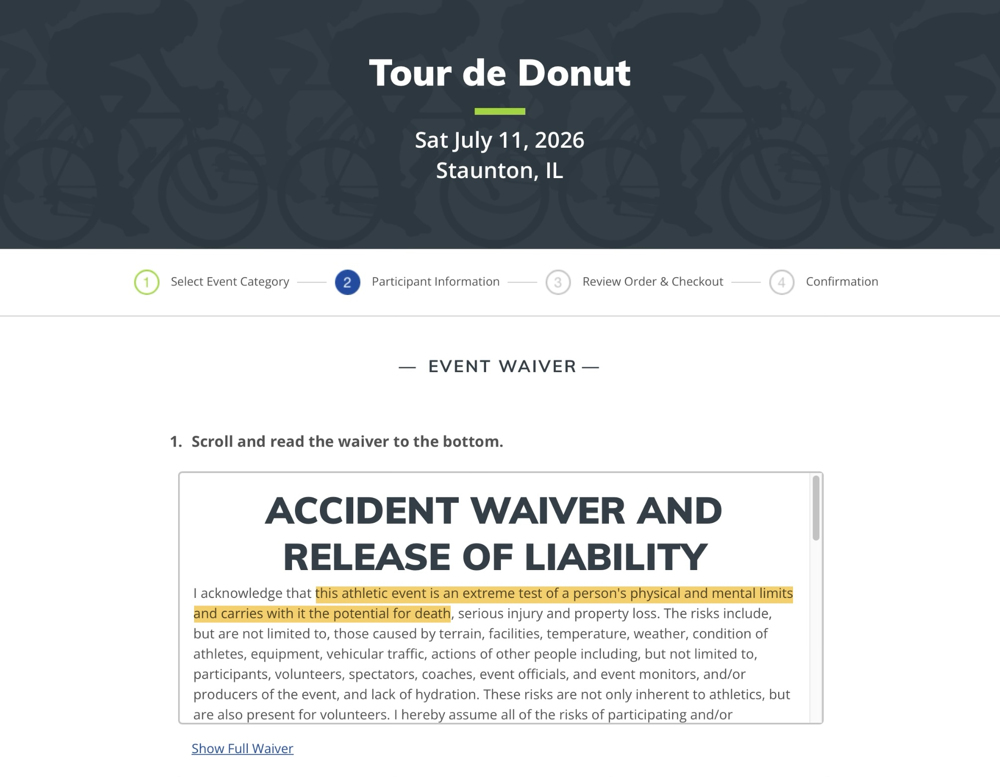
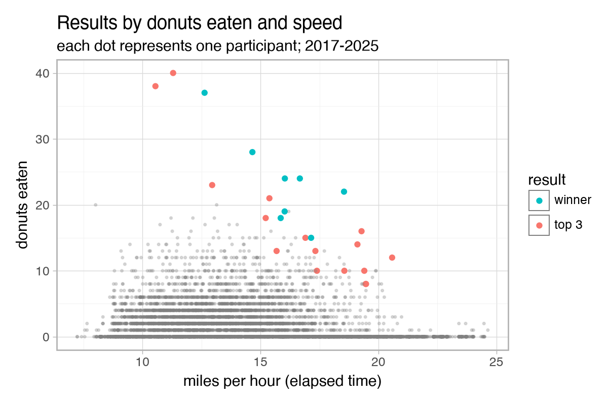
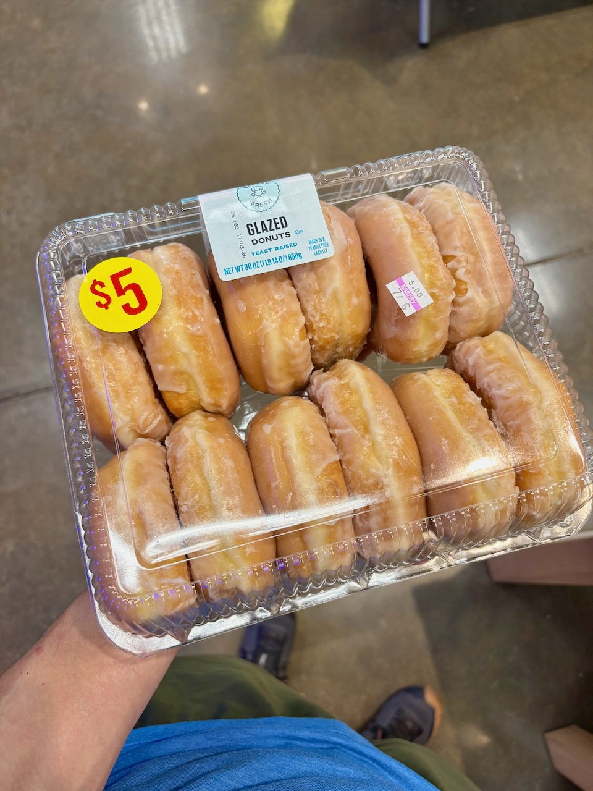
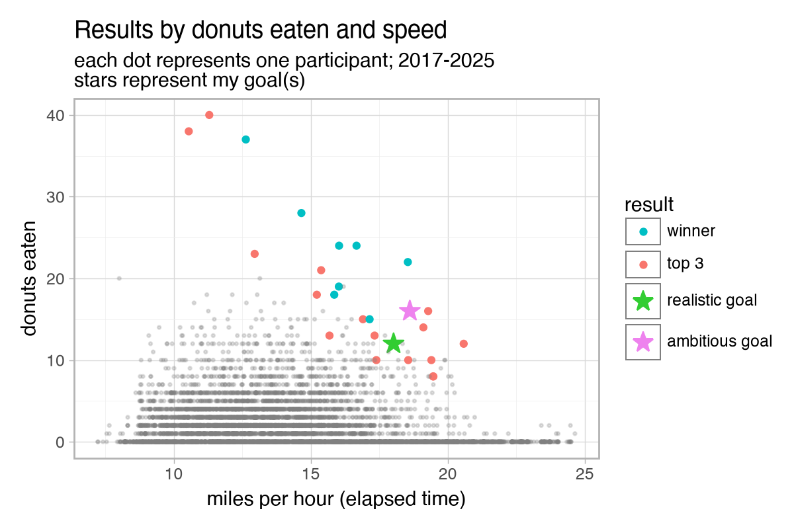
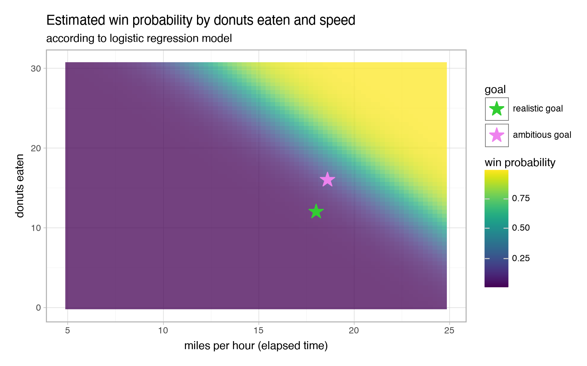

+++
title = "Can I win the Tour de Donut?"
subtitle = "Probably not, but I'll give it a shot"
date = 2026-07-08
tags = ["data analysis", "statistics", "cycling"]
draft = false
description = """
  The Tour de Donut is a bike race with a silly twist: each donut eaten subtracts five minutes from your time.
  Best "donut time" wins.
  Let's crunch some numbers to see what it takes to win, and whether I have a chance.
"""
+++

The [Tour de Donut](https://www.tourdedonut.org) is happening this weekend.
It's an annual bike race in Staunton, IL[^1] with a silly twist: there are all-you-can-eat donut stops along the way, and each donut you eat subtracts five minutes from your time.
Awesome!
Sign me up!

I'm a decent cyclist and I've been known to put away a few donuts.
Can I put up a competitive time?
Could I even _win?_
Let's analyze past results to find out.

## Race overview

<figure>

<figcaption>
What have I gotten myself into??
</figcaption>
</figure>

[The route](https://ridewithgps.com/routes/43459268) for the main race[^2] is approximately 36 miles and relatively flat (it's in Illinois, after all).
There are two donut stops, at miles 7 and 26.
For a decent cyclist, it should be an easy ride—unless you're slowed down by a bunch of donuts in your stomach.

Typically about 600-700 people sign up for the main race, according to the race website and published results.

## Past results and winners

Let's get a sense for what the winning times look like.
The race website has published results going back to 2017.
Here are the previous winners:

<figure>

Tour de Donut winners: 2017-present

| year | name           | donuts eaten | donut time (MM:SS) | elapsed MPH | estimated moving MPH |
| ---- | -------------- | ------------ | ------------------ | ----------- | -------------------- |
| 2025 | Doug Bristow   | 24           | 11:02              | 16.7        | 19.3                 |
| 2024 | Yasir Salem    | 28           | 09:01              | 14.7        | 17.1                 |
| 2023 | Samuel Hancoth | 15           | 50:59              | 17.1        | 18.8                 |
| 2022 | Yasir Salem    | 24           | 14:44              | 16.0        | 18.5                 |
| 2021 | Kyle Hanner    | 22           | 6:30               | 18.5        | 21.6                 |
| 2020 | _n/a_          | -            | -                  | -           | -                    |
| 2019 | Kyle Hanner    | 18           | 45:07              | 15.9        | 17.6                 |
| 2018 | Kyle Hanner    | 19           | 29:36              | 16.0        | 18.1                 |
| 2017 | Benjy Bomkamp  | 37           | -13:58             | 12.6        | 15.1                 |

<figcaption>
    <b>Donut time:</b> elapsed time minus five minutes per donut eaten.
    Fastest donut time wins.
    Yes, it's possible to have a negative time if you eat enough donuts.
     
     
    <b>Elapsed MPH:</b> course miles divided by elapsed time.
    Your average speed including time spend eating donuts and not moving.
     
     
    <b>Estimated moving MPH:</b>
    It can't be exactly calculated because the results do not include donut eating times.
    My estimate assumes the top competitors average 45 seconds per donut (plausible, but obviously not exact).
</figcaption>
</figure>

Holy smokes, that's a lot of donuts.
No one's ever won with less than 15 donuts, and the winner usually eats more than 20.

And some of these guys are real heavy hitters.
Yasir and Kyle are both competitive eaters.
Yasir has [his own webpage](https://www.yasirsalem.com/about-me/) dedicated to his Tour de Donut accomplishments (including his personal record of 61 donuts!), and Kyle has [a page](https://www.facebook.com/hammerhanner/) where he claims 10 career donut race wins.

It's pretty clear that the Tour de Donut is an eating competition first, bike race second (although some of the winners' speeds are nothing to scoff at).
Zooming out makes that even clearer.

<figure>

</figure>

Winners and top-3 finishers tend to eat a lot more donuts than the rest of the field.
Speed helps, but it's not enough on its own.
You most likely need to eat at least 20 donuts to win, or at least 10 for a top-3 finish.

## My preparation and goals

I haven't specifically trained for the biking portion of the race, but I ride enough in everyday life (50+ miles per week) that it shouldn't be an issue.
On a flat route like this, I expect to average about 20 MPH while moving.
Maybe a bit faster if I'm able to stick with a fast group, or maybe slower if a stomach full of donuts slows me down.

I did a bit of training/benchmarking for the donut portion of the race.
I bought a 12-pack of glazed donuts from the grocery store in the middle of a bike ride, ate 6 of them as fast as I could, then continued on the bike ride.
The next day I did the same thing with the remaining 6 donuts.
I learned three things from that exercise:

1. I can "comfortably" eat 6 donuts in one go.
   I could probably eat a few more, but it would be a slog.
2. It takes me about 5 and a half minutes to eat 6 donuts[^3].
   That means each donut will net me about 4 minutes off my time (if I can hold that pace, which is not a given).
3. Biking with a stomach full of 6 donuts felt surprisingly fine, and I wasn't any slower.

<figure>

<figcaption>
    My practice donuts.
    Heavier than I expected, and 310 calories each.
    I hope the race-day donuts are smaller than this, but I'm not counting on it...
</figcaption>
</figure>

Given my preparation, here are my realistic (but not easy) and ambitious goals for the race.
I'd guess I have a ~50% chance of achieving the realistic goal and a ~5-10% chance of achieving the ambitious goal.

|                                  | Realistic Goal | Ambitious Goal |
| -------------------------------- | -------------- | -------------- |
| Number of donuts                 | 12             | 16             |
| Moving speed (mph)               | 20             | 21             |
| Eating speed (seconds per donut) | 60             | 50             |
| _--- calculated values ---_      |                |                |
| _--> Elapsed speed (mph)_        | _18.0_         | _18.5_         |
| _**--> Donut time (MM:SS)**_     | _**61:12**_    | _**37:20**_    |

## Might I win?

Probably not, but there's an outside chance.
_If_ I achieve one of my goals, here's how I'd stack up against the field from recent years:

<figure>

</figure>

If I achieve my realistic goal, I'm almost certainly not going to win but I might be in contention for a top-3 finish.
My donut time would be slower than any of the winners since 2017.

If I achieve my ambitious goal I _might_ have a small chance to eke out a win.
My time would be faster than two of the past winners[^4], but it definitely looks closer to the "Top 3" cluster than the winners cluster on the scatter chart.

Let's take it one step further and attempt to estimate my win probability.
We'll use a simple logistic regression model.
Win probability is basically a function of donuts eaten and elapsed speed, so we can frame a simple model as:

\[ \text{logit}\left(\text{WinProbability}\right)= \beta_0 + \beta_1\text{DonutsEaten} + \beta_2\text{ElapsedSpeed}\]

<figcaption>
    Or instead of "win probability" we can predict "top-3 probability", and so on.
</figcaption>

Fitting the model to the data[^5] and plugging in my goal values gives the following results:

| _if I achieve..._ | Win Probability | Top-3 Probability | Top-10 Probability |
| ----------------- | --------------- | ----------------- | ------------------ |
| Realistic goal    | 1.9%            | 28.0%             | 99.5%              |
| Ambitious goal    | 16.3%           | 97.5%             | 100.0%             |

And here's a visual of what it takes to achieve a high win probability, and where my goals would put me:

<figure>

<figcaption>
    I'm going to need to eat a lot more donuts or ride impossibly fast if I'm going to have a real chance to win.
</figcaption>
</figure>

So it looks like I've got a pretty low chance of winning, but maybe a solid chance of finishing near the top of the field.
Not bad!
That's _if_ I can achieve my goal, of course, which is no sure thing... I'll follow up next week with my actual results.

[^1]:
    The Staunton, IL race is the original Tour de Donut, according to their website.
    There are a handful of similar copycat races (the one in [Ohio](https://www.thetourdedonut.com/Race/OH/TROY/TourDeDonut) might be the largest).

[^2]:
    There's also a shorter 12-month route and a tandem division.
    Combined, there are typically a little over 1,000 participants.

[^2]: I used the highly recommended approach of smashing several donuts into a flat, dense patty and eating them together.

[^3]: Of course, times aren't really directly comparable from one year to the next due to different weather and course conditions.

[^4]:
    I didn't fit the model on the results dataset directly.
    Instead, I bootstrapped a larger dataset.
    I repeatedly sampled a simulated field of _N_=700 records (roughly a typical field size in recent years) from the historical data and computed the winner of that simulated race.
    I created a dataset of 100 such simulated races, then I fit the logistic regression model on that dataset.
    This approach gives us a larger and more diverse dataset.
